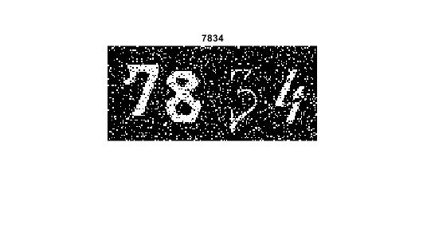

<div dir="rtl">

#### بدون استفاده از دستوران متلب یک کپچای تصویری را بکشید؛ اعداد را با تابع عدد تصادفی ایجاد کنید و سپس با توجه به اعداد بدست آمده برای هر یک در تصویر پیکسل های مورد نظر را رسم کنید؛ تصویر باینری باشد و اعداد رنگ سفید و پیش زمینه رنگ مشکی داشته باشد. <br />


###### کد:
</div>

```matlab
clc;clear;close all;

img=imread('0-9');
imgcaptcha=zeros(0,0,'logical');
ttl=0;
for i=0:3
    B=randi([1,9]);
    ttl=ttl+B*10^(3-i);
    p=randi([1,20]);
    q=randi([1,10]);
    C=B*100+1;
    D=i*40+1+q;
    imgcaptcha(p:60+p, D:D+39) = img(40:100, C+30:C+69);
end    
for i=1:3000
    X=randi([1,size(imgcaptcha,1)]);
    Y=randi([1,size(imgcaptcha,2)]);
    imgcaptcha(X,Y)=randi([0,1])*255;
end
figure;
imshow(imgcaptcha),title(int2str(ttl));

```

<div dir="rtl">

#### برسی کد:
1.
- در خط اول یک ارایه از قبل ایجاد شده اعداد 0-9 را در ماتریس img قرار می دهد.
- در خط دوم یک آرایه صفر عنصری باینری تعریف میکند. 
  </div>

```matlab
img=imread('0-9');
imgcaptcha=zeros(0,0,'logical');
```
<div dir="rtl">

2.
- یک حلقه for وظیفه جدا کردن هر حرف و قرار دادن آن در ماتریس بانری imgcaptcha را بر عهده دارد.
- متغییر B یک عدد اتفاقی باری درج در کپچا انتخاب میکند.
- متغییر ttl کل عدد را جهت مقایسه نگه می دارد.
- متغیر های p و q دو عدد تصادفی جهت جابجایی جزئی مگان قرارگری اعداد در تصویر نهایی استفاده شده است.
- در نهایت در خط آخر for یک کپی از عدد انتخاب شده در تصویر خروجی قرار گرفته است.
</div>

```matlab
for i=0:3
    B=randi([1,9]);
    ttl=ttl+B*10^(3-i);
    p=randi([1,20]);
    q=randi([1,10]);
    C=B*100+1;
    D=i*40+1+q;
    imgcaptcha(p:60+p, D:D+39) = img(40:100, C+30:C+69);
end    
```

<div dir="rtl">

3.
- در حلقه زیر نویز فلفل نمکی به تصویر نهایی اضافه شده تا توسط Bot ها خوانده نشود.

</div>

```matlab
for i=1:3000
    X=randi([1,size(imgcaptcha,1)]);
    Y=randi([1,size(imgcaptcha,2)]);
    imgcaptcha(X,Y)=randi([0,1])*255;
end
```

<div dir="rtl">
تصویر خروجی:<br />
</div>


