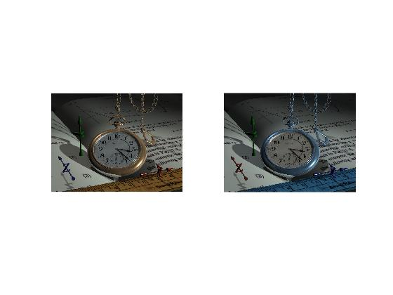

<div dir="rtl">

#### تمرین <br />
#### کانال رنگی آبی و قرمز یک تصویر را با هم جابجا کنید و خروجی را نمایش دهید... <br />


### کد:
</div>

```matlab
clc;clear;close all;

img=imread("../../../benchmark/watch.png");
subplot(1,2,1),imshow(img);
R = img(:, :, 1);G = img(:, :, 2);B = img(:, :, 3);
[sr,sc,sz] = size(img);
imgout = zeros(sr, sc, sz, 'uint8');
for r=1:sr
   for c=1:sc
       imgout(r,c,1)=B(r,c);
       imgout(r,c,2)=G(r,c);
       imgout(r,c,3)=R(r,c);
   end
end
subplot(1,2,2),imshow(imgout);
```

<div dir="rtl">

---
#### برسی کد:

1. <br/>
- لود تصویر رنگی در متغیر img <br/>
- تبدیل آن به تصویر safe color <br/>
</div>

```matlab
img=imread("../../../benchmark/watch.png");

```
<div dir="rtl">

---
2. <br/>
-lمتغیر حالت رنگ  <br />
</div>

```matlab
R = img(:, :, 1);G = img(:, :, 2);B = img(:, :, 3);

<div dir="rtl">

---
3. <br/>
- حلقه تو در تو جهت جابه جایی رنگ آبی و قرمز <br/>
</div>

```matlab
for r=1:sr
   for c=1:sc
       imgout(r,c,1)=B(r,c);
       imgout(r,c,2)=G(r,c);
       imgout(r,c,3)=R(r,c);
   end
end
```
<div dir="rtl">

---
4-<br/>
- نمایش تصویر های خروجی 
</div>

```matlab
subplot(1,2,2),imshow(imgout);
```
<div dir="rtl">
تصویر خروجی:<br />
</div>


