

###### سومین کنفرانس بین‌المللی در مورد محاسبه و ارتباطات شبکه ( CoCoNet " 19 )  

# خنثي كردن و قطعه‌بندی روش Epigraphy با مدل چند مقیاسی و آنالیز اجزا متصل  

****
- ##  چكيده :  

    ####   Epigraphy به مطالعه كتيبه اشاره دارد . این اصطلاحی است که معمولا ً در epigraphy به کار می‌رود تا بتوان کپی دقیقی از آن را به دست آورد . معمولا  با استفاده از  تخمين زدن کاغذ مرطوب روی سطح سنگ که در آن هر ماده مرکب پاک می‌شود  به دست می‌آید این فرآیند همچنین منجر به ظهور نویز ناخواسته می‌شود که ناشی از بافت سنگ , خطای انسانی و یا انواع عوامل مختلف است . 

    ####  در این مقاله , ما CCD ها را پیشنهاد می‌کنیم خنثي كردن اجزا متصل به یک رویکرد جدید برای حفظ نویز و تقسیم‌بندی کاراکتر از طریق تحلیل مولفه‌های متصل و تطبیق الگوی چند مقیاسی  یک آستانه پویا از طریق پیش‌بینی‌های تراکم هیستگرام به دست می‌آید تا به طور موثر مناطق پر سر و صدا را از بین ببرد . سپس یک مطالعه تطبیقی بین رویکردهای مختلف انجام می‌شود  MSTM CC , Hybrid  بازرسی نتایج رویکرد ترکیبی توسط hvs يعني سیستم بصری انسان  نشان می‌دهد که این روش از همه تکنیک‌های قبلی بهتر عمل می‌کند . 

****
- ##  مقدمه :  

    #### Epigraphy آنالیز مفصلی از نوشته‌ها بر روی سنگ‌ها ، ستون‌ها ، سکه‌ها و سطوح دیگر است . این نوشته‌ها ارزش زیادی برای یک کشور دارند ، چرا که نشان می‌دهد فرهنگ و ظهور ادبیات را توضیح می‌دهد . پردازش و نگهداری از این کتب مقدس در هند توسط بررسی باستان‌شناسی هند انجام شده‌است . امروزه حتی در بسیاری از دیواره‌ای معبد از قبیل غارهای مشهور Ajanta و Ellora دیده می‌شود . 

    #### اطلاعات استخراج‌شده از این کتب مقدس را می‌توان برای تایید رویداده‌ای تاریخی مانند وجود سلسله‌های هندی گسترش داد . در نتیجه مهم است که این حوزه را مورد بررسی قرار دهیم با این حال وظایفی که این فرآیند را تشکیل می‌دهند خسته‌کننده و نیازمند دقت زیادی هستند  مکانیزم مورد استفاده برای حفظ این مصنوعات  ایجاد یک نسخه پلاستیکی از نوشته‌های روی کاغذ با استفاده از جوهر و نسخه کاغذ فیزیکی است که سپس توسط متخصصان رمزگشایی می‌شود . این کار به شدت مشکل است چون بافت‌ها , فرورفتگي ها و سنگ‌ها صداهای غیر منتظره غیر منتظره امروزه  یک نسخه دیجیتالی از کتب مقدس ایجاد شده‌است که به حفظ وامنیت اسناد فیزیکی کمک می‌کند . 

    #### ورودی‌های سیستم  تصاویری از این نوشته‌ها با نویز هستند و کار در دست خط کشیدن , بخش‌بندی و تشخیص شخصیت‌هایی است که  نوبه خود به کشف کتیبه کمک می‌کنند . در حالت ایده‌آل هر مدل OCR انتظار دارد که وضوح بالایی در تصویر حاوی متن برای دستیابی به دقت بالا در فرآیند بازشناسی داشته باشد. 

    #### بنابراین روشن سازی و پیدا کردن اجزای محدود متن در تصویر بخش عمده‌ای از پردازش ورودی است , یعنی : دیجیتالی شدن تصاویر دیجیتالی , باید از آن عبور کرد . 

****
- ##   بررسی ادبیات :  
  
    #### مولفه‌های متصل به اسكن تصویر و گروه‌ها را براساس اتصال پیکسل تشکیل می‌دهند , به عبارت دیگر , تمامی پیکسل در یک جز متصل  مقادیر شدت پیکسل را مشابه یکدیگر دارند و به نحوی به هم متصل هستند  هنگامی که اسکن کامل شود , هر پیکسل برچسب یا مقدار مربوط به جز متعلق به آن است داده می‌شود . استخراج و برچسب زدن بخش‌های مختلف و هم متصل به هم در یک تصویر , در بسیاری از کاربردهای آنالیز تصویر خودکار قرار دارد . 

    #### از پروفایل اجزا متصل برای تشخیص زبان استفاده می‌کند . یک فرآیند به نام انتخاب مولفه‌های معنادار  که  عناصر نسبتا  کوچک و بزرگ  را از طریق مقادیر آستانه تعیین می‌کند که به طور تجربی تعیین شده‌اند برای حفظ نویز به کار گرفته می‌شود .نویسندگان از اجزای متصل برای استخراج خطوط متنی در اسناد دست‌نوشته استفاده می‌کنند . شناسایی همسایگی با استفاده از پارامترهای تنظیم و محاسبه عرض میانگین و ارتفاع کاراکتر انجام شده‌است . هر قطعه‌ای که درون یک جعبه محدود كننده قرار دارد  برچسب یکسانی را به آن اختصاص می‌دهد . 

    #### یک بلوک مبتنی بر الگوریتم برچسب گذاری شده مبتنی بر سه استراتژی بهینه‌سازی را ایجاد می‌کند .  

    #### 1. اولين استراتیي یک ماسک اسکن شده با انتخاب تنها زیر مجموعه‌ای از پیکسل در یک ماسک اسکن به دست می‌آید تا دسترسی‌های حافظه اضافی را کاهش دهد.  
  
    #### 2. دومین استراتژی برای کاهش قضاوت مورد نیاز در اسکن بعدی به کار گرفته می‌شود .  

    #### 3. سومين استراتژی كه استراتژي نهایی باعث ایجاد دو درخت تصمیم‌گیری دودویی برای بهبود عملکرد با حذف عملیات مجاور اضافی می‌شود .  

    #### نویسندگان  یک الگوریتم برچسب گذاری چند پویش را برای بهبود عملکرد بحث می‌کنند  به منظور حل و فصل روابط همسایگی , از جلو و عقب تکراری استفاده می‌شود . با این حال , کل فرآیند بیش از ۴ اسکن از تصویر را به خود اختصاص می‌دهد و در نتیجه زمان مناسبی نیست . الگوریتم مرتب‌سازی چند پویش را با اجرای جدول جستجو بهبود بخشید . در طول هر عملیات در هر محله , جدول جستجو دسترسی به حافظه اضافی را از دست می‌دهد نتایج این نسخه بهبود یافته الگوریتم برچسب به صورت تجربی برای کاهش ۴۶ % زمان اجرا نشان‌داده شده‌است . 

    #### نویسندگان تصاویر کاراکترها را  بسته به طول و عرض تصویر ، چسب ، شکسته ، طبیعی ، دارای نويز و مورد اختلاف به کلاسهای زیر طبقه بندی می کنند و برای تعیین لبه تقریبی یک کاراکتر پلاک واحد ، از پیش بینی های افقی برای تصاویری که در طبقات شکسته و چسبنده قرار می گیرند استفاده می شود در مورد یک طرح عمودی برای دستیابی به همان استفاده می کنند كه به منظور تجزیه و تحلیل توزیع چگالی ، CAPTCHA یعنی تصویر روی محور X را تجسم می کنند. مقدار فرافکنی به همراه مقدار واریانس یک قطعه در تمايز دادن بین شلوغي تصوير کمک می کند 

    #### همسان سازی هیستگرام تکنیکی است که به طور مکرر برای بهبود کیفیت تصویر استفاده می شود هموار سازی و تخصیص شدت مداوم ، اثرات متوسط قوی تری را ایجاد می کنند و اثر پرت ها را کاهش می دهند از اختلاف شیب پیش بینی های تراکم هیستگرام برای محاسبه آستانه های بهینه استفاده می شود 

    #### معیارهای مختلفی برای ارزیابی کیفیت تصویر وجود دارد روشهای ارزیابی کیفیت تصویر به روشهای عینی و ذهنی تقسیم می شوند  روشهای ذهنی مربوط به ادراک بصری انسان است و هیچ معیار مشخصی برای قضاوت ندارند روشهای عینی بر اساس مقایسه و استفاده از معیارهای عددی صریح برای ارزیابی کیفیت تصویر است  معیارهای PSNR و SSIM که بیشترین کاربرد و مورد قبول را دارند SSIM توسط Wang و ایجاد شده است  که برخی از ارتباط با درک کیفیت توسط HVS يعني سیستم بینایی انسان در نظر گرفته شده است 

****
- ## مفاهیم پیشینه :  
    
    #### درک قسمت‌های مختلف یک الگوریتم کامل برای کار آن مهم است . این خط لوله را می‌توان به سه بخش عمده تقسیم کرد : 

  - #### حذف پس‌زمینه سفید  
  - #### ميانگين منطقه جستجوگر شخصیت  
  - #### تحلیل اجزا متصل به آن  

    #### در مرحله اول نیاز به نوعی از راه‌حل جعبه محدود وجود دارد. در ابتدا چند عمل ساده مورفولوژیکی برای حذف برخی از نویزها انجام می شود. پس از آن خطوط در روند یافتن کوچکترین جعبه که تصویر مورد نظر را در بر می گیرد خطوط منحنی که به نقاط پیوسته با شدت یا همان رنگ متصل می شوند برای کاهش استفاده از حافظه در حفظ خطوط مختلف  تقریب نفشه برجسته ذخیره می شود. سپس نقشه برجسته با بزرگترین مساحت پیدا شده و به صورت 4 نقطه مستطیل نشان داده می شود. 

    #### قطعه بعدی مکمل آخرین قطعه خط لوله است برای حذف نویز از اجزای متصل متفاوتی که شناسایی شده اند باید یک منطقه آستانه به الگوریتم داده شود که به طور متوسط مساحت یک کاراکتر را تعریف می کند. این آستانه تخمین می زند که یک قطعه مورد انتظار چقدر بزرگ است برای یافتن این ناحیه از  افقی تصویر برای تقریب فاصله بین خطوط و نویسه ها استفاده شده است نمونه ای از هر مقدار پیکسل در هر سطر برای دادن افقی و هر ستون برای دادن طرح عمودی اضافه می شود. 

    

      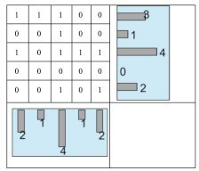
       شكل1) پیش بینی های افقی و عمودی یک تصویر 
         
     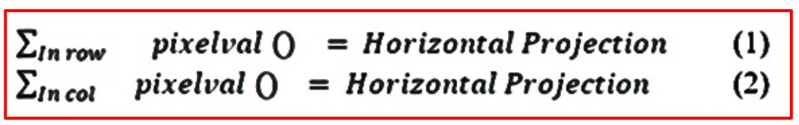
    

    #### تاج ها و فرورفتگی های موجود در پیش بینی های ایجاد شده به ما ایده ای از فاصله بین شخصیت ها می دهد در مثال بالا با فرض اینکه متن توسط شكل اول نشان داده شده و سایر قسمتهای تصویر 0 است ، می توانیم ببینیم که هر ردیف پیکسل یک جمله از کاراکترهاست. بنابراین فاصله خط ها 1 است به همین ترتیب با استفاده از فرافکنی عمودی می توان فرض کرد که فاصله کاراکترها نیز 1 است این به طور متوسط یک منطقه از قدرمطلق x در مرحله فوق به دلیل سر و صدای ذاتی ، پیش بینی ها نامنظم و تصادفی هستندهمانطور که در شكل زير نشان داده شده است  برای یافتن تفکیک مشخص خط یا تفکیک کاراکترها هموار می شوند. 

     

      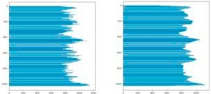
       شكل 2) تصوير اصلی و تصوير هموار 
    

    #### در قسمت پایانی خط لوله ما اجزای متصل شده از شخصیت ها را در تصویر پیدا می کنیم  رویکرد سلب اسناد در اینجا روشی معمول نیست که نویز را از موضوع تصویر حذف می کند  بلکه برعکس است این الگوریتم موضوع را از پس زمینه نويز جدا می کند. ایده همسایگی یک پیکسل کاملاً شناخته شده است و معانی مختلفی دارد اما بصری به معنای لمس پیکسل با پیکسل مورد نظر است که حداکثر می تواند تعداد 8 باشد همسايگي ها را می توان به طور خاص تر تعریف کرد 

      

      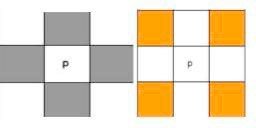
        شكل 3) همسايگي d و همسايگي پیکسل p  
        
     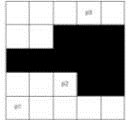
       شكل 4) اتصال و اجزای متصل   
    

    #### پیکسل های متصل به مجموعه ای از پیکسل ها تعلق دارند که متعلق به یکدیگر هستند و زنجیره ای از اتصالات را تشکیل می دهند. در شکل 3 ، p1 به p2 متصل است اما هیچ یک از p1 یا p2 به p3 متصل نیستند زیرا مجموعه پیکسل های سیاه در این بین اتصال را از بین می برند. 

    #### این مورد بیشتر گسترش می یابد تا مناطقی از پیکسل ها را که به یکدیگر متصل هستند پیدا کند و این موارد را به عنوان اجزای متصل تصویر تعریف کند. مثالی از 2 قطعه موجود در تصویر در شکل 5 آورده شده است. 

    

      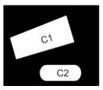
       شكل 5)  دو جز ارتباط متصل در یک تصویر  
    

****
- ## اجزای متصل :  

    ###### ساختار - ساختار داده و الگوریتم 

    #### یک مجموعه گسسته , که به عنوان ساختار داده پیدا شده توسط اتحادیه هم شناخته می‌شود , یک ساختار داده‌ای است که به دنبال مجموعه‌ای از عناصر بخش‌بندی شده به مجموعه‌ای از زیرمجموعه‌های ناپیوسته ( همپوشانی ) است  الگوریتم ۲ عملیات انجام می‌دهد : 

    1. ####   پیدا کردن : این عملیات مشخص می‌کند که کدام یک از    عناصر خاص به آن تعلق دارد . می‌تواند برای پیدا کردن یک شکل تشابه بین عناصر متعلق به یک زیر مجموعه استفاده شود . در نتیجه پاسخ این سوال  آیا دو نقطه شبکه متصل هستند ؟   

   1. ####  اتحاد : تركيب دو زیرمجموعه مجزا در یک زیرمجموعه واحد . در نتیجه به عنوان یک عمل عمل می‌کند که یک یال بین دو نقطه ایجاد می‌کند .   

    #### اکنون یک مولفه همبندی که تعریف شده‌است مجموعه‌ای از پيكسل است که متعلق به هر همسایه دیگر هستند که زنجیره‌ای از اتصالات را تشکیل می‌دهند . برای الگوریتم ما یک جز متصل به سادگی به عنوان مجموعه‌ای از رئوس متصل به هم تعریف می‌کنیم . 

    #### ما با هر پیکسل یا راس یک جز منحصر به فرد شروع می‌کنیم . در حال حاضر می ‌توان مشاهده کرد که اجرای یک عملیات اتحادیه  هیچ کدام از اجزا را تا مقدار ۱ کاهش می‌دهد الگوریتم در ساده‌ترین شکل كه عبور بر روی تصویر را اجرا می‌کند  اولین مرحله در این الگوریتم کلاسیک استفاده از برنامه‌نویسی پویا برای برچسب زدن  از هر پیکسل می‌گذرد و به برچسب‌هایی که قبلا ً به ۲ پیکسل همسایه , یک بالا و یک چپ از نقطه موردنظر اختصاص‌داده شده‌اند این کار ۲ مورد را ایجاد می‌کند : : 

    1. ####    در این مورد که پیکسل ‌های پس‌زمینه هستند ، یک برچسب جدید برای هر دوی آن‌ها ایجاد کنید .    

    2. ####    در این مورد که هر دوی آن‌ها پیکسل پس‌زمینه نیستند , برچسب‌ها را همانطور که هست رها کنید .    

    #### هنگامی که این کار انجام شود , عدد برچسب کوچک‌تر به پیکسل مورد نظر اختصاص داده می‌شود و سپس یک بازبيني ساخته می‌شود اگر پیکسل فعلی دو همسایه را به هم متصل کند . اگر به این ترتیب عمل پیوند نامیده می‌شود و اجزای کوچک‌تر  بزرگ‌تر را تشکیل می‌دهند . 

    #### دومین مرحله از الگوریتم برای پاک کردن هر اشتباهی که در طول اولین بار انجام می‌شود می‌باشد . برای مثال , اختصاص چندین برچسب به یک جز كه این کار با تلاش برای رسیدن به پیکسل ریشه آن جز با پیروی از ساختار درختی انجام می‌شود و سپس برچسب نهایی را به تمامی پیکسل در مسیر اختصاص می‌دهد  بنابراین الگوریتم در انت‌های یک لیست از برچسب‌ها که به هر پیکسل اختصاص داده می‌شود را نشان می‌دهد كه پیکسل به آن تعلق دارد . 

 ****
- ## روش پیشنهادی :  

    #### بررسی باستان‌شناسی هند ( ASI ) مجموعه‌ای از ۱۴۴ epigraphs را برای آزمایش فراهم کرده‌است . هر کدام از این  تصاویرخاكستري در قالب سیاه و سفید یا فرمت  هستند . اکثر این تصاویر حاوی مقادیر قابل‌توجهی از نویز و پیش‌پردازش هستند تا به عنوان یک تصویر ورودی در مرحله بعد بکار رود ( قطعه‌بندی ) . تصویر ورودی نمونه در زیر نشان‌داده شده‌است : 

    

      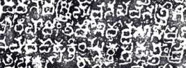
       شكل 6)  نمونه تصویر  
    

    - #### تصویر منبع مورد استفاده , تصویر خروجی الگوریتم MSTM است . این تصاویر به عنوان ورودی‌های ایده‌آل عمل می‌کنند چون رویکرد قبلی ما به طور موثر تمام نويزهاي کوچک را حذف می‌کند و همچنین به تقسیم قطعات بزرگ اجزای کاراکتر به اجزای کوچک‌تر مفید تری کمک می‌کند  بخش نتایج به این دلیل توضیح می‌دهد که چرا این روش گروهی موثرتر از مولفه‌های متصل به هم متصل است . 
     
    - #### تصویر منبع سپس بر روی محور X و محور Y نمایش داده می‌شود . هیستگرام مربوط به محوری که به چگالی پیکسل مربوط می‌شود رسم شده‌است و تخمینی از اندازه میانگین کاراکتر بدست می‌آید . 
     
    - #### پیش بینی های مشاهده شده تمایل دارد که ماهیت نامنظمی داشته باشد و بنابراین برای یافتن تفکیک خط یا فاصله مشخص شخصیت ، پیش بینی ها صاف می شوند. 
  
    - #### پس از آن یک درصد از این مساحت به‌دست‌آمده به عنوان یک مقدار آستانه برای تحلیل مولفه‌های متصل به کار می‌رود آستانه یک شاخص برای حفظ مولفه‌های معنادار است . 
     
    - #### ۸ برچسب مرتبط با یکدیگر برچسب گذاری شده و هر پیکسل یک مقدار مربوطه براساس مولفه در آن قرار داده می‌شود  سپس آنالیز اجزا متصل به منظور حذف تمام مولفه‌هایی که زیر مقدار آستانه قرار می‌گیرند انجام می‌شود . 
     
    - #### تصویر خروجی به دست می‌آید و کیفیت تصویر با استفاده از PSNR و مقادیر ssim ارزیابی می‌شود . 

    - #### تصویر خروجی با استفاده از روش اجزا متصل با استفاده از گرادیان به رنگی کردن اجزای مختلف یافته تقسیم شد . 

    - ####  محدوده شیب به k تقسیم شد , که در آن k نشان‌دهنده عدم وجود خطوط متن در تصویر است . 

    - ####  هر دامنه شیب از طریق و خطوط متن از بقیه جدا شد . 

**** 
****
- # نتيجه 

    #### روش پیشنهادی بر روی مجموعه‌ای از144 توسط epigraphs ارائه‌شده تست شده است از آنجا که یک تصویر ایده‌آل یا نويز برای مقایسه وجود ندارد  مقادیر ارایه‌شده توسط برآوردگرهای مورد نظر یک شاخص واضح برای کیفیت تصویر ارائه نمی‌کنند  با این حال  یک مقدار به اندازه کافی بالا از هر دوی این شاخص‌ها نشان می‌دهد که تمامیت كاركترها حفظ شده‌است و هیچ تلفاتی در اطلاعات با ارزش وجود ندارد  مقادیر متوسط ssim و PSNR   قرار دارند . 

    #### به ترتیب ۱۴.۱۲  ادراک بصری انسان می‌تواند به راحتی تفاوت قابل‌توجهی را در کیفیت بین نتایج روش پیشنهادی و ایجاد یک تصویر با روش‌های حذف نویز استاندارد فیلتر Median  و فیلتر   گاوسی  شناسایی کند . 

    #### الگوریتم همچنین زمان کارا است و بیش از ۲ دقیقه طول نمی‌کشد تا برای یک تصویر با نویز کافی اجرا شود . جدول زیر مقادیر ssim و PSNR را برای مجموعه نمونه ۱۰ تصویر نشان می‌دهد . مقدار برآوردگرهای برای چهار نمونه اول متناظر با تصاویری است که در صفحه  به تصویر کشیده شده‌است . 

   #####  جدول 1) مقایسه با الگوریتم شناخته‌شده  

    

    | Method      |Average SSIM|Cool  |
    | ------------|:----------:|-----:|
    |Wiener Filter|0.9547      |28.336|
    |Median Filter|0.9410      |26.033|
    |   CD        |0.8802      |14.121| 
    

   

   #####  جدول 2) SSIM و PSNR برای چند تصویر  
     

    |Image 	    |SSIM 	|PSNR |
    |-	        |-	    |-	  |
    |Sample 1	|0.87  	|14.27|
    |Sample 2  	|0.85  	|13.25|
    |Sample 3  	|0.92  	|16.37|
    |Sample 4  	|0.87  	|13.97|
    |Sample 5  	|0.88  	|14.21|
    |Sample 6  	|0.95  	|17.54|
    |Sample 7  	|0.94  	|16.32|
    |Sample 8  	|0.88  	|13.55|
    |Sample 9  	|0.81  	|12.04|
    |Sample 10  |0.92  	|15.32|
    
    

    #### یک مطالعه تطبیقی برای یافتن بهترین راه حل ممکن با مجموعه الگوریتم های جدید ساخته شده برای همان مورد انجام شد تطبیق الگو چند مقیاس برای اولین بار به عنوان پایه برای محک زدن تصاویر واضح استفاده شده در MSTM ، الگویی ایجاد می شود که متشکل از نویز موجود در epigraph است. اندازه این الگو حدود 7x7 پیکسل است. یک فیلتر تو در تو روی تصویر اعمال می شود زیرا مرزبندی واضح تری را بین متن و پس زمینه فراهم می کند. الگوریتم تطبیق الگو اجرا شده و از همه موارد تطبیقی یک ماسک ایجاد می شود. تمام تصاویر بالای یک مقدار آستانه از پیش تعیین شده مطابقت دارند. یک ماسک از تمام نویزهای همسان ایجاد شده و سپس رنگ آمیزی تصویر اعمال می شود. 

    #### محدودیت روش پیشنهادی در MSTM این واقعیت است که اندازه الگو نمی تواند خیلی بزرگ باشد یک الگوی بزرگ می تواند باعث از بین رفتن کارکتر شود بنابراین استفاده از آن را محدود کنید تا فقط نویز کوچک تا متوسط را حذف کند استفاده از این روش به عنوان پیش درآمد روش پیشنهادی دارای چندین مزیت است MSTM از نظر محاسباتی کارآمد است و مشخصات کوچکی از نویز را از ورودی ها به طور م دائم حذف می کند  که می تواند در هنگام اجرای الگوریتم پیشنهادی به عنوان اجزای متصل در نظر گرفته شود در آزمایشات ما مشخص شد که هیچکدام از اجزای متصل در تصویر اصلی با استفاده از MSTM 25٪ کاهش می یابد به همین دلیل  روش پیشنهادی به نوبه خود از نظر محاسباتی کارآمدتر است. 

    #### همچنین مشاهده شد که نویزهای کوچک یکی از دلایل مثبت کاذب است که توسط الگوریتم اجزای متصل مشخص شده است این مشخصات کوچک ذاتاً به دو جداگانه بزرگ پیوسته اند که پس از آن به عنوان یک الگوریتم واحد به نظر می رسند بنابراین استفاده از MSTM برای حذف چنین نویزهایی به روش پیشنهادی کمک می کند تا به راحتی بین اجزای سازنده تفاوت قائل شود خط لوله در MSTM شامل استفاده از فیلتر تو در تو و تطبیق الگو است که نویزهایی مانند بافت سنگ را از بین می برد ، که در غیر این صورت الگوریتم به عنوان یک جز در نظر گرفته می شد مشاهده شد که از دست دادن شخصیت فقط برای ازبین بردن اجزای متصل و روش گروه پس از ایجاد تصاویر مخروطی خروجی ، یک کار تقسیم بندی ساده با استفاده از اجزای متصل شده از قبل مشخص و ابتدا اجزای سازنده با استفاده از شیب رنگ آمیزی شده و دامنه شیب آن تقسیم و با استفاده از یافتن تعداد خطوط متن در تصویر ، تعدادی که باید شیب را به آن تقسیم شود  تعیین شده است در زیر مثالی آورده شده است 

    

      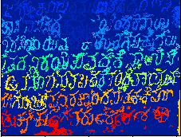
       شكل 7)   قطعه متصل شده با گرادیان   
    

    #### تقسیم بندی به دلیل اتصالات بسیار کوچک ناشی از سطوح سنگی در تصاویر ، خالی از خطا نیست اینها باعث مثبت کاذب می شوند و بعضی از اجزا را به اشتباه طبقه بندی می کنند. اما وظیفه کامل تقسیم بندی خود می تواند به عنوان پیشرفت های آینده تلقی شود که می تواند الگوریتم را کامل کند. 

    

      
        شكل 8)  خط 1 و خط 2 تصویر شناسایی شده است    
    

    

      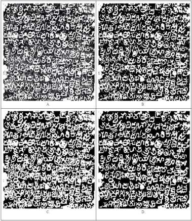
        شكل 9)  A. ورودی ، B. خروجی MSTM ، C. خروجی CCD ، D. خروجی رویکرد ترکیبی    
    

     

      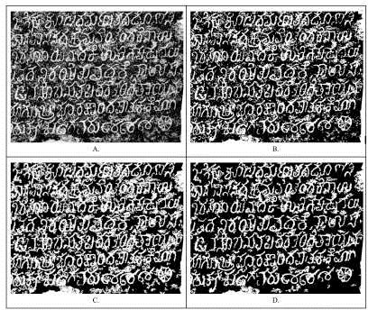
        شكل 10)  A. ورودی ، B. خروجی MSTM ، C. خروجی CCD ، D. خروجی رویکرد ترکیبی    
    

     

      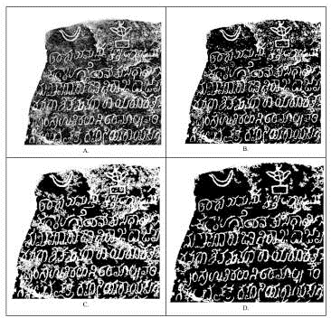
        شكل 11)  A. ورودی ، B. خروجی MSTM ، C. خروجی CCD ، D. خروجی رویکرد ترکیبی    
    

   **** 
   ****
   **** 
   ****
- # نتیجه گیری  

    #### هدف از این مقاله تحقیقاتی تکمیل مرحله اولیه فرآیندی است که با تخمین های ساده مصنوعی آغاز می شود و پس از شناسایی کارکتر پایان می یابد دقت OCR را می توان با تصاویر با کیفیت بالاتر نویز بهبود بخشید و در عین حال از حفظ یکپارچگی و ساختار کارکتر اطمینان حاصل کنید بنابراین  این مقاله بر ایجاد یک الگوریتم خنثی سازی کاملاً خودکار متمرکز است که از نظر زمانی و مکانی به منظور کمک به مراحل بعدی پردازش مانند تقسیم بندی و شناسایی ، کارآمد است نتایج با استفاده از معیارهای PSNR و SSIM ارزیابی شده و با فیلترهای استاندارد رسوب گذاری مانند فیلترهای متوسط و وینر مقایسه می شوند. توسط HVS مشاهده می شود که تفاوت قابل توجهی در کیفیت بین نتایج حاصل از CCD و نتایج فیلترهای استاندارد وجود دارد ، 

    ####  

