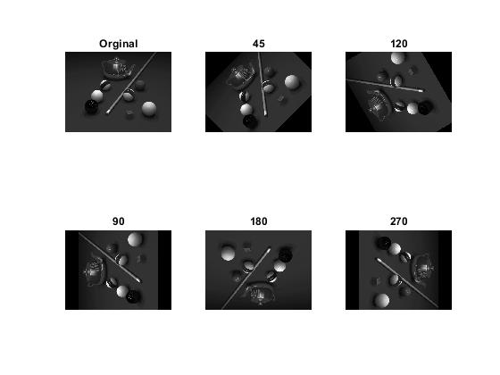

<div dir="rtl">

#### تمرین 8
#### بدون استفاده از توابع آماده ی متلب یک تصویر را با 45،90،120،180 درجه بچرخانید؛ در تصاویری که چرخش تصویر باعث خارج شدن از حالت مربعی می شود پیکسل های خالی را برابر رنگ مشکی قرار دهید و پیکسل های خارج شده از محدوده را نادیده بگیرید. <br />

### کد:
</div>

```matlab
clc;clear;close all;
imagepad=imread("../../../benchmark/cat.png");
imagepad=rgb2gray(imagepad);
imagerot=zeros(size(imagepad),"uint8");
%midpoints
midx=ceil((size(imagepad,1)+1)/2);
midy=ceil((size(imagepad,2)+1)/2);
dd=[45,120,90,180,270];
l=length(dd);k=1;
subplot(2,(l+1)/2,1),imshow(imagepad),title('Orginal');
while (k <= l)
    imagerot=zeros(size(imagepad),"uint8");
    rad=(pi/180)*dd(k);
    for i=1:size(imagerot,1)
        for j=1:size(imagerot,2)

             x= (i-midx)*cos(rad)+(j-midy)*sin(rad);
             y=-(i-midx)*sin(rad)+(j-midy)*cos(rad);
             x=round(x)+midx;
             y=round(y)+midy;

             if (x>=1 && y>=1 && x<=size(imagepad,1) && y<=size(imagepad,2))
                  imagerot(i,j)=imagepad(x,y);        
             end

        end
    end
    subplot(2,(l+1)/2,k+1),imshow(imagerot),title(int2str(dd(k)));
    
    k=k+1;
end
```
---
<div dir="rtl">

#### برسی کد:

1.
- لود کردن تصویر در ماتریس img <br />
- تبدیل تصویر رنگی به خاکستری
- ایجاد ماتریس هم اندازه با تصویر ورودی جهت تصویر خروجی چرخیده.
</div>

```matlab
imagepad=imread("../../../benchmark/cat.png");
imagepad=rgb2gray(imagepad);
imagerot=zeros(size(imagepad),"uint8");
```
---
<div dir="rtl">

2.
-  پیدا کردن مختصات مرکز دوران  که همان مرکز تصویر ورودی است.<br />
</div>

```matlab
midx=ceil((size(imagepad,1)+1)/2);
midy=ceil((size(imagepad,2)+1)/2);
```
---
<div dir="rtl">

2.
-  آرایه ای از اعداد که زاویه چرخش های تصویر را معین می کند.<br />
</div>

```matlab
dd=[45,120,90,180,270];
l=length(dd);k=1;
```
---
<div dir="rtl">

3.
-  حلقه while  بیرونی روی آرایه dd حرکت می کند و زاویه چرخش را ازآرایه  را  استخراج می کند.<br/>
- حلقه for تو در تو داخلی موقعیت هر پیکسل از روی زاویه استخراج شده محسبه و ترسیم می کند.
</div>

```matlab
while (k <= l)
    imagerot=zeros(size(imagepad),"uint8");
    rad=(pi/180)*dd(k);
    for i=1:size(imagerot,1)
        for j=1:size(imagerot,2)

             x= (i-midx)*cos(rad)+(j-midy)*sin(rad);
             y=-(i-midx)*sin(rad)+(j-midy)*cos(rad);
             x=round(x)+midx;
             y=round(y)+midy;

             if (x>=1 && y>=1 && x<=size(imagepad,1) && y<=size(imagepad,2))
                  imagerot(i,j)=imagepad(x,y);        
             end

        end
    end
    subplot(2,(l+1)/2,k+1),imshow(imagerot),title(int2str(dd(k)));
    
    k=k+1;
end
```
<div dir="rtl">
تصویر خروجی:<br />
</div>


