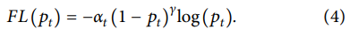

  
  # روش تشخیص  کپچا مبتنی بر  شبکه عصبی کانولوشن  با  FL (Focal Loss)
 

###### به منظور تمایز بین کامپیوترها و انسان‌ها، کپچا به طور گسترده‌ای در لینک‌هایی مانند ورود به وب سایت و ثبت‌نام استفاده می‌شود. روش شناسایی سنتی CAPTCHA دارای قابلیت شناسایی ضعیف و مقاومت در برابر انواع مختلف کدهای تایید است. به همین دلیل، این مقاله یک روش تشخیص CAPTCHA را براساس شبکه عصبی کانولوشن با تابع اتلاف کانونی پیشنهاد می‌کند این روش ساختار شبکه VGG سنتی را بهبود می‌بخشد و تابع اتلاف کانونی برای تولید مدل تشخیص کپچا جدید معرفی می‌کند. ابتدا ما پیش‌پردازش مانند مقیاس خاکستری، روشنایی، نویز زدایی، تقسیم‌بندی و حاشیه‌نویسی را انجام می‌دهیم و سپس از کتابخانه Keras برای ساخت یک مدل شبکه عصبی ساده استفاده می‌کنیم. علاوه بر این، ما یک مدل شبکه عصبی پایانه به پایانه برای تشخیص کپچا پیچیده با چسبندگی بالا و پیکسل تداخل بیشتر می‌سازیم. با آزمایش CNKI CAPTCHA، Zengfang CAPTCHA و تولید تصادفی CAPTCHA، نتایج تجربی نشان می‌دهد که روش پیشنهادی دارای اثر شناسایی و مقاومت بهتری برای سه مجموعه داده مختلف است و مزایای خاصی در مقایسه با روش‌های یادگیری عمیق سنتی دارد. میزان  تشخیص به ترتیب ۹۹ %، ۹۸.۵ % و ۹۷.۸۴ % می‌باشد.
 

### ۱.مقدمه
 
 

****
 
#### کپچا الگوریتمی برای رفتار انسان منطقه‌ای و رفتار ماشین است. با توسعه سریع فن‌آوری اینترنت، مسائل امنیت شبکه همچنان گسترش می‌یابند. تشخیص کپچا یک روش موثر برای حفظ امنیت شبکه و جلوگیری از حملات مخرب از برنامه‌های کامپیوتری است و به طور گسترده‌ای در وب سایت‌های اصلی مورد استفاده قرار گرفته‌است. کپچا عموما به عنوان یک آزمون تورینگ معکوس برای طبقه‌بندی انسان‌ها و کامپیوترها در نظر گرفته می‌شود. جریان اصلی کپچا مبتنی بر نمایش بصری شامل تصاویری مانند حروف و متن است. تشخیص سنتی کپچا [‏ ۴ - ۶ ]‏ شامل سه مرحله است: پیش‌پردازش تصویر، تقسیم‌بندی کاراکترها و تشخیص کاراکترها. روش‌های سنتی دارای قابلیت‌های تعمیم و نیرومندی برای انواع مختلف کپچا هستند. چسبندگی ضعیف است. به عنوان نوعی از شبکه عصبی عمیق، شبکه عصبی کانولوشن، عملکرد بسیار خوبی در زمینه تشخیص تصویر از خود نشان داده‌است و بسیار بهتر از روش سنتی یادگیری ماشین است. 
در مقایسه با روش‌های سنتی، مزیت اصلی سی ان ان در لایه کانولوشن است که در آن ویژگی‌های تصویر استخراج‌شده دارای قابلیت بیان قوی، اجتناب از مشکلات پیش‌پردازش داده‌ها و ویژگی‌های طراحی مصنوعی در تکنولوژی شناسایی سنتی است. اگرچه سی ان ان به نتایج خاصی دست یافته‌است، اما تاثیر تشخیص کپچا پیچیده کافی نیست [‏ ۷ ]‏.
این مقاله به معرفی تابع اتلاف کانونی براساس مدل CNN برای حل مساله تشخیص کپچا پیچیده و بهبود مشکلات آموزش سنتی شبکه عصبی کانولوشن مانند پیچیدگی مدل و افزونگی پارامترهای لایه خروجی می‌پردازد. نتایج آزمون  بر روی سه دیتاست  مختلف کارایی روش پیشنهادی را نشان می‌دهد. - بقیه مطالب به صورت زیر مرتب شده‌اند: بخش ۲ کار مربوطه را معرفی می‌کند و بخش ۳ براساس شبکه عصبی کانولوشن تمرکز می‌کند. در بخش ۴، عملکرد روش پیشنهادی به وسیله آزمایش‌ها تایید می‌شود. در نهایت، خلاصه و چشم‌انداز ارائه شده‌است.
.
 

****
 
## 1. مقدمه
 

#### به سختی می‌توان شاخه دیگری از ارتقای Cybernetics (فرمان شناسی) را یافت که به سرعت و پشتکار بینایی رایانه برسد. تکنیک‌ها، روش‌ها و الگوریتم های بینایی رایانه، طیف وسیعی از کارهای ترافیکی، صنعتی و سایر کارهایی را که برای سنجش بینایی در نظر گرفته شده است را حل می‌کنند. 
 در اوایل ظهور فناوری های بینایی رایانه، در صنایع تنها کارهای ساده پردازش تصویر انجام می‌شد. در آن زمان، معمولاً بررسی حضور، ابعاد یا رنگ محصول داده شده مورد بررسی قرار می‌گرفت. به مروز زمان، این نوع بازرسی های صنعتی در صنایع غذایی (به عنوان مثال برای بررسی بطری های شیشه‌ای، تجزیه و تحلیل مواد بصری (به عنوان مثال طبقه بندی بصری سیم های فولادی) و ..) جای خود را محکم کردند. سیستم های نظارت بر ترافیک و تخلف همراه با سیستم های به اصطلاح ADAS، دومین کلاس اصلی برنامه های بینایی رایانه است. در حال حاضر، نمونه مناسبی از سیستم های نظارت بر ترافیک برای تخمین صف ترافیک را می‌توانید در بسیاری از کشور‌ها مشاهده کنید. علاوه بر صنعت و ترافیک، در کار‌ها و حوزه های زیادی از ابزار پردازش تصویر استفاده می‌شود. بازسازی صحنه سه بعدی برای رباتیک در محیط های بیرونی و داخلی به طور گسترده‌ای مورد استفاده قرار می‌گیرد. به عنوان مثال، اخیراً محققان یک رویکرد جدید برای بازسازی استریو بدون کالیبره را معرفی کردند.
 

### ۲. کارهای مرتبط

 

#### کپچا عمدتا شامل متن کپچا [‏ ۸ ]‏، تصویر کپچا [‏ ۹ ]‏ و صدا کپچا [‏ ۱۰ ]‏ است که در میان آن‌ها متن کپچا بیش‌ترین کاربرد را دارد. کپچا متنی عمدتا از اعداد و حروف انگلیسی تشکیل شده‌است و امنیت آن عمدتا با دو عامل تضمین شده‌است: اطلاعات تداخل پس‌زمینه و چسبندگی کاراکتر. هر دوی این ویژگی‌های امنیتی دشواری تشخیص و تقسیم‌بندی را به درجات مختلف افزایش می‌دهند. با توجه به اینکه آیا کاراکترها باید در فرآیند تشخیص بخش‌بندی شوند، روش‌های تشخیص کپچا متنی را می توان به تشخیص قطعه‌بندی و تشخیص کلی تقسیم کرد. تشخیص قطعه‌بندی یک روش رایج برای کرک کردن CAPTCHA است. Chellapilla and Simard [‏ ۱۱ ]‏ اثبات کردند که قطعه‌بندی موثر کاراکترها در CAPTCHA می‌تواند دقت بازشناسی را به میزان زیادی بهبود بخشد. در مراحل اولیه، وب سایت خدمات کپچا نماینده کپچا بود، که با اطلاعات تداخل کم یا بدون پس‌زمینه مشخص می‌شد، و کاراکترها  فاقد تحول پیچیده مانند تحریف، چرخش و چسبندگی بودند، و اثر دفاعی محدود بود. یان و احمد [‏ ۱۲ ]‏ این نوع کپچا را با محاسبه پیکسل ها به طور کامل کرک کردند. از آن زمان به بعد، طراح CAPTCHA الگوریتم تولید را بهبود بخشیده و اطلاعات تداخل پس‌زمینه را اضافه کرده‌است، اما یان و آل احمد [‏ ۱۳ ]‏ از الگوریتم طرح برای تقسیم‌بندی موثر آن با دقت تا ۹۰ % استفاده کرده‌اند، و نرخ موفقیت کرک تا ۶۰ % است. پس از دو دور متوالی حملات و دفاع‌ها، به منظور مقاومت بهتر در برابر الگوریتم تقسیم‌بندی، طراح بیشتر کپچا را بهبود بخشید و تبدیل‌های پیچیده چندگانه مانند چرخش کاراکتر، چرخش و چسبندگی و تبدیل پیچیده‌تر اطلاعات تداخل پس‌زمینه را اضافه کرد [‏ ۱۴، ۱۵ ]‏. برای این نوع کپچا، گائو و همکاران [‏ ۱۶ ]‏ استفاده کردند. فیلتر کردن گابور برای استخراج خطوط کاراکتری و استفاده از جستجوی گراف برای یافتن ترکیب بهینه برای تقسیم‌بندی کاراکترها، و دقت کرک reCAPTCHA به ۷۷ % رسید. با پیشرفت تکنولوژی یادگیری عمیق، تکنولوژی تشخیص کپچا براساس یادگیری عمیق به طور گسترده‌ای مورد استفاده قرار می‌گیرد. کینگ و ژانگ [‏ ۱۷ ]‏ یک شبکه عصبی کانولوشن چند لیبل را برای تشخیص کپچا متنی بدون تقسیم‌بندی پیشنهاد کردند و به نتایج بهتری برای اعوجاج کاراکتر و کپچا پیچیده دست یافتند. شی و همکاران [‏ ۱۸ ] سی ان ان را با شبکه عصبی بازگشتی ترکیب کرد و یک شبکه عصبی بازگشتی کانولوشن را برای تشخیص کلی کپچا پیشنهاد کرد. دو و همکاران [‏ ۱۹ ]‏ به سرعت استفاده کردند. RCNN برای شناخت کلی، که اثر شناخت بهتری برای کپچا با توالی‌های طولی متغیر دارد. لین و همکاران [‏ ۲۰ ]‏ از شبکه عصبی کانولوشن برای یادگیری سکته مغزی استفاده کردند. و ویژگی‌های کاراکتری کپچا تا حد زیادی دقت تشخیص کپچا با اعوجاج، چرخش و نویز پس‌زمینه را بهبود می‌بخشد. در مقایسه با روش‌های سنتی، شبکه‌های عصبی عمیق توانایی یادگیری بهتری دارند و می‌توانند به طور موثر کارایی طبقه‌بندی و تشخیص را بهبود بخشند [‏ ۲۱ - ۲۳ ]‏. به عنوان مثال، الکسنت [‏ ۲۴ ]‏ بیشتر معماری سی ان ان را بهبود می‌بخشد و به طور قابل‌توجهی اثر طبقه‌بندی را بهبود می‌بخشد. این برنامه به طور گسترده برای آموزش سی ان ان مورد استفاده قرار گرفته‌است. روی GPU. با این حال، فن‌آوری یادگیری عمیق در حال حاضر در مواجهه با مشکلات پردازش تصویر AI شدید (‏مانند تقارن [‏ ۲۵ ]‏ و مثال خصمانه [‏ ۲۶ ]‏)‏محدود شده‌است. اکثر الگوریتم های تشخیص انتها به انتها به طور مستقیم از ساختار شبکه عصبی کانولوشن موجود استفاده می‌کنند که دارای لایه‌های عمیق شبکه و پارامترهای آموزشی بزرگ است. هنگامی که تعداد نمونه‌های موثر محدود باشد، انطباق بیش از حد و عدم توانایی تعمیم پذیری آسان است [‏ ۲۷ ]‏. بنابراین چگونگی طراحی کپچا برای نقایص یادگیری عمیق مشکل کلیدی است که باید حل شود.
 

### ۳. روش پیشنهادی

 

#### ۳.۱. preprocessing. روش‌های پردازش سنتی برای پیش پردازش تصویر CAPTCHA، شامل مقیاس خاکستری، روشنایی، حذف نویز از تصویر، جداسازی تصویر و تفسیر تصویر مورد استفاده قرار می‌گیرند. اول، روش میانگین وزنی برای پردازش سطح خاکستری استفاده می‌شود و فرمول آن Y= 0.30∗R + 0.59∗G + 0.11∗B
است که در آن R، G و B با مقادیر مولفه‌های قرمز، سبز و آبی در تصویر رنگی متناظر هستند. باینری سازی تصویر انجام می‌شود. الگوریتم Otsu برای بدست آوردن مقدار آستانه بهینه هر تصویر استفاده می‌شود. - پیکسل های بالاتر از مقدار آستانه به ۲۵۵ تنظیم می‌شوند و پیکسل های زیر مقدار آستانه به ۰ تنظیم می‌شوند. فرمول (‏y، x)‏*∑▒〖f 〗(‏M / 1)‏ = (‏y، x)‏gبرای تنظیم مقدار پیکسل فعلی به عنوان مقدار میانگین هشت پیکسل همسایه استفاده می‌شود. در نهایت، تصویر بخش‌بندی شده و فرآیند خاص در شکل ۱ نشان‌داده شده‌است.

 

### Focal Loss:3.2 
 

#### اتلاف کانونی (focal loss)[‏ ۲۸ ]‏ حل مسئله دقت پایین در تشخیص یک مرحله‌ای هدف است.این تابع اتلاف باعث کاهش وزن تعداد زیادی از نمونه‌های منفی ساده در آموزش می‌شود. همچنین می‌تواند به عنوان یک استخراج نمونه دشوار در نظر گرفته شود. اتلاف کاانونی براساس تابع اتلاف آنتروپی متقابل اصلاح می‌شود، که می‌تواند وزن طبقه‌بندی آسان نمونه‌ها را کاهش دهد تا تمرکز مدل بر روی طبقه‌بندی دشوار نمونه‌ها در طول آموزش بیشتر شود. برای تابع دو دسته‌ای آنتروپی متقابل، فرمول به صورت زیر است:

 
  

      
     

#### که در آن p احتمال تخمینی است که نمونه پیش‌بینی به ۱ تعلق دارد (‏بازه ۰ - ۱ است)‏، y برچسب است و مقدار y  {‏۱ -، ۱+ }‏ است. برای راحتی نمایش، متغیر pt معرفی می‌شود. آن فرمول به شرح زیر است:
 
   
  

      
     
  

#### آنتروپی متقاطع دو دسته را می توان به صورت CE (pt) = −log (pt) CE (p,y)=  بیان کرد. آن  روش معمول برای حل عدم تعادل کلاس، معرفی ضریب وزنی است که α ∈ [0, 1] برای دسته ۱ و  1 − αبرای دسته ۱ - است.
 
   

      
     

 
  

      
    

#### سپس، آنتروپی متقاطع متعادل CE(pt) = −αtlog(pt )‏است. اگر چه می‌تواند اهمیت نمونه‌های مثبت و منفی را متعادل کند اما نمی‌تواند نمونه‌های سخت و آسان را تشخیص دهد. از این رو کاهش کانونی وزن نمونه‌های ساده را کاهش می‌دهد و بر آموزش نمونه‌های سخت منفی تمرکز می‌کند. با معرفی پارامتر  γبرای نشان دادن سختی اختلاف وزن بین سختی و نمونه‌های آسان، هرچه γ بزرگ‌تر باشد، اختلاف بیشتر خواهد بود، بنابراین اتلاف کانونی به صورت زیر تعریف می‌شود:. 
 

      
    

 

#### از این رو، اتلاف کانونی یک تابع اتلاف آنتروپی متقابل با مقیاس قابل تنظیم پویا است که دارای دو پارامتر αt و γ است که در آن αt حل عدم تعادل بین نمونه‌های مثبت و منفی و γ حل عدم تعادل نمونه‌های سخت و آسان است.
 
### ۳.۳ کپچا ساده.
 

#### برای مثال  کپچا ساده، به دلیل فرمت کوچک تصویر داده و اطلاعات کم‌تر پس از پیش‌پردازش تصویر، مدل نسبتا ساده است. ساختار شبکه (‏همانطور که در جدول ۱ و شکل ۲ نشان‌داده شده‌است)‏، دو لایه کانولوشن تکراری همراه با ادغام لایه ۱ پولینگ(pooling)، و به دنبال آن یک لایه مسطح و یک لایه متراکم است. تابع سیگموئید، پارامتر فعال‌سازی لایه اتصال کامل است و برچسب ماتریس کدگذاری one-hot با حداکثر احتمال به ماتریس کدگذاری one-hot تبدیل می‌شود.شایان‌ذکر است که هر لایه کانولوشن از تابع فعالسازی ReLU استفاده می‌کند، که به دنبال آن یک لایه استانداردسازی دسته‌ای نرمال سازی دسته‌ای قرار دارد.

 
 
 ### (‏۱)‏لایه ورودی
 
 ####داده‌های ورودی، داده‌های تصویر تک کاناله پس از دودویی سازی با اندازه ۲۵ * ۱۲ است.
 
  

 ### (‏۲)‏لایه کانولوشن C1
  
 #### با استفاده از ۸ کرنل کانولوشن که اندازه آن‌ها ۳ *۳ است، padding با استفاده از کانولوشن مشابه، پر کردن لبه ماتریس داده تصویر ورودی با یک دایره از ۰ مقدار، و اندازه گام عملیات کانولوشن ۱ است، هر هسته کانولوشن شامل ۹ پارامتر است، و یک پارامتر بایاس اضافه می‌کند، بنابراین پارامترهای مورد نیاز برای این لایه  ۰ ۸ = ۸ (‏۱ +  ۳ *۳)‏.  تابع فعال‌سازی تابع ReLU است، که به دنبال آن یک لایه نرمال سازی دسته‌ای، و خروجی۸* ۲۵ * ۱۲ نقشه ویژگی قرار دارد.
 
 ### (‏۳)‏لایه کانولوشن C2
 
####با استفاده از ۸ کرنل  کانولوشن، اما اندازه کرنل کانولوشن ۸* ۳ *۳می‌شود، padding هنوز هم کانولوشن مشابهی دارد، اندازه گام کانولوشن ۱ است، پارامتر کل۵۸۴ =۸* (‏۱+ ۸* ۳ *۳)‏ و تابع فعال‌سازی تابع ReLU است، که به دنبال آن یک لایه نرمال سازی دسته‌ای، و خروجی ۸* ۲۵ * ۱۲  نقشه ویژگی قرار دارد.
 
  ###(‏۴)‏لایه  Pooling لایه P3  
   
  ####ما الگوریتم Pooling حداکثر نتیجه خروجی را به لایه C2 برای عملیات Pooling اعمال می‌کنیم؛این لایه نیز لایه  downsampling نامیده می‌شود. در لایه downsampling، اندازه پنجره مورد استفاده ۲* ۲و خروجی آن ۸ * ۶ * ۱۲ نقشه ویژگی می باشد.
   
  ###(‏۵)‏لایه کانولوشن C4 
   
  ####با استفاده از ۱۶ کرنل کانولوشن که اندازه آن‌ها ۸* ۳ *۳ است، padding همان کانولوشن را دارد، طول گام کانولوشن ۱ است، پارامترهای مورد نیاز کل ۱۱۶۸= ۱۶ * (‏۱+ ۸* ۳ *۳)‏ هستند، تابع فعالسازی تابع ReLU است، که به دنبال آن یک لایه نرمال سازی دسته‌ای و خروجی ۱۲ * ۶* ۱۶ نقشه ویژگی قرار دارند.
   
  
  ###(‏۶)‏لایه کانولوشن لایه C5
   
  ####با استفاده از ۱۶ کرنل کانولوشن که اندازه آن‌ها  ۱۶* ۳ *۳  است، padding همان کانولوشن، طول گام کانولوشن ۱، پارامترهای مورد نیاز کل عبارتند از ۲۳۲۰= ۱۶ * (‏۱+ ۱۶* ۳ *۳)‏ تابع فعالسازی تابع ReLU است، که به دنبال آن یک لایه نرمال سازی دسته‌ای و خروجی ۱۲ * ۶* ۱۶ نقشه ویژگی قرار دارند.
   
  ###(‏۷)‏لایه پولینگ P6
   
  ####ما الگوریتم Pooling حداکثر نتیجه خروجی را به لایه C2 برای عملیات Pooling اعمال می‌کنیم در لایه downsampling، اندازه پنجره مورد استفاده ۲* ۲و خروجی آن ۳ * ۶ * ۱۶ نقشه ویژگی می باشد.
   
  
  ###(‏۸)‏لایه مسطح کننده F7(Flattening) 
   
  ####ما داده‌های خروجی نقشه‌های ویژگی را به لایه   P6مسطح می‌کنیم، که در مجموع  ۲۸۸  = ۳ * ۶ * ۱۶  گره است.
   
  #### (‏۹) لایه متراکم کاملاً با لایه F7 متصل است. تابع فعالیت تابع اتلاف  کانونی است. تمام ویژگی‌ها طبقه‌بندی می‌شوند. نتیجه طبقه‌بندی  مربوط به دسته کاراکترهای کپچا است، که شامل ۱۰ عدد و ۲۶ کاراکتر بزرگ انگلیسی است، که به معنی ۳۶ نتیجه ممکن است. در مجموع ۳۶ پارامتر ۱۰۴۰۴ =( ۱+‏۳ * ۶ * ۱۶  )‏ مورد نیاز است.
    
 
### ۳.۴. کپچا پیچیده
 
####کپچا های پیچیده عمدتا بر روی تصویر کپچا متمرکز شده‌اند که به دلیل چسبندگی بیشتر، فونت مایل، رنگ پیچیده و پیکسل های مزاحم، تقسیم‌بندی آن‌ها دشوار است. به طور گسترده در وب سایت‌های اصلی اینترنت مورد استفاده قرار می‌گیرد. برای کپچا پیچیده، شبکه عصبی انتها به انتها برای شناسایی کپچا استفاده می‌شود. ساختار مدل در شکل ۳ نشان‌داده شده‌است.نوع مشکل طبقه بندی چند برچسب است. پنج بار تکرار می‌شود، دو لایه کانولوشن، یک لایه پولینگ، و سپس یک لایه مسطح، و در نهایت چهار طبقه بند به هم متصل می‌شوند. هر طبقه‌بندی کننده به طور کامل به هم متصل است که شامل ۶۲ گره عصبی است. تابع سیگموئید، پارامتر فعال‌سازی لایه همگرای کامل است، یعنی، احتمال اینکه هر طبقه‌بندی کننده یک کاراکتر را کنار بگذارد، و خروجی نهایی، رمزگذاری تک  هات(one-hot) کامل ۴ کاراکتر تصویر است.
  
  ####(‏۱)‏لایه ورودی: داده‌های ورودی داده‌های تصویر RGB با اندازه ۲۷* ۷۲  و ۳ کانال هستند.
   
  ####(‏۲)‏لایه کانولوشن : C1 ۳۲ کانولوشن کرنل با اندازه  ۳ *۳ *۳استفاده می‌شود، و همان محتوا برای padding استفاده می‌شود؛به عبارت دیگر، یک دایره از ۰ به لبه ماتریس داده تصویر ورودی، و مرحله عملیات کانولوشن ۱ است. هر کانولوشن کرنل شامل ۲۷ پارامتر است و یک پارامتر بایاس اضافه می‌کند.از این رو پارامترهای مورد نیاز این لایه ۸۹۶=۳۲ * (‏۱ +۳ *۳ *۳)‏ می‌باشد. - تابع فعال‌سازی تابع ReLU است که در کنار لایه نرمال سازی دسته‌ای قرار دارد و ۲۷ * ۷۲ * ۳۲ نقشه ویژگی خروجی دارد
  
   

      
     

 
 

      
     

 
 

      
     

 
 

#### (‏۳)‏لایه کانولوشنC2 : ۳۲ کرنل  کانولوشن استفاده می‌شود، اما اندازه کرنل کانولوشن ۳۲*۳ *۳  می‌شود، padding هنوز همان کانولوشن است، مرحله کانولوشن ۱ است و پارامتر کل ۹۲۴۸= ۳۲ * (‏ ۱+ ۳۲*۳ *۳  )‏ است،  و  تابع فعالسازی تابع ReLU است،که به دنبال آن یک لایه نرمال سازی دسته‌ای و خروجی۲۷  * ۷۲ * ۳۲  نقشه ویژگی قرار دارند.
 
#### (‏۴)‏لایه پولینگ لایه P3: ما الگوریتم Pooling حداکثر نتیجه خروجی را به لایه C2 برای عملیات Pooling اعمال می‌کنیم در لایه downsampling، اندازه پنجره مورد استفاده ۲* ۲و خروجی آن ۱۳ * ۳۶ * ۳۲ نقشه ویژگی می باشد.
 
 #### (‏۵)‏لایه کانولوشن C4: ما از ۶۴ کرنل کانولوشن استفاده می‌کنیم که اندازه آن‌ها ۳۲*۳ *۳  است، padding همان کانولوشن است، گام کانولوشن ۱ است، پارامترهای مورد نیاز کل عبارتند از :
۱۸۴۹۶= ۶۴ * (‏ ۱+ ۳۲*۳ *۳  ) و تابع فعال‌سازی تابع ReLU است، که به دنبال آن یک لایه نرمال سازی دسته‌ای و خروجی ۱۳ * ۳۶ * ۶۴ نقشه ویژگی قرار دارند.

 
 #### (‏۶)‏لایه کانولوشن C5 :ما از ۶۴*۳ *۳کرنل کانولوشن استفاده می کنیم که اندازه آن ۶۴ است ، padding همان مرحله کانولوشن است ، مرحله کانولوشن ۱ است ، کل پارامترهای مورد نیاز مجدد۶۳۶۹۲۸=۶۴ * (۱+ ۶۴*۳ *۳) هستند ، و تابع فعال سازی تابع ReLU است که به دنبال آن یک لایه نرمال سازی دسته ای و خروجی ۱۳ * ۳۶ * ۶۴ نقشه ویژگی قرار دارند.

 
  
#### (‏۷)‏لایه پولینگ P6: الگوریتم Pooling حداکثر نتیجه خروجی را به لایه C5 برای عملیات Pooling اعمال می‌کند و در لایه downsampling، اندازه پنجره مورد استفاده ۲* ۲و خروجی آن ۱۸ * ۶ * ۶۴ نقشه ویژگی می باشد.
 
####(‏۸)‏لایه کانولوشن  C7: ما از ۱۲۸ کرنل کانولوشن استفاده می‌کنیم که اندازه آن‌ها ۶۴*۳ *۳است، padding همان کانولوشن است، اندازه گام کانولوشن ۱ است، پارامترهای مورد نیاز کل۷۳۸۵۶ = ۱۲۸* (‏۱+ ۶۴*۳ *۳)‏ هستند، و تابع فعال‌سازی تابع ReLU است، است که به دنبال آن یک لایه نرمال سازی دسته ای و خروجی ۱۲۸ * ۱۸* ۶ نقشه ویژگی قرار دارند.
 
  ####(‏۹)‏لایه کانولوشن C۸: ما از ۱۲۸ کرنل کانولوشن استفاده می‌کنیم که اندازه آن‌ها ۱۲۸*۳ *۳ است، padding همان کانولوشن است، اندازه گام کانولوشن ۱ است، پارامترهای مورد نیاز کل۱۴۷۵۸۴ = ۱۲۸* (‏۱+ ۱۲۸*۳ *۳)‏ هستند، و تابع فعال‌سازی تابع ReLU است، که به دنبال آن یک لایه از لایه نرمال سازی دسته‌ای و نقشه ویژگی خروجی ۱۲۸ * ۱۸* ۶ قرار دارد.
 
  ####(‏۱۰)‏لایه پولینگ P9 :ما الگوریتم Pooling حداکثر نتیجه خروجی را به لایه C8 برای عملیات Pooling اعمال می‌کنیم در لایه downsampling، اندازه پنجره مورد استفاده ۲* ۲ و خروجی نقشه‌های ویژگی ۳ * ۹* ۱۲۸ است. 
 
  ####(‏۱۱)‏لایه کانولوشن10 C: ما از ۱۲۸ کرنل کانولوشن استفاده می‌کنیم که اندازه آن‌ها ۱۲۸*۳ *۳ است، padding همان کانولوشن است، طول گام کانولوشن ۱ است، پارامترهای کل مورد نیاز ۱۴۷۵۸۴ = ۱۲۸* (‏۱+ ۱۲۸*۳ *۳)‏ هستند، و تابع فعال‌سازی تابع ReLU است، که با یک لایه استانداردسازی دسته‌ای و نقشه ویژگی خروجی ۳ * ۹* ۱۲۸ دنبال می‌شود.
 
  ####(‏۱۲)‏لایه کانولوشن C11: ما از ۱۲۸ کرنل کانولوشن استفاده می‌کنیم که اندازه آن‌ها ۱۲۸*۳ *۳ است، padding همان کانولوشن است، گام کانولوشن ۱ است، پارامترهای مورد نیاز کل ۱۴۷۵۸۴ = ۱۲۸* (‏۱+ ۱۲۸*۳ *۳)‏هستند، و تابع فعال‌سازی تابع ReLU است، که با یک لایه استانداردسازی دسته‌ای و نقشه ویژگی خروجی ۳ * ۹* ۱۲۸ دنبال می‌شود.
 
  ####(‏۱۳)‏لایه پولینگ P12: : خروجی لایه C11 توسط الگوریتم حداکثرا Pooling جمع می شود و اندازه پنجره downsampling مورد استفاده ۲* ۲  و نقشه ویژگی خروجی    ۱* ۴  *۱۲۸است.
 
  ####(‏۱۴)‏لایه مسطح کننده لایه F13: ما داده‌های نقشه‌های ویژگی خروجی توسط لایه P12 و در مجموع 
۵۱۲= ۱۲۸* ۴ * ۱ گره را مسطح می‌کنیم.

 
####(‏۱۵)‏ لایه متراکم کاملا به لایه F13 متصل است، که ۴ طبقه بندی را به هم متصل می‌کند؛هر طبقه‌بندی کننده شامل ۳۶ گره عصبی است، تابع فعال‌سازی تابع سیگموئید است و حداکثر احتمال رمزگذاری یک بعدی یک کاراکتر کپچا خروجی است. هر طبقه‌بندی کننده به پارامترهای ۱۸۴۶۸= ۳۶ * (‏۱+ ۱۲۸* ۴ * ۱)‏ نیاز دارد.
 
 
  ## ۴. آزمایش‌ها
  
  
 ## ۴.۱. Dataset
   
 ####. مجموعه داده کپچا استفاده‌شده در این مقاله شامل CNKI کپچا، ژنگفانگ کپچا و به طور تصادفی کپچا را تولید می‌کند. تمام مجموعه داده‌های کپچا از حروف و اعداد بزرگ و کوچک، شامل ۳۳ دسته تشکیل شده‌اند.
  
 ##کپچا CNKI
  
 ####شامل روش‌های متداول کپچا است، مانند تغییر مقیاس کاراکتر، نویز خطی و چسبندگی کاراکتر، که برای آزمایش کاربرد کپچا مناسب‌تر است. مجموعه داده تصویر شامل ۴۰۰۰ تصویر در مجموعه آموزش و ۶۰۰ تصویر در مجموعه آزمون است. تصویر نمونه در شکل ۴ نشان‌داده شده‌است.
   
  ##سیستم مدیریت آموزشی ژنگ فانگ کپچا
   
  ####ویژگی‌های نویز نقطه‌ای و چسبندگی انحراف نسبی را دارد که می‌تواند برای ارزیابی عملکرد روش تشخیص کد تایید ویژگی چسبنده مورد استفاده قرار گیرد. ما از ۲۰۰۰ مجموعه داده کپچا به عنوان مجموعه آموزشی و ۲۰۰ مجموعه آزمایشی استفاده می‌کنیم، و به صورت دستی برخی از تصاویر تغییر نام یافته را برچسب می‌زنیم. تصویر نمونه در شکل ۵ نشان‌داده شده‌است.
کپچا که به صورت تصادفی تولید می‌شود دارای ویژگی‌های اعوجاج و چسبندگی متوسط است که با روش‌های سنتی تشخیص کپچا قابل‌تشخیص نیست. ما ۱۰۰۰۰ تصویر کپچا را به عنوان مجموعه آموزشی و ۲۰۰۰ را به عنوان مجموعه آزمایشی تولید می‌کنیم. - e، کاراکترهایی هستند که توسط تصویر به علاوه شماره سریال متوالی نمایش داده می‌شوند تا از ظاهر شدن خطا با همان تصویر جلوگیری شود.قالب نام گذاری، کاراکترهایی هستند که توسط تصویر به علاوه شماره سریال متوالی نمایش داده می‌شوند تا از ظاهر شدن خطا با همان تصویر جلوگیری شود. تصویر نمونه در شکل ۶ نشان‌داده شده‌است.

   
   ##۴.۲ عملکرد.
   
  ####در ابتدا، کپچا پیش‌پردازش می‌شود، سپس مجموعه داده‌ها وارد مدل شبکه برای آموزش و تنظیم پارامتر می‌شود، و سپس نمونه‌های تست پیش‌بینی می‌شوند. ما تعداد مثبت واقعی (‏TP)‏و تعداد منفی واقعی (‏TN)‏را می‌شماریم و در نهایت نرخ دقت را با توجه به نتایج آماری، (‏TP + TN)acc=TP/‏محاسبه می‌کنیم. نمودار دقت و مقدار اتلاف شبکه عصبی کانولوشن بر روی سه مجموعه داده است که در شکل ۷ - ۹ نشان‌داده شده‌است و نتایج آزمون بر روی هر مجموعه داده نیز در شکل ۱۰ - ۱۲ نشان‌داده شده‌است. می توان از این شکل مشاهده کرد که روش پیشنهادی در این مقاله دارای نرخ تشخیص بالاتر و استحکام بهتر می‌باشد.
برای CAPTCHA که حاوی اطلاعات تداخل پیچیده یا چسبندگی‌ها است، شناسایی روش‌های سنتی مبتنی بر جداسازی تصویر دشوار است و جداسازی اطلاعات کاراکترها را از بین می‌برد و باعث ایجاد خطا در جمع‌آوری می‌شود. با فن‌آوری یادگیری عمیق انتها به انتها، پیش‌بینی نتیجه از انتهای ورودی به انتهای خروجی وجود خواهد داشت. خطای پیش بینی منتقل شده و در هر لایه از شبکه تنظیم می شود تا زمانی که نتیجه مورد انتظار بدست آید.

   
  

      
     

 
 

      
     

 
 

      
     

 
  
 
  #### در هر لایه از شبکه تا رسیدن به نتیجه مورد انتظار ادامه دارد. با معرفی این معماری شبکه خودآموزی به شناخت CAPTCHA، مرحله تقسیم‌بندی کاراکتر می‌تواند حذف شود و عملیات پیش‌پردازش می‌تواند با توجه به پیچیدگی تداخل در نمونه آموزشی انتخاب شود، به طوری که اطلاعات ویژگی بین کاراکترها را بهتر برجسته و حفظ کند.
به منظور بررسی بیشتر عملکرد روش پیشنهادی در این مقاله، جدول ۲ نرخ‌های تشخیص روش‌های یادگیری عمیق مختلف را تحت سه کد تایید مختلف نشان می‌دهد، از جمله روش‌هایی مانند AlexNet ، VGG، GoogleNet و ResNet. همانطور که از شکل مشاهده می‌شود، نرخ تشخیص روش پیشنهادی برای CNKI CAPTCHA به ترتیب برابر با ۲.۰۵ %، ۲.۴۲ %، ۱.۶۶ % و ۰.۲۴ % بیشتر از AxNet، VGG16 - ، GoogleNet و ResNet می‌باشد.

 

      
     

 
 

      
     

 
 

      
     

 
  

      
     

 
 

      
     

 

#### نرخ تشخیص افزایش ۲۵ / ۲ درصدی، ۶۱ / ۲ درصدی، ۸۵ / ۲ درصدی و ۳ / ۲ درصدی را نشان می‌دهد. برای کپچا که به صورت تصادفی تولید می‌شود، ۳.۴۶ % افزایش می‌یابد. ۱. ۹۵ %، ۰.۹۸ % و ۰.۵۹ %.روش پیشنهادی دارای نرخ تشخیص بالا، کارایی بالا و قابلیت تعمیم خوبی برای سه مجموعه داده مختلف است.
 
  

      
     

 
  

      
     

##۵. نتیجه‌گیری

 

 

#### در این مقاله یک روش شبکه عصبی کانولوشن براساس اتلاف کانونی برای تشخیص کپچا ارائه شده‌است. تابع اتلاف کانونی برای حل مساله عدم تعادل نمونه‌های مثبت و منفی و نمونه‌های سخت و آسان معرفی شده‌است. در ابتدا، پیش‌پردازش مانند خاکستری کردن، دودویی کردن، حذف نویز، قطعه‌بندی و برچسب زدن انجام می‌شود و سپس یک مدل شبکه عصبی ساده با استفاده از کتابخانه Keras ساخته می‌شود. علاوه بر این، یک مدل شبکه عصبی انتها به انتها برای کپچا پیچیده با چسبندگی بالا و پیکسل های مداخله گر بیشتر ساخته شده‌است. نتایج آزمون بر روی سه مجموعه داده مختلف CAPTCHA نشان می‌دهد که روش پیشنهادی نسبت به روش‌های سنتی دارای مزایای خاصی بوده و دارای نرخ تشخیص، استحکام و قابلیت تعمیم خوبی می‌باشد. در آینده، ما انواع بیشتری از تشخیص کپچا را مطالعه خواهیم کرد.
 
##در دسترس بودن داده‌ها.

  

####داده‌های مورد استفاده برای تایید یافته‌های این پژوهش در این مقاله آورده شده‌است.
 

##تضاد منافع
 
####نویسندگان معتقدند که هیچ گونه تضاد منافع در خصوص انتشار این مقاله وجود ندارد.
 

##سپاسگزاری
 

#### این کار توسط بنیاد علوم طبیعی ملی چین (‏۶۱۹۷۶۱۹۸)‏، پروژه کلیدی تحقیقات علوم طبیعی برای کالج‌ها و دانشگاه Anhui Province (‏KJ۲۰۱۹A۰۷۲۶)‏، بنیاد تحقیقات علمی سطح بالا برای معرفی استعداد دانشگاه Hefei Normal (‏۲۰۲۰ rcj۴۴)‏، و آزمایشگاه Hefei Normal  از تجزیه و تحلیل کلان داده و پروژه کاربردی باز پشتیبانی شد.

  

## منابع
 

[1] B. B. Zhu, J. Yan, G. Guanbo Bao, M. Maowei Yang, and N. Ning Xu, “CAPTCHA as graphical passwords-a new security primitive based on hard AI problems,” IEEE Trans actions on Information Forensics and Security, vol. 9, no. 6, pp. 891–904, 2014.
 [2] M. A. Kouritzin, F. Newton, and B. Wu, “On random field completely automated public turing test to tell computers and humans apart generation,” IEEE Transactions on Image Processing, vol. 22, no. 4, pp. 1656–1666, 2013.
 [3] L. Lizhao, L. Jian, D. Yaomei, X. Huarong, Y. Huayi, and Z. Shunzhi, “Design and implementation of verification code identification based on anisotropic heat kernel,” China Communications, vol. 13, no. 1, pp. 100–112, 2016.
 [4] P. Wang, H. Gao, Z. Shi, Z. Yuan, and J. Hu, “Simple and easy: transfer learning-based attacks to text CAPTCHA,” IEEE Access, vol. 8, pp. 59044–59058, 2020.
 [5] P. Wang, H. Gao, Q. Rao, S. Luo, Z. Yuan, and Z. Shi, “A security analysis of CAPTCHAS with large character sets,” IEEE Transactions on Dependable and Secure Computing, p. 1, 2020.
 [6] Y. H. Shen, R. G. Ji, D. L. Cao, and M. Wang, “Hacking Chinese touclick CAPTCHA by multiscale corner structure model with fast pattern matching,” Proceedings of the ACM International Conference on Multimedia, pp. 853–856, 2014. 
[7] M. Belk, C. Fidas, P. Germanakos, and G. Samaras, “Do human cognitive differences in information processing affect preference and performance of CAPTCHA?” International Journal of Human-Computer Studies, vol. 84, pp. 1–18, 2015.
 [8] V. P. Singh and P. Pal, “Survey of different types of CAPTCHA,” International Journal of Computer Science and Information Technologies, vol. 5, no. 2, pp. 2242–2245, 2014.
 [9] P. Lupkowski and M. . Urbanski, “SemCAPTCHA—user friendly alternative for OCR-based CAPTCHA systems,” in Proceedings of the 2008 International Multiconference on Computer Science & Information Technology, pp. 325–329, IEEE, Wisia, Poland, October 2008. 
[10] P. Golle and N. Ducheneaut, “Keeping bots out of online games,” in Proceedings of the Advances in Computer Entertainment Technology, pp. 262– 265, DBLP, Valencia, Spain, June 2005. 
[11] K. Chellapilla and P. Y. Simard, “Using machine learning to break visual human interaction proofs (HIPs),” Advances in Neural Information Processing Systems, pp. 265–272, 2004.
 [12] J. Yan and A. S. El Ahmad, “Breaking visual CAPTCHAs with naive pattern recognition algorithms,” in Proceedings of the 23rd Annual Computer Security Applications Conference, pp. 
279–291, Miami Beach, FL, USA, December 2007.
 [13] J. Yan and A. S. El Ahmad, “A low-cost attack on a Microsoft CAPTCHA,” in Proceedings of the ACM Conference on Computer & Communications Security, pp. 543-544, Alexandria, Virginia USA, October 2008.
 [14] E. Bursztein, M. Martin, and J. Mitchell, “Text-based CAPTCHA strengthsand weaknesses,” in Proceedings of the 18th ACM conference on Computer and communications se curity, pp. 125–138, Chicago, IL, USA, October 2011.
 [15] H. Gao, W. Wang, J. Qi, X. Wang, X. Liu, and J. Yan, “-e robustness of hollow CAPTCHAs,” in Proceedings of the 2013 ACM SIGSAC conference on Computer & communications security, pp. 1075–1086, Berlin, Germany, November 2013.
 [16] H. Gao, J. Yan, F. Cao et al., “A simple generic attack on text captchas,” in Proceedings of the Network & Distributed System Security Symposium, pp. 220–232, San Diego, CA, USA, February 2016.
 [17] K. Qing and R. Zhang, “A multi-label neural network approach to solving connected CAPTCHAs,” in Proceedings of the 2017 14th IAPR International Conference on Document Analysis and Recognition (ICDAR), pp. 1313–1317, IEEE Computer Society, Kyoto, Japan, November 2017.
 [18] B. Shi, X. Bai, and C. Yao, “An end-to-end trainable neural network for image-based sequence recognition and its ap plication to scene text recognition,” IEEE Transactions on Pattern Analysis & Machine Intelligence, vol. 39, no. 11, pp. 2298–2304, 2016. 
[19] F.-L. Du, J.-X. Li, Z. Yang, P. Chen, B. Wang, and J. Zhang, “CAPTCHA recognition based on faster R-CNN,” Intelligent Computing ;eories and Application, pp. 597–605, 2017.
 [20] D. Lin, F. Lin, Y. Lv, F. Cai, and D. Cao, “Chinese character CAPTCHA recognition and performance estimation via deep neural network,” Neurocomputing, vol. 288, pp. 11–19, 2018. 
[21] F. H. Alqahtani and F. A. Alsulaiman, “Is image-based CAPTCHA secure against attacks based on machine learning? an experimental study,” Computers & Security, vol. 88, 2019.
 [22] H. Yu, S. Xiao, Z. Yu, Y. Li, and Y. Zhang, “ImCAPTCHA: imperceptible CAPTCHA based on cursor trajectories,” IEEE Consumer Electronics Magazine, vol. 9, no. 1, pp. 74–82, 2020.
 [23] J. Wang, J. Qin, J. Qin, X. Xiang, Y. Tan, and N. Pan, “CAPTCHA recognition based on deep convolutional neural network,” Mathematical Biosciences and Engineering, vol. 16, no. 5, pp. 5851–5861, 2019.
 [24] A. Krizhevsky, I. Sutskever, and G. E. Hinton, “Imagenet classification with deep convolutional neural networks,” Proceedings of the Advances in Neural In- Formation Processing Systems, pp. 1097–1105, 2012. 
[25] C. Funk and Y. Liu, “Symmetry reCAPTCHA,” in Proceedings of the 2016 IEEE Conference on Computer Vision and Pattern Recognition (CVPR), pp. 5165–5174, IEEE, Las Vegas, NV, USA, June 2016. 
[26] M. Osadchy, J. Hernandez-Castro, S. Gibson, O. Dunkelman, and D. Perez-Cabo, “No bot expects the deep CAPTCHA! ´ introducing immutable adversarial examples, with applications to CAPTCHA generation,” IEEE TranInformation Forensics and Security, vol. 12, no. 11, pp. 2640–2653, 2017.
 [27] J. Chen, X. Luo, Y. Liu, J. Wang, and Y. Ma, “Selective learning confusion class for text-based CAPTCHA recognition,” IEEE Access, vol. 7, pp. 22246–22259, 2019. [28] T. Y. Lin, P. Goyal, R. Girshick, K. He, and P. Doll´ar, “Focal loss for dense object detection,” IEEE Transactions on Pattern Analysis & Machine Intelligence, vol. 99, pp. 2999–3007, 2017.

