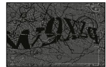
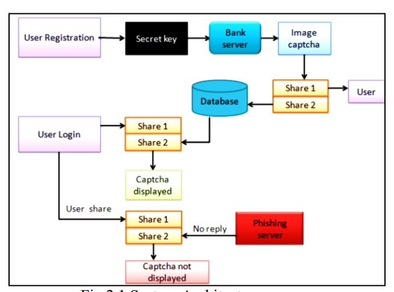
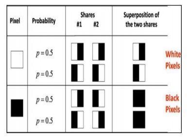
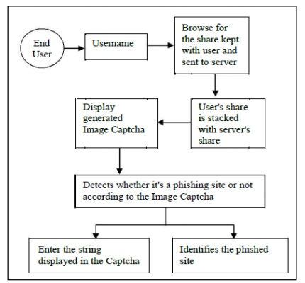
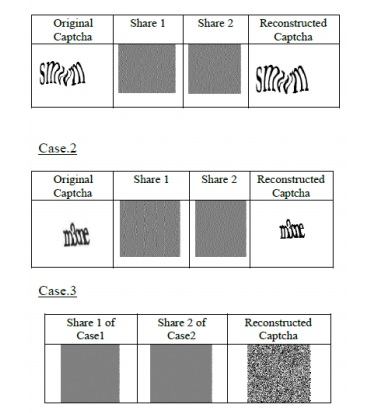

  
  
**تایید رمز عبور کپچا جدا شده با استفاده از رمزنگاری بصری**
  
  

 

  چكيده

 

با ظهور اینترنت، حملات آنلاین مختلفی افزایش‌یافته است و در میان آن‌ها مشهورترین حمله فیشینگ است. فیشینگ تلاشی است توسط یک فرد یا گروه برای به دست آوردن اطلاعات محرمانه شخصی مانند رمز عبور، اطلاعات کارت اعتباری از قربانیان غیر مشکوک برای سرقت هویت، سود مالی و دیگر فعالیت‌های کلاهبردارانه. ما از الگوریتم رمزنگاری بصری برای جداسازی امتیازات استفاده می‌کنیم. 
   
  
  استفاده از رمزنگاری بصری برای حفظ حریم خصوصی یک تصویر کپچا با تجزیه تصویر اصلی کپچا به دو سهم (‏که به عنوان برگ شناخته می‌شوند)‏ که در سرورهای پایگاه‌داده جداگانه ذخیره می‌شوند (‏یکی با کاربر و دیگری با سرور به طوری که تصویر اصلی کپچا را تنها زمانی می توان آشکار کرد که هر دو به طور همزمان در دسترس باشند؛ تصاویر تک‌ تک صفحات هویت تصویر اصلی کپچا را آشکار نمی‌کنند. 
 

 
 

  کلمات کلیدی: رمزنگاری بصری، DES، LSB 
  

   
  

مقدمه 
  

   

  امروزه تراکنش های آنلاین بسیار رایج شده‌اند و حملات مختلفی در پشت آن‌ها وجود دارد. در این نوع از حملات مختلف، فیشینگ به عنوان یک تهدید امنیتی عمده شناخته می‌شود و ایده‌های نوآورانه جدیدی در هر ثانیه با این موضوع به وجود می‌آیند، بنابراین مکانیزم‌های پیشگیرانه نیز باید بسیار موثر باشند. بنابراین امنیت در این موارد بسیار بالا است و نباید به راحتی با پیاده‌سازی قابل پی‌گیری باشد
 
  
 
 تکنیکی برای پردازش یک تصویر ورودی و به دست آوردن خروجی به عنوان فرم بهبود یافته همان تصویر و / یا ویژگی‌های تصویر ورودی است. رمزنگاری بصری (‏VC)‏ روشی برای رمزنگاری یک تصویر مخفی در سهام است، به طوری که انباشته کردن تعداد کافی از سهام، تصویر مخفی را آشکار می‌کند. 
  
  

  
   
  

  واترمارکینگ یک برنامه مهم پردازش تصویر است که برای احراز هویت اسناد کاربر از طریق جایگزاری و پنهان کردن برخی اطلاعات تصدیق شده در پشت یک تصویر، صدا یا تصویر استفاده می‌شود. واترمارکینگ ویدئو شامل تعبیه یک اطلاعات محرمانه در ویدیو است. برای مثال، نمادها یا امضاهای حق کپی اغلب مورد استفاده قرار می‌گیرند. روش واترمارکینگ سنتی معمولا یک تصویر واترمارک کامل را در هر فریم ویدئویی یا در فریم‌های ویدیویی تصادفی جایگزاری می‌کند تا ظاهر یک واترمارک پنهان را به یک ناظر اتفاقی بدهد. امروزه روش کارآمدتر و امن تری برای انجام واترمارکینگ مورد استفاده قرار می‌گیرد. این کار با استفاده از طبقه‌بندی زیر تصویر یعنی فریم های انتخابی تن‌ها شامل تعداد کسری از کل بیت از تصویر واترمارک خواهد بود. واترمارکینگ ويدئو توسط تکنیک تشخیص تغییر صحنه مبتنی بر بلوک که قسمت‌های مختلف یک واترمارک منفرد را در صحنه‌های مختلف یک ویدئو جایگزاری می‌کند، انجام می‌شود. 
  

  
   
  
  

  مجله بین‌المللی علوم مهندسی و محاسبات، مه ۲۰۱۶ 
  

   
   
  
  

  مطالعات قبلي 
  
  

  
   
  

  مطالعات زیادی توسط محققان در مورد توسعه روش‌های جدید کپچا و شکستن آن‌ها انجام شده‌است. کپچا ها در اصل توسط آلتا ویستا توسعه یافتند تا از ارایه URL ها به موتور جستجو جلوگیری کنند [‏ ۶ ] ‏.
   
   این یک کپچا ساده بود که از کاربران می‌خواست یک کلمه انگلیسی تحریف‌شده‌ای را تایپ کنند. کارنگی ملون روش Gimpy را طراحی کرد که یک کلمه از فرهنگ لغت را انتخاب می‌کند و از کاربران می‌خواهد تا آنچه را که به عنوان یک تصویر می‌بینند را پس از ارائه تصویر تحریف‌شده حاوی متن، تایپ کنند [‏ ۷ ]‏.
   
  
   یاهو از نسخه ساده این روش استفاده می‌کند. EZGimpy. اصلاح تصویر EZGimpy شامل شبکه‌های پس‌زمینه، گرادیان‌ها، تغییر شکل‌های غیر خطی، مات سازی و نویز پیکسل می‌باشد. بیشتر انسان‌ها می‌توانند سه کلمه از تصویر تحریف‌شده‌ای را بخوانند، در حالی که برنامه‌های کامپیوتری فعلی نمی‌توانند. 
  

  
   
 

      
       شكل 2) برخي از كلمات كپچا 
    

 

 
 

  که از ضعف عمده سیستم‌های OCR مانند ناتوانی در تشخیص تصاویر با کیفیت پایین استفاده می‌کند [‏ ۸ ]‏. فقط کلمات انگلیسی معمولی بین پنج تا هشت کاراکتر را در بر می‌گیرد. 
  
   
  
  پس چاپ تنها از ۷۰ کلمه استفاده کرد که بسیار کم است. کپچا اثر پس از چاپ ممکن است از بین برود 
احتمال ۱ / ۷۰ است. بنابراین، این روش آن طور که انتظار می‌رود موفق نمی‌شود. 
هات میل یک سرویس رایگان ایمیل توسط شرکت هم‌ کاری مایکروسافت است و یک روش دیگر کپچا استفاده می‌شود [‏ ۱۰ ]‏. یک رشته از کاراکترهای انگلیسی به طور تصادفی انتخاب می‌شوند و پس از اعمال برخی تغییرات، از کاربران خواسته می‌شود تا آنچه را که می‌بینند را تایپ کنند. 
 
  

 

  ii. معماری سیستم
   
  طراحی سیستم درک و جزئیات رویه‌ای لازم برای اجرای سیستم پیشنهادی در مطالعه سیستم را فراهم می‌کند. 
  

  
   
  

      
       شكل 2) معماري سيستم 
    

 
  
 

 iii. اصل طراحی 

 

  تعدادی ویژگی مهم وجود دارد که یک کپچا می‌تواند از خود نشان دهد. این موارد شامل دشواری حل شدن توسط OCR و هر برنامه حمله، تحریف‌های مشترک قابل خواندن، مقاومت در برابر حملات مخرب، حمل بسیاری از اطلاعات، قابلیت هم‌زیستی با دیگر کپچا ها، و نیاز محاسباتی شناختی توسط کاربر است. 
  

  

  اهمیت نسبی این ویژگی‌ها به نوع کپچا بستگی دارد. اصول پشت کپچا به شرح زیر است: 
کاربر با یک تصویر درهم‌ریخته که بر روی آن متنی نمایش داده می‌شود، نشان داده می‌شود. این تصویر توسط سرور با استفاده از متن تصادفی ایجاد می‌شود. کاربر باید حروف مشابه در متن را وارد یک زمینه متنی کند که در فرم برای محافظت نمایش داده می‌شود. 
زمانی که فرم ارسال می‌شود، سرور بررسی می‌کند که آیا متن وارد شده توسط کاربر با متن ایجاد شده اولیه مطابقت دارد یا خیر. اگر این کار را انجام دهد، تراکنش ادامه می‌یابد. در غیر این صورت، پیام خطا نمایش داده می‌شود و کاربر باید کد جدیدی را وارد کند. مشاهده را مورد بهره‌برداری قرار می‌دهد که انسان‌ها هنوز هم در بسیاری از وظایف تشخیص الگو بسیار بهتر از کامپیوترها هستند. 

  

 

  IV. رمزنگاری تصویری 
  

  
   
  
  

  طرح رمزنگاری بصری یک تکنیک رمزنگاری است که اجازه رمزگذاری اطلاعات بصری را می‌دهد به طوری که رمزگشایی می‌تواند با استفاده از سیستم بصری انسان انجام شود. ما می‌توانیم با یکی از طرح‌های ساختار دسترسی زیر به این هدف دست یابیم. 
  

  
   
  

مجله بین‌المللی علوم مهندسی و محاسبات، مه ۲۰۱۶ 

 
   

  ۱. (‏۲، ۲)‏طرح VCS آستانه این یک طرح آستانه ساده است که یک پیام مخفی می‌گیرد و آن را در دو سهم مختلف رمزنگاری می‌کند که تصویر مخفی را زمانی که روی هم می‌افتند آشکار می‌کند. هیچ اطلاعات اضافی برای ایجاد این نوع ساختار دسترسی مورد نیاز نیست. 
  

   
  
  

  ۲. (‏۲، n)‏طرح VCS آستانه - این طرح تصویر مخفی را در n سهم رمزنگاری می‌کند به طوری که وقتی هر دو (‏یا بیشتر)‏سهام روی هم گذاشته می‌شوند، تصویر مخفی آشکار می‌شود. کاربر برای n، تعداد شرکت کنندگان تحریک خواهد شد. 
  

  
   
  
  

  ۳. (‏n، n)‏طرح VCS آستانه - این طرح تصویر مخفی را به n سهم رمزنگاری می‌کند به طوری که وقتی همه n سهم با هم ترکیب شوند، تصویر مخفی آشکار خواهد شد. کاربر برای n، تعداد شرکت کنندگان تحریک خواهد شد. 
  

  
   
  
  

  ۴. (‏k، n)‏طرح VCS آستانه این طرح تصویر مخفی را برای n سهم رمزنگاری می‌کند به طوری که وقتی هر گروه حداقل k سهم کنار گذاشته شود تصویر مخفی آشکار خواهد شد. کاربر برای k، آستانه، و n، تعداد شرکت کنندگان تحریک خواهد شد. 
  

  
  
 
 

  در مورد (‏۲، ۲)‏VCS، هر پیکسل P در تصویر اصلی به دو زیرپیکسل به نام سهام رمزگذاری می‌شود. شکل. توجه داشته باشید که انتخاب سهام برای یک پیکسل سیاه و سفید به طور تصادفی تعیین می‌شود (‏دو انتخاب برای هر پیکسل در دسترس است)‏. هیچ کدام از این سهم‌ها هیچ سرنخی در مورد پیکسل اصلی ارائه نمی‌دهند زیرا پیکسل های مختلف در تصویر مخفی با استفاده از انتخاب‌های تصادفی مستقل رمزگذاری خواهند شد. هنگامی که این دو سهم اضافه می‌شوند، مقدار پیکسل اصلی P را می توان تعیین کرد. اگر P یک پیکسل سیاه باشد، ما دو زیرپیکسل سیاه می‌گیریم؛ اگر پیکسل سفید باشد، یک زیرپیکسل سیاه به دست می‌آوریم. 
  

  
   
  
  

      
    

  IV. روش پیشنهادی 
  

  
   
  
  

  برای تشخیص و پیش‌گیری فیشینگ، ما یک روش جدید برای شناسایی وب سایت فیشینگ ارائه می‌دهیم. روش ما مبتنی بر طرح اعتبارسنجی تصویر ضد فیشینگ کپچا با استفاده از رمزنگاری بصری است. از رمز عبور و دیگر اطلاعات محرمانه از وب سایت‌های فیشینگ جلوگیری می‌کند. 
  
   

  
   
  رویکرد پیشنهادی را می توان به دو مرحله تقسیم کرد: 

 
 
  
   
A. فاز ثبت نام
 
B. فاز ورود به سیستم
 
C. فاز واترمارکینگ 
  

 

  A. فاز ثبت‌نام 
  
    
   

   

  در مرحله ثبت‌نام، یک رشته کلیدی (‏رمز عبور)‏از کاربر در زمان ثبت‌نام برای وب سایت امن درخواست می‌شود. رشته کلید می‌تواند ترکیبی از الفباها و اعداد باشد تا محیطی امن‌تر فراهم کند. این رشته با رشته تولید شده تصادفی در سرور الحاق می‌شود و یک تصویر captcha [‏ ۴ ]‏ [‏ ۵ ]‏ تولید می‌شود. تصویر captcha به دو سهم تقسیم می‌شود به طوری که یکی از سهم با کاربر نگهداری می‌شود و سهم دیگر در سرور نگهداری می‌شود. اشتراک کاربر و تصویر اصلی captcha برای تایید بعدی در طول مرحله ورود به سیستم به کاربر ارسال می‌شود. تصویر captcha همچنین در پایگاه‌داده واقعی هر وب سایت محرمانه به عنوان اطلاعات محرمانه ذخیره می‌شود. پس از ثبت، کاربر می‌تواند رشته کلید را در صورت نیاز تغییر دهد. فرآیند ثبت‌نام در شکل. 
  
  

  
   
  
  
  
 
    
   

   
     شكل 4.1) زماني كه كاربر فرايند ثبت نام را انجام مي دهد 
   

    
    
    
    
 

 B. فاز ورود به سیستم 
 

  
   
  
  

  هنگامی که کاربر با وارد کردن اطلاعات محرمانه خود برای استفاده از حساب کاربری وارد سیستم می‌شود، در ابتدا از کاربر خواسته می‌شود تا نام کاربری خود (‏شناسه کاربر)‏را وارد کند. این اشتراک به سرور فرستاده می‌شود که در آن اشتراک و اشتراک کاربر که در پایگاه‌داده وب سایت برای هر کاربر ذخیره می‌شود، برای تولید کپچا تصویر روی هم انباشته می‌شود. تصویر captcha برای کاربر نمایش داده می‌شود. کاربر نهایی باید متن نمایش‌داده‌شده در کپچا تصویر را وارد کند و این می‌تواند به هدف رمز عبور خدمت کند و با استفاده از این، کاربر می‌تواند وارد وب سایت شود. با استفاده از نام کاربری و کپچا تصویر تولید شده توسط انباشت دو سهم، می توان تایید کرد که آیا وب سایت واقعی / امن است یا یک وب سایت فیشینگ و همچنین می‌تواند تایید کند که آیا کاربر انسان است یا خیر. این فاز در شکل. 
  

  
   
  
  
  

              
              
 

      
       شكل 4.2) وقتی کاربر سعی می کند وارد سایت شود 
    

 
 
 
 
   
             
 

  C. فاز علامت گذاري 
  

  
   
  
  

  ماژولها
  

  
   
  
  

  I) ماژول ورودي:
  

   
   

II) ماژول رمز گذاري:

  <br/
      
 

1.انتخاب secret file
   
۲. فایل جلد (‏ویدئو، صوتی)‏را انتخاب کنید،
   
۳.  انتخاب save location
   
۴. گذرواژه را وارد کنید
 
۵. انتخاب Done 
  
  

  
  
  
  

 III: ماژول رمزگشایی 
  

 

  
  

 I) ‏ماژول ورودی: 
  

  
1-select encryption  
2- Select save location   
3-Enter password  
4-select done   

 

 شرح ماژول
  

 

I) ‏ماژول ورودی: 

 

  ماژول ورودی به گونه‌ای طراحی شده‌است که سیستم پیشنهادی باید قادر به رسیدگی به هر نوع فرمت داده باشد، مانند اگر کاربر بخواهد هر فرمت تصویری را پنهان کند، پس باید با تمام فرمت های معمول تصویر مانند jpg، gif، bmp سازگار باشد، همچنین باید با فرمت های ویدئویی مانند. ماژول ورودی به گونه‌ای طراحی شده‌است که سیستم پیشنهادی باید قادر به رسیدگی به هر نوع فرمت داده باشد، مانند اگر کاربر بخواهد هر فرمت تصویری را پنهان کند، پس باید با تمام فرمت های معمول تصویر مانند jpg، gif، bmp سازگار باشد، همچنین باید با فرمت های ویدئویی مانند. و همچنین باید با فرمت های مختلف اسناد سازگار باشد، به طوری که کاربر بتواند هر فرمتی را برای پنهان کردن داده‌های محرمانه استفاده کند. 
  

 

  II)‏ماژول رمزنگاری: 
  

   
  
  

  
  در ماژول رمزنگاری، از بخش فایل کلید تشکیل شده‌است، که در آن فایل کلید را می توان با رمز عبور به عنوان یک امنیت خاص در آن مشخص کرد. سپس کاربر می‌تواند داده‌ها را تایپ کند یا در غیر این صورت می‌تواند داده‌ها را آپلود کند اگرچه دکمه فهرست زمانی که کلیک می‌شود دیالوگ باکس باز فایل باز باز می‌شود و کاربر می‌تواند پیام مخفی را انتخاب کند. سپس کاربر می‌تواند انتخاب کند.
  

  
   
  
  

  فایل تصویری یا تصویری از طریق یک دیالوگ باکس باز دیگر که زمانی که روی دکمه کاور فایل کلیک می‌شود باز می‌شود. جایی که کاربر می‌تواند فایل پوششی را انتخاب کند و سپس دکمه مخفی کردن کلیک می‌شود تا اطلاعات مخفی یا پیام در فایل پوششی با استفاده از تکنیک مخفی کردن داده منطقه ممنوعه پنهان شود. 
  

 

III) ماژول رمزگشایی:  
  

  
  
  

  این ماژول برخلاف ماژول رمزگذاری است که در آن فایل کلید باید همانند بخش رمزنگاری مشخص شود. سپس کاربر باید فایل پوششی رمزگذاری شده را انتخاب کند و سپس دکمه استخراج را انتخاب کند تا پیام مخفی در ناحیه متنی مشخص‌شده در برنامه نمایش داده شود یا در جایی که کاربر آن را مشخص می‌کند، استخراج شود. 
  

 

  V. پياده سازي تجزيه تحليل و نتايج
  

 

  
  روش پیشنهادی اجرا می‌شود. شکل ۵.۱، نتیجه ایجاد و انباشته کردن سهام را نشان می‌دهد. در مرحله ثبت، مهم‌ترین بخش، ایجاد سهام در تصویر captcha است که در آن یک سهم با کاربر نگهداری می‌شود و سهم دیگر را می توان با سرور نگهداری کرد. برای ورود به سیستم، کاربر باید نام کاربری معتبری را در این زمینه وارد کند. سپس او باید سهم و فرآیند خود را مرور کند. در سمت سرور، اشتراک کاربر با اشتراک در سرور ترکیب می‌شود و یک تصویر کپچا تولید می‌شود. کاربر باید متن را از تصویر captcha در فیلد مورد نیاز برای ورود به وب سایت وارد کند.. کل فرآیند در شکل 5.1 به صورت متفاوت به تصویر کشیده شده است موارد. مورد 1 و مورد 2 ایجاد و انباشته کردن را نشان می دهد اشتراک های دو تصویر کپچا در نتیجه اصلی است .
  

 

                
 

      
       شكل 5.1) پياده سازي روش پيشنهادي 
    

    

   

  
  دامنه پروژه
   
  
  با استفاده از رمزنگاری تصویری، کاربر می‌تواند به طور ایمن وارد سیستم شود. کاربر نامعتبر قادر به ورود به سایت نخواهد بود. اطلاعات شخصی و محرمانه امن خواهند بود. در این حالت، کاربر منتظر یک دوره زمانی برای دریافت کپچا بازسازی‌شده خواهد بود. اگر کاربر کپچا درست یا کپچا نادرست را دریافت نکند، قادر به ورود به سیستم نخواهد بود. پس از ورود به سیستم، کاربر قادر خواهد بود داده‌ها را در ویدئو رمز گذاری کند تا داده‌ها را به شکل امن نگه دارد. 
  

