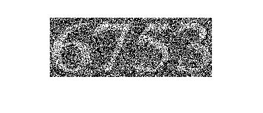

## پاسخ تمرین دهم :
### بدون استفاده از دستورات متلب یک کپچای تصویری را بکشید؛ اعداد را با تابع عدد تصادفی ایجاد کنید و سپس با توجه به اعداد بدست آمده برای هر یک در تصویر پیکسل های مورد نظر را رسم کنید؛ تصویر باینری باشد و اعداد رنگ سفید و پیش زمینه رنگ مشکی داشته باشد.

<div dir="rtl">
1. ده تصویر مربوط به اعداد رادر که از قبل آماده شده را فراخوانی کرده ودر یک  لیست struct قرار می دهیم
</div>

````
picList=dir('10\number\*.png');
````
<div dir="rtl">
2. در يك متغيير تعداد اعداد مورد نياز قابل درج در خروجي را قرار مي دهيم
و یک نصویر خالی با همان میزان ایجاد می کنیم
  و یک لیست struct خالی به تعداد ایجاد می کنیم
</div>

````
tedad =4;
capchaPic=zeros(100,68*tedad,'uint8');
tempPicList=struct('name',{});
````
<div dir="rtl">
3. در یک حلقه به تعداد اولیه عدد اتفاقی ایجاد کرده و تصویر متناظر با آن را در لیست موقت ایجاد شده را قرار می دهیم.
</div>

````
for i=1 : tedad
    x=randi([1,10]);
    tempPicList(i).name = picList(x).name;
end
````
<div dir="rtl">
4. در حلقه ای تصاویر مشخص شده را در تصویر نهایی قرار می دهیم
</div>

````
for i=1 :tedad
    tempPic=imread(tempPicList(i).name);
    tempPic =rgb2gray(tempPic);
    
        for xi=1: 68
            for yi=1 : 100
                capchaPic(yi,(i*68)-67+xi)=tempPic(yi,xi);
            end
        end
    
end
````
<div dir="rtl">
5. ایجاد نویز
برای این کار یک عددی را به عنوان میزان نویز قرار می دهیم.
یک عدد اتفاقی بین 0 تا 255 در یک آرایه به اندازه طول و عرض تصویر قرار می دهیم
و در مرحله اول تمام نقاطی که دارای مقدار کمتر از عدد مشخص شده باشند مشکی شده
  و در مرحله بعد تمامی نقاطی که به میزان عدد تعیین شده از 255 کمتر هستند سفید می شوند
</div>

````
picSize=size(capchaPic); 
noise=90;

x = randi([0,255],picSize(1),picSize(2));
capchaPic(x <= noise+0) = 0;  
capchaPic(x >=255-noise) = 255;
````
<div dir="rtl">
6. در پایان تصویر نهایی نمایش داده میشود
</div>

````
imshow(capchaPic);
````



````
clc;
clear;
close all;

picList=dir('10\number\*.png');

tedad =4;

capchaPic=zeros(100,68*tedad,'uint8');
tempPicList=struct('name',{});

for i=1 : tedad
    x=randi([1,10]);
    tempPicList(i).name = picList(x).name;
end

for i=1 :tedad
    tempPic=imread(tempPicList(i).name);
    tempPic =rgb2gray(tempPic);
    
        for xi=1: 68
            for yi=1 : 100
                capchaPic(yi,(i*68)-67+xi)=tempPic(yi,xi);
            end
        end
    
end

%noise
picSize=size(capchaPic); 
noise=90;

x = randi([0,255],picSize(1),picSize(2));
capchaPic(x <= noise+0) = 0;  
capchaPic(x >=255-noise) = 255;

imshow(capchaPic);
````
