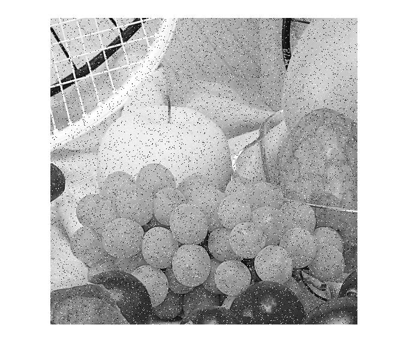

## پاسخ تمرین یازده :
### بدون استفاده از دستورهای آماده ی متلب نویز فلفل نمکی را روی چند تصویر ایجاد کنید.

````
clc;
clear;
close all;

orginalPic=imread('fruits.png');  
orginalPic=rgb2gray(orginalPic);
picSize=size(orginalPic); 

noise=6;
peppersColor=0;
saltColor=255;

x = randi([0,255],picSize(1),picSize(2));
orginalPic(x <= noise+0) = peppersColor;  
orginalPic(x >=255-noise) = saltColor;
imshow(orginalPic);
````

<div dir="rtl">
1. درمرحله تصویرمورد نظر را خوانده و در یک متغییر قرار می دهیم. سپس آن را به خاکستری تبدیل کرده و اندازه تصویر را در یک متغییر دیگر ذخیره می کنیم.
</div>

````
orginalPic=imread('fruits.png');  
orginalPic=rgb2gray(orginalPic);
picSize=size(orginalPic); 
````
<div dir="rtl">
2. یک متغییر جهت تعیین میزان نویز مشحص می گنیم
</div>

````
noise=6;
````
<div dir="rtl">
  3.با ایجاد دومتغییر یکی برای میزان رنگ نقاط فلفل و یکی برای رنگ نقاط نمکی تعیین می کنیم.
</div>

````
peppersColor=0;
saltColor=255;
````
<div dir="rtl">
4.یک ماتریس به اندازه تصویر خود ایجاد میکنیم که تمام خانه های آن با عددی بین 0 تا 255  به صورت رندوم مقدار دهیشده است
</div>

````
x = randi([0,255],picSize(1),picSize(2));
````
<div dir="rtl">
5. در این مرجله تمام نقاط در ماترس رندوم ما به اندازه نویز با مشکی فاصله دارد را به در تصویر اصلی به رنگ فلفل و هرکدام که به میزان نویز کمتر از سفید میباشد را به رنگ نمک تغییر می دهیم.
</div>

````orginalPic(x <= noise+0) = peppersColor;  
orginalPic(x >=255-noise) = saltColor;
````
<div dir="rtl">
6. در پایان تصویر نهایی نمایش داده میشود
</div>

````
imshow(orginalPic);
````


