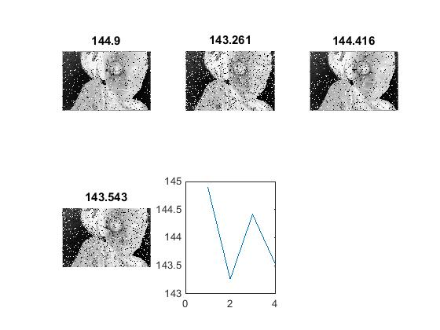

## پاسخ تمرین سیزده :
### روی یک تصویر نگاتیو نویز فلفل نمکی را با اعداد مختلف امتحان کنید و میانگین تمام پیکسل های آن را در یک جدول خروجی دهید.

````
clc;
clear;
close all;

orginalPic=imread('girl.png');

x=size(size(orginalPic),2);
if x==3
    grayPic=rgb2gray(orginalPic);
else
    grayPic=orginalPic;
end

picSize=size(grayPic);

%negativePic
negativePic = 255 - grayPic;

%noise
tedad=4;
for i=1 : tedad
noisPic=negativePic;
noise=randi([1,30]);

x = randi([0,255],picSize(1),picSize(2));
noisPic(x <= noise+0) = 0;  
noisPic(x >=255-noise) = 255;
average(i)=sum(noisPic(:))/(picSize(1)*picSize(2));

    subplot(2,3,i);
    imshow(noisPic),title(average(i));
end

    
    subplot(2,3,tedad+1);
    plot(average);
    
xlswrite('average.xls',average);
````

<div dir="rtl">
1. درمرحله تصویرمورد نظر را خوانده و در یک متغییر قرار می دهیم. سپس  و اگر رنگی بود آن را به خاکستری تبدیل کرده و اندازه تصویر را در یک متغییر دیگر ذخیره می کنیم.
</div>

````
orginalPic=imread('girl.png');
x=size(size(orginalPic),2);
if x==3
    grayPic=rgb2gray(orginalPic);
else
    grayPic=orginalPic;
end

picSize=size(grayPic);
````
<div dir="rtl">
2. تصویر رو نگاتیو میکنیم
</div>

````
negativePic = 255 - grayPic;
````
<div dir="rtl">
  3.با ایجاد یک متغییر تعداد ایجاد نویز را مشخص میکنیم. و با ایجاد یک حلقه به یک میزان رندوم میزان نویز را مشخص می کنیم و  سپس تا کد تمرین 11 نویز راایجاد میکنیم.
</div>

````
tedad=4;
for i=1 : tedad
noisPic=negativePic;
noise=randi([1,30]);

x = randi([0,255],picSize(1),picSize(2));
noisPic(x <= noise+0) = 0;  
noisPic(x >=255-noise) = 255;
````
<div dir="rtl">
4. متغییری برای ذخیره میانگین ها قرار می دهیم و در هر مرحله میانگین اعداد در اندیس مربوطه ذخیره می شود
</div>

````
average(i)=sum(noisPic(:))/(picSize(1)*picSize(2));
````

<div dir="rtl">
5. در پایان تصویر نهایی نمایش داده میشود
</div>

````
    subplot(2,3,i);
    imshow(noisPic),title(average(i));
````
<div dir="rtl">
6. در پایان تصویر نهایت میزان میانگین ها در جدول اکسل خروجی داده می شود.
</div>

````
xlswrite('average.xls',average);
````

