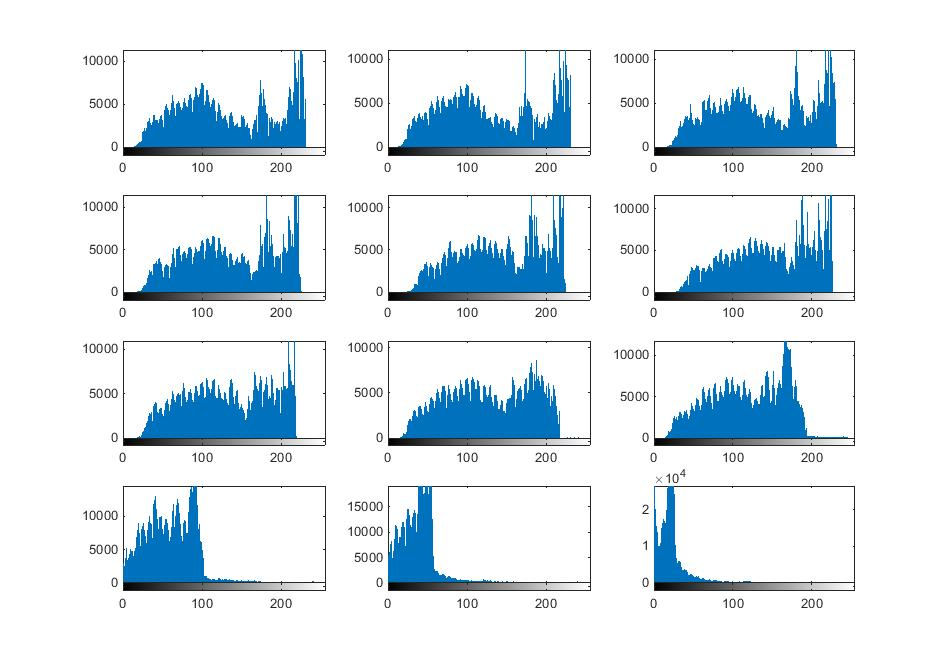

## پاسخ تمرین چهارده :
### یک دیتاست تصویری از 12 ساعت مختلف یک شبانه روز ایجاد کنید و این تصاویر را به grayscale تبدیل کنید و هیستوگرام هر کدام را با یکدیگر مقایسه کنید.

````
clc;
clear;
close all;

picList=dir('14\view\*.jpg');

tedad =size(picList,1);

for i=1 :tedad
    tempPic=imread(picList(i).name);
    tempPic =rgb2gray(tempPic);
    
    subplot(4,3,i);
    imhist(tempPic);
end
````

<div dir="rtl">
1. درمرحله  اول کلیه تصاویر که در یک پوشه قرار دارد را خوانده ولی در یک مهسف قرار می دهیم.
</div>

````
picList=dir('14\view\*.jpg');

````
<div dir="rtl">
2. تعداد تصاویر را مشخص میکنیم
</div>

````
tedad =size(picList,1);
````
<div dir="rtl">
 3. در یک حلقه با تعداد تصاویر تصاویر خواندهشدهوو به خاکستری تبدیل می کنیم.
</div>

````
for i=1 :tedad
    tempPic=imread(picList(i).name);
    tempPic =rgb2gray(tempPic);
````
<div dir="rtl">
4. هیستوگرام ها روکنار یک دیگر نمایش می دهیم
</div>

````
    subplot(4,3,i);
    imhist(tempPic);
````

<div dir="rtl">
5. در پایان تصویر نهایی نمایش داده میشود
</div>

````
    subplot(2,3,i);
    imshow(noisPic),title(average(i));
````


