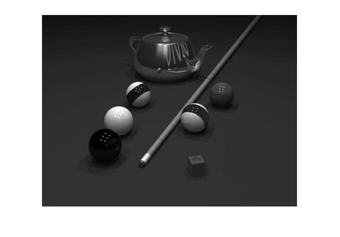

## پاسخ تمرین پانزده :
### ابتدا تصویر pool.png را به grayscale تبدیل کنید و سپس توپ زرد را از تصویر حذف کنید..

````
clc;
clear;
close all;


image = imread('pool.png');
image=rgb2gray(image);

startX=350;
startY=230;

setColor=48;
telorance=2;

for x=1:110
    for y=1 : 110
        if image(startY+y,startX+x)>setColor+telorance;
            image(startY+y,startX+x)=setColor;
        else if image(startY+y,startX+x)<setColor-telorance;
                image(startY+y,startX+x)=setColor;
            end
        end
    end
end

imshow(image);
````

<div dir="rtl">
1. در مرحله اول تصویر خوانده شده و خاکستری می شود
</div>

````
image = imread('pool.png');
image=rgb2gray(image);
````
<div dir="rtl">
2. یک نقطه به عنوان نفطه اول سمت چپ بالا توپ می باشد.
</div>

````
startX=350;
startY=230;
````
<div dir="rtl">
  3.در این مرجله دو متغییر تعریف کرده. یکی به عنوان رنگ زمینه و عدد دوم به عنوان میزان اختلاف آن قرار می دهیم.
</div>

````
setColor=48;
telorance=2;
````
<div dir="rtl">
4. در دو حلقه تودر تو به میزان 110 خانه در صورتی که میزان آن خانه کمتر از عدد مورد نظر باشد به رنگ زمینه تغییر میکند
</div>

````
for x=1:110
    for y=1 : 110
        if image(startY+y,startX+x)>setColor+telorance;
            image(startY+y,startX+x)=setColor;
        else if image(startY+y,startX+x)<setColor-telorance;
                image(startY+y,startX+x)=setColor;
            end
        end
    end
end
````

<div dir="rtl">
5. در پایان تصویر نهایی نمایش داده میشود
</div>

````
imshow(image);
````


