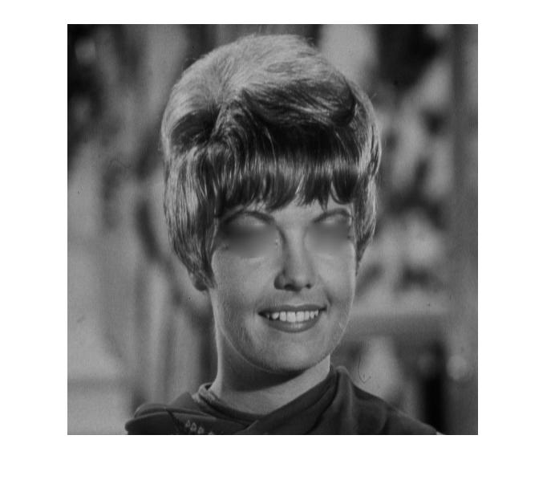

## پاسخ تمرین شانزده :
### چشم های تصویر zelda.png را حذف کنید.

````
clc;
clear;
close all;

image = imread('zelda.png');

startX=300;
startY=247;

for w=1:50
for i=1:50
    for j=1 : 40
        x=startX+i;
        y=startY+j;

        sS=[image(y-1,x-1),image(y-1,x),image(y-1,x+1),image(y,x+1),image(y+1,x+1),image(y+1,x),image(y+1,x-1),image(y,x-1)];
        sumx=sum(sS);
        
        image(y,x)=round(sum(sS)/8);

    end
end
end


startX=200;
startY=250;

for w=1:50
for i=1:60
    for j=1 : 40
        x=startX+i;
        y=startY+j;

        sS=[image(y-1,x-1),image(y-1,x),image(y-1,x+1),image(y,x+1),image(y+1,x+1),image(y+1,x),image(y+1,x-1),image(y,x-1)];
        sumx=sum(sS);
        
        image(y,x)=round(sum(sS)/8);

    end
end
end

imshow(image);
````

<div dir="rtl">
1. در مرحله اول تصویر خوانده شده
</div>

````
image = imread('zelda.png');
````
<div dir="rtl">
2. یک نقطه به عنوان نفطه اول سمت چپ بالا چشم می باشد.
</div>

````
startX=300;
startY=247;
````
<div dir="rtl">
  3.در این مرحله به تداد دلخواه وبه اندازه حدودی چشم میزان هر خانه به میانگین خانه های اطرافش تغییر میکند .
</div>

````
for w=1:50
for i=1:50
    for j=1 : 40
        x=startX+i;
        y=startY+j;

        sS=[image(y-1,x-1),image(y-1,x),image(y-1,x+1),image(y,x+1),image(y+1,x+1),image(y+1,x),image(y+1,x-1),image(y,x-1)];
        sumx=sum(sS);
        
        image(y,x)=round(sum(sS)/8);

    end
end
end
````
<div dir="rtl">
  4. برای چشم دوم هم مراحل را انجام می دهیم
</div>

````
startX=200;
startY=250;

for w=1:50
for i=1:60
    for j=1 : 40
        x=startX+i;
        y=startY+j;

        sS=[image(y-1,x-1),image(y-1,x),image(y-1,x+1),image(y,x+1),image(y+1,x+1),image(y+1,x),image(y+1,x-1),image(y,x-1)];
        sumx=sum(sS);
        
        image(y,x)=round(sum(sS)/8);

    end
end
end
````

<div dir="rtl">
5. در پایان تصویر نهایی نمایش داده میشود
</div>

````
imshow(image);
````


