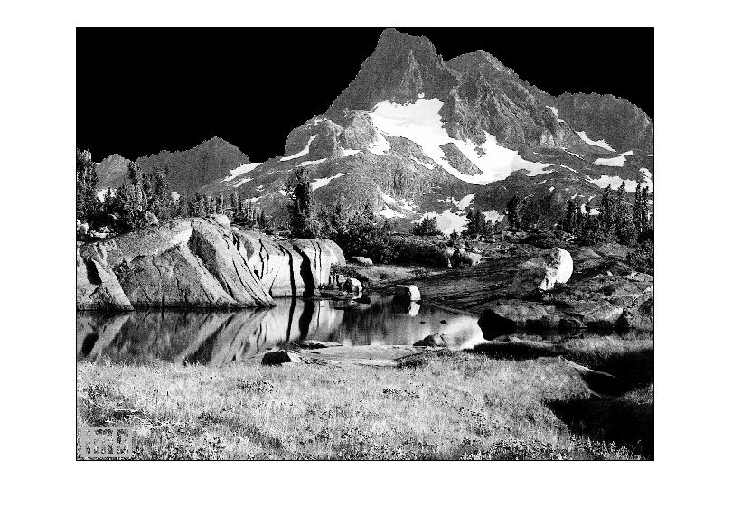

## پاسخ تمرین هفده :
### آسمان تصویر mountain.png را سیاه رنگ کنید.

````
clc;
clear;
close all;

image = imread('mountain.png');

setColor=200;

for x=1:639
    for y=1 : 150
        if image(y,x)>setColor;
            image(y,x)=0;
        end
        if image(y+1,x)<setColor;
            break;
        end
    end
end

imshow(image);
````

<div dir="rtl">
1. در مرحله اول تصویر خوانده شده
</div>

````
image = imread('mountain.png');
````
<div dir="rtl">
2. یک مقدار به عنوان حد روشنایی آسمان در نظر گرفته می شود.
</div>

````
setColor=200;
````

<div dir="rtl">
  3.در این مرحله یک حلقه تو در ت برای پیمایش تصویر تعریف می کنیم که حلقه اول جهت حرکت در عرض تصویر و حلقه دوم برای حرکت در ارتفاع می باشد .
</div>

````
for x=1:639
    for y=1 : 150


    end
end
````
<div dir="rtl">
  4.  برای سیاه کردن آسمان از دو شرط استفاده میکنیم. در شرط اول اگر پیکسل انتخاب شده از حد تعیین شده بزرگتر بود، آن پیکسل سیاه می شود و در شرط دوم اگر خانه بعدی در ارتفاع از حد آسمان خارج باشد به معنی پایان بوده و حلقه داخلی را لغو و وارد ردیف بعد می شود.
</div>

````
        if image(y,x)>setColor;
            image(y,x)=0;
        end
        if image(y+1,x)<setColor;
            break;
        end
````

<div dir="rtl">
5. در پایان تصویر نهایی نمایش داده میشود
</div>

````
imshow(image);
````


