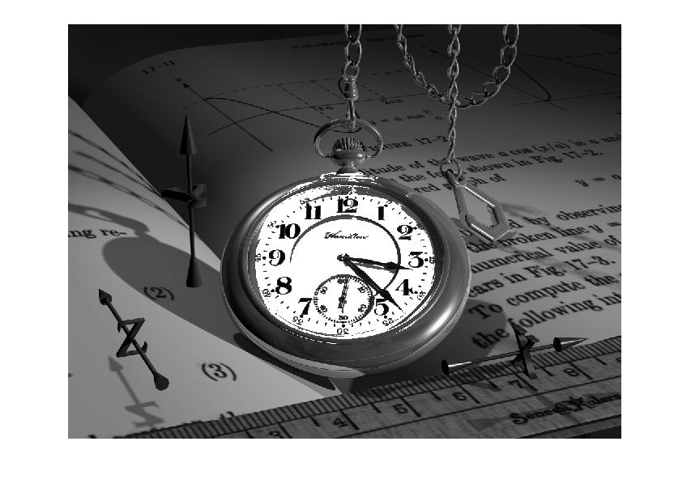

## پاسخ تمرین هجده :
### سعی کنید صفحه ی ساعت تصویر watch.png را کاملا سفید کنید.

````
clc;
clear;
close all;

image = imread('watch.png');
image=rgb2gray(image);

r=168;
y=442;
x=515;

for j=r:-1:1
for i=1 : 0.01: 365
    ci=  round((j*cosd(i))+y);
    si= round((j*sind(i))+x);
    if image(ci,si)>85
    image(ci,si)=255;
    end
end
end

imshow(image);
````

<div dir="rtl">
1. در مرحله اول تصویر خوانده شده به خاکستری تبدیل می کنیم
</div>

````
image = imread('watch.png');
image=rgb2gray(image);
````
<div dir="rtl">
2. با فرض دایره بودن صفحه ساعت سه عدد به عنوان شعاع دایده و مرکز دایره انتخاب می کنیم.
</div>

````
r=168;
y=442;
x=515;
````

<div dir="rtl">
  3.در این مرحله یک حلقه تو در تو برای پیمایش دایره استفاده کرده و هر خانه که مقدار بیشتر از 85 داشته باشد را سفید می کنیم .
</div>

````
for j=r:-1:1
for i=1 : 0.01: 365
    ci=  round((j*cosd(i))+y);
    si= round((j*sind(i))+x);
    if image(ci,si)>85
    image(ci,si)=255;
    end
end
end
````


<div dir="rtl">
4. در پایان تصویر نهایی نمایش داده میشود
</div>

````
imshow(image);
````


