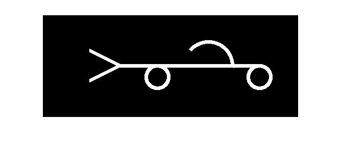

## پاسخ تمرین بیست :
### با دستورات ساده ی متلب سعی کنید اسم خودتان را با کلمات فارسی در یک تصویر ایجاد کنید. استفاده از توابع آماده ی رسم کاراکترها در این تمرین مجاز نیست.

````
clc;
clear;
close all;

namePic=zeros(200,500,'uint8');

for i=150 : 425
    for j=97 : 103
        namePic(j,i)=255;     
    end
end

y=122;
x=425;
for j=19:25
for i=1 : 0.01: 8
    ci=  round((j*cos(i))+y);
    si= round((j*sin(i))+x);
    namePic(ci,si)=255;
end
end
    
y=122;
x=225;
for j=19: 25
for i=1 : 0.01: 8
    ci=  round((j*cos(i))+y);
    si= round((j*sin(i))+x);
    namePic(ci,si)=255;
end
end

y=100;
x=325;
for j=44:50
for i=1.5 : 0.01: 4
    ci=  round((j*cos(i))+y);
    si= round((j*sin(i))+x);
    namePic(ci,si)=255;
end
end
size=60;
start=[100-(size/2),60+(size/2)];
y=start(1);
for x =1 :(size/2)
          for j=-3:3
             namePic(start(1)+size-x+j,start(2)+2*x)=255;
             namePic(start(1)+size-x+j,start(2)+(2*x)+1)=255;
          
          
             namePic(y+j,start(2)+2*x)=255;
             namePic(y+j,start(2)+(2*x)+1)=255;
          end
          y=y+1;    
   
end

imshow(namePic);
````

<div dir="rtl">
1. یک تصویر خالی به اندازه دلخواه ایجاد می کنیم
</div>

````
namePic=zeros(200,500,'uint8');
````
<div dir="rtl">
2. یک خط در میانه میدان رسم می کنیم
</div>

````
for i=150 : 425
    for j=97 : 103
        namePic(j,i)=255;     
    end
end
````

<div dir="rtl">
  3.با یک حلقه تو در تو یک دایره به قطر خط ایجاد شده برای رسم دایره میم اول رسم می کنیم
</div>

````
y=122;
x=425;
for j=19:25
for i=1 : 0.01: 8
    ci=  round((j*cos(i))+y);
    si= round((j*sin(i))+x);
    namePic(ci,si)=255;
end
end
````
<div dir="rtl">
  4.با یک حلقه تو در تو یک دایره به قطر خط ایجاد شده برای رسم دایره میم دوم رسم می کنیم
</div>

````
y=122;
x=225;
for j=19: 25
for i=1 : 0.01: 8
    ci=  round((j*cos(i))+y);
    si= round((j*sin(i))+x);
    namePic(ci,si)=255;
end
end
````
<div dir="rtl">
  5.با یک حلقه تو در تو یک منحنی رسم کرده و ح را رسم می کنیم
</div>

````
y=100;
x=325;
for j=44:50
for i=1.5 : 0.01: 4
    ci=  round((j*cos(i))+y);
    si= round((j*sin(i))+x);
    namePic(ci,si)=255;
end
end
````
<div dir="rtl">
  6.با یک حلقه تو در تو دو خط اریب برای حرف د رسم می کنیم
</div>

````
size=60;
start=[100-(size/2),60+(size/2)];
y=start(1);
for x =1 :(size/2)
          for j=-3:3
             namePic(start(1)+size-x+j,start(2)+2*x)=255;
             namePic(start(1)+size-x+j,start(2)+(2*x)+1)=255;
          
          
             namePic(y+j,start(2)+2*x)=255;
             namePic(y+j,start(2)+(2*x)+1)=255;
          end
          y=y+1;    
   
````
<div dir="rtl">
7. در پایان تصویر نهایی نمایش داده میشود
</div>

````
imshow(image);
````


