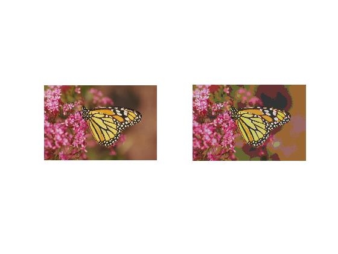

## پاسخ تمرین بیست و یک :
### رنگ های موجود در یکی از تصاویر benchmark را به انتخاب خودتان به safe color تبدیل کنید.

````
clc;
clear;
close all;

image = imread('girl.png');
result=image;

for k =1 :3
result(:,:,k)=fix(image(:,:,k)/51)*51;
end

subplot(1,2,1); imshow(image);
subplot(1,2,2);imshow(result);
````

<div dir="rtl">
1. در مرحله اول تصویر خوانده شده و یک متغییر دیگر یک برابر تصویر قرار می دهیم.
</div>

````
image = imread('girl.png');
result=image;
````
<div dir="rtl">
2. در یک حلقه سه تایی برای هر کانال رنگ تمام خانه های تصویر نتیجه را مساوی نقطه مشابه در تصویر اصلی تقسیم بر 51 که به سمت صفر روند شده است قرار می دهیم.
</div>

````
for k =1 :3
result(:,:,k)=fix(image(:,:,k)/51)*51;
end
````
<div dir="rtl">

3. در پایان تصویر نهایی نمایش داده میشود
</div>

````
imshow(image);
````


