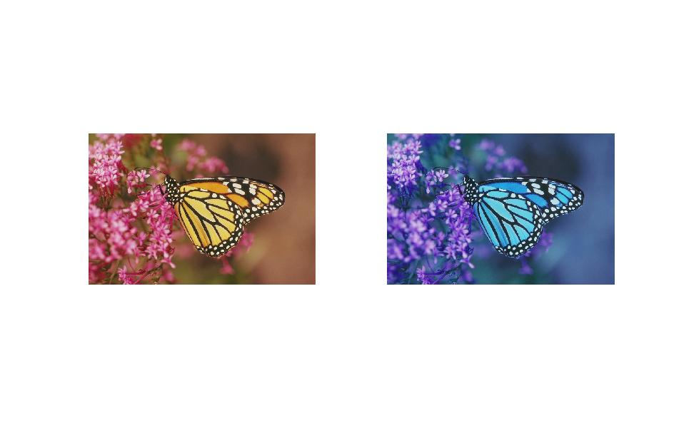

## پاسخ تمرین بیست و دو :
### کانال رنگی آبی و قرمز یک تصویر را با هم جابجا کنید و خروجی را نمایش دهید.

````
clc;
clear;
close all;

image = imread('monarch.png');
subplot(1,2,1); imshow(image);

tempImage= image(:,:,1);
image(:,:,1) = image(:,:,3);
image(:,:,3)=tempImage;

subplot(1,2,2); imshow(image);
````

<div dir="rtl">
1. در مرحله اول تصویر خوانده شده و نمایش داده می شود.
</div>

````
image = imread('girl.png');
result=image;
````
<div dir="rtl">
2.یک متغییر موقع تعریف و کانال قرمز تصویر را در آن قرار می دهیم.
</div>

````
tempImage= image(:,:,1);
````
<div dir="rtl">
3.کانال آبی تصویراصلی را جایگزین کانال قرمز می کنیم.
</div>

````
image(:,:,1) = image(:,:,3);
````
<div dir="rtl">
4.اطلاعات منتقل شده به متغییر موقت را به کانال آبی تصویر منتقل می کنیم.
</div>

````
image(:,:,3)=tempImage;
````
<div dir="rtl">

5. در پایان تصویر نهایی نمایش داده میشود
</div>

````
subplot(1,2,2); imshow(image);
````


