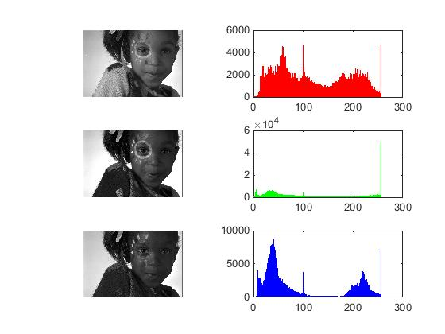

## پاسخ تمرین بیست و سه :
### بدون استفاده از توابع آماده ی متلب هیستوگرام هر یک از کانال های رنگی یکی از تصاویر را به صورت جداگانه محاسبه کنید. کدهای هیستوگرام را تبدیل به یک تابع در فایل جداگانه کنید و برای هر سه کانال رنگی آن را فراخوانی کنید.
````
clc;
clear;
close all;

pic = imread('girl.png');

color=['r','g','b'];

x=1;
for i=1 : 3
histo=rgbHisto(pic(:,:,i));

subplot(3,2,x); imshow(pic(:,:,i));
subplot(3,2,x+1); bar(histo,color(i));
x=x+2;
end


function [Histo] = rgbHisto( colorChanel )

    for i=0 : 255
        Histo(i+1)=sum(colorChanel(:)==(i));
    end

end

````

<div dir="rtl">
1. در مرحله تصویر خوانده شده و در یک متغییر قرار می گیرد.
</div>

````
pic = imread('girl.png');
````
<div dir="rtl">
2.یک حلقه 3 تایی برای انجام هر یک از کانال ها ایجاد می کنیم و در مرحله یک کانال رنگی را در تابع فراخوانی می کنیم.
</div>

````
for i=1 : 3
histo=rgbHisto(pic(:,:,i));
````
<div dir="rtl">
  3.از سایر دستورا هم برای نمایش خروجی ها استفاده می کنیم
</div>

````
color=['r','g','b'];
x=1;
subplot(3,2,x); imshow(pic(:,:,i));
subplot(3,2,x+1); bar(histo,color(i));
x=x+2;
end
````

<div dir="rtl">
4. در تابع ایجاد شده به نام rgbhisto یک کانال رنگی به عنوان وروردی وارد شده و یک آرایه به عنوان اعداد هیستوگرام خروجی داده می شود.
</div>

````
function [Histo] = rgbHisto( colorChanel )
````
<div dir="rtl">
5. در تابع یک حلقه 256 تایی از 0 تا 255 ایجاد می کنیم تا تمامی طیف را پوشش دهد. و در هر مرحیه کلیه خانه های ماتریس تصویر هر جا که برابر شمارنده حلقه باشد شمارش و در خانه مربوطه ذخیره می شود
</div>

````
    for i=0 : 255
        Histo(i+1)=sum(colorChanel(:)==(i));
    end

````

