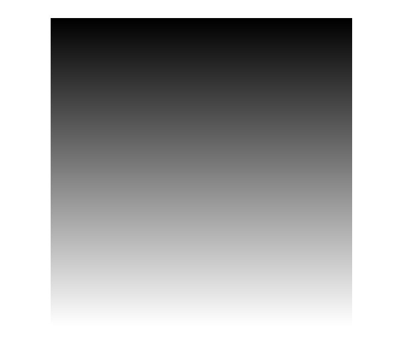

## پاسخ تمرین ششم :
### یک تصویر راه راه بسازید که از سمت بالا سیاه کامل و پایین آن سفید باشد.

````
clc;
clear;
close all;

w=1000;
image=zeros(w,20,'uint8');
step=round(w/255);

for c=1:256
    for y=(c*step)-step+1:step*c
        for  x=1:w
        image(y,x)=c-1;
        end
    end
end

imshow (image);
````

<div dir="rtl">
1. درمرحله اول متغييري را جهت مشخص كردن اندازه تصوير قرار ميديم.
</div>

````
w=1000;
````
<div dir="rtl">
2. یک تصویر با مقدار اولیه صفر (مشکی) به طول عرض دلخواه ايجادميكنيم
</div>

````
image=zeros(w,20,'uint8');
````
<div dir="rtl">باتوجه به اندازه انتخاب شده و تعداد رنگ طيف خاكستري ار تفاع هريك از رديف ها را مشخص مي كنيم.
</div>

````
step=round(w/255);
````
<div dir="rtl">
4.  باتوجه به مراحل قبل سه حلقه تودر تو ايجاد مي كنيم. حلقه اول براي تغيير رنگ هر مرحله. حلقه دوم براي حركت عمودي و پيمايش  سطر  ها و حلقه آخر جهت  حركت افقي و تغيير مقدار تصوير نهايي مي باشد
</div>

````
  for c=1:256
    for y=(c*step)-step+1:step*c
        for  x=1:w
        image(y,x)=c-1;
````
<div dir="rtl">
5. در پایان تصویر نهایی نمایش داده میشود
</div>

````
imshow(image);
````


