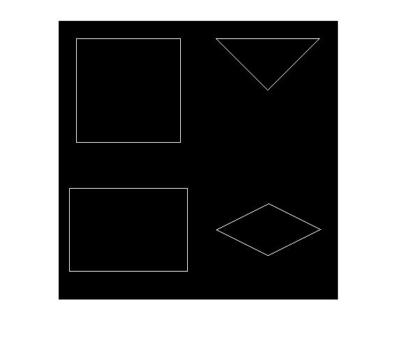

## پاسخ تمرین هفتم :
### اشکال هندسی مربع، مستطیل، لوزی، مثلث را بدون توابع متلب رسم کنید.

````
clc;
clear;
close all;

page=zeros(400,400,'uint8');

%Square
size=150;
start=[25,25];

for x =1 : size
    page(start(1)+1,start(2)+x)=255;
    page(start(1)+size,start(2)+x)=255;
    page(start(1)+x,start(2)+1)=255;
    page(start(1)+x,start(2)+size)=255;
end

%rectangle
xsize=170;
ysize=120;
start=[240,15];

for x =1 : xsize
    page(start(1)+1,start(2)+x)=255;
    page(start(1)+ysize,start(2)+x)=255;

end
for y =1 : ysize
    page(start(1)+y,start(2)+1)=255;
    page(start(1)+y,start(2)+xsize)=255;
end

%Triangle
size=150;
start=[25,225];
for x =1 : round( size/2)
    page(start(1)+1,start(2)+x)=255;
    page(start(1)+x,start(2)+x)=255;
end
y=start(1)+round( size/2);
for x =round( size/2) : size-1
    page(start(1)+1,start(2)+x)=255;
    page(y,start(2)+x)=255;
    y=y-1;
end

%Diamond
size=150;
start=[300,225];
x2=round(size/2);
y=start(1);
for x =1 :x2
    if x<= (x2/2)
          page(start(1)+x,start(2)+2*x)=255;
          page(start(1)+x,start(2)+(2*x)+1)=255;
          page(y,start(2)+2*x)=255;
          page(y,start(2)+(2*x)+1)=255;
                        
          y=y-1;    
    else
          page(start(1)+x2-x,start(2)+2*x)=255;
          page(start(1)+x2-x,start(2)+(2*x)+1)=255;

          page(y,start(2)+2*x)=255;
          page(y,start(2)+(2*x)+1)=255;
        
          y=y+1;    
    end
end

imshow(page);
````


<div dir="rtl">
1.  یک تصویر با مقدار اولیه صفر (مشکی) به طول عرض دلخواه ایجاد میکنیم ودر 4 قسمت آن  اشکال را رسم می کنیم
</div>

````
page=zeros(400,400,'uint8');
````
<div dir="rtl">
 2. رسم مربع
 یک متغییر به عنوان اندازه ضلع های مربع انتخاب می کنیم
  یک متغییر به نام startنیز بادو آرگومان ایجاد کرده که نقطه شروع مربع باشد
با توجه به یک اندازه بودن ضلع عا از یک حلقه به استفاده می کنیم و 4 ضلع مربع را رسم میکنیم
</div>

````
size=150;
start=[25,25];

for x =1 : size
    page(start(1)+1,start(2)+x)=255;
    page(start(1)+size,start(2)+x)=255;
    page(start(1)+x,start(2)+1)=255;
    page(start(1)+x,start(2)+size)=255;
end
````
<div dir="rtl">
2. رسم مستطیل
یک متغییر برای طول و یک متغییر برای عرض تعیین می کنیم.
  یک متغییر با دو آرگومان هم برای نقطه شروع
  سپس با دو حلقه یکی خطوط عمودی و یکی خطوط افقی را رسم می کنیم
</div>

````
xsize=170;
ysize=120;
start=[240,15];

for x =1 : xsize
    page(start(1)+1,start(2)+x)=255;
    page(start(1)+ysize,start(2)+x)=255;

end
for y =1 : ysize
    page(start(1)+y,start(2)+1)=255;
    page(start(1)+y,start(2)+xsize)=255;
end

````
<div dir="rtl">
3. رسم مستطیل
یک متغییر برای طول و یک متغییر برای عرض تعیین می کنیم.
  یک متغییر با دو آرگومان هم برای نقطه شروع
  سپس با دو حلقه یکی خطوط عمودی و یکی خطوط افقی را رسم می کنیم
</div>

````
xsize=170;
ysize=120;
start=[240,15];

for x =1 : xsize
    page(start(1)+1,start(2)+x)=255;
    page(start(1)+ysize,start(2)+x)=255;

end
for y =1 : ysize
    page(start(1)+y,start(2)+1)=255;
    page(start(1)+y,start(2)+xsize)=255;
end
````
4. رسم مثلث
یک متغییر برای  اندازه ضلع ها تعیین می کنیم.
  یک متغییر با دو آرگومان هم برای نقطه شروع
  سپس با دو حلقه یکی خط قائده و یکی خطوط مورب را رسم می کنیم
در حلقه دوم از یک متغییر دیگر برای حرکت معکوس یکی از خطوطاستفاده میکنیم
</div>

````
size=150;
start=[25,225];
for x =1 : round( size/2)
    page(start(1)+1,start(2)+x)=255;
    page(start(1)+x,start(2)+x)=255;
end
y=start(1)+round( size/2);
for x =round( size/2) : size-1
    page(start(1)+1,start(2)+x)=255;
    page(y,start(2)+x)=255;
    y=y-1;
end
````
5. رسم لوزی
یک متغییر برای قطر اصلی کار در نظر می گیریم.
  یک متغییر با دو آرگومان هم برای نقطه شروع
  سپس با یک حلقه به میزان اندازه دریافتی حرکت می کنیم 
با یک شرکت قرار گرفتن در سمت راست و چپ کار را مشخص می کنیمو با دستور های معکوس دو طرف شکل را رسم میکنیم
نکته: به علت مورب بودن خطوط و حفظ پیوستگی در هر مکان دو پیکسل تغییر رنگ داده میشوند
</div>

````
size=150;
start=[300,225];
x2=round(size/2);
y=start(1);
for x =1 :x2
    if x<= (x2/2)
          page(start(1)+x,start(2)+2*x)=255;
          page(start(1)+x,start(2)+(2*x)+1)=255;
          page(y,start(2)+2*x)=255;
          page(y,start(2)+(2*x)+1)=255;
                        
          y=y-1;    
    else
          page(start(1)+x2-x,start(2)+2*x)=255;
          page(start(1)+x2-x,start(2)+(2*x)+1)=255;

          page(y,start(2)+2*x)=255;
          page(y,start(2)+(2*x)+1)=255;
        
          y=y+1;    
    end
end
````
<div dir="rtl">
6. در پایان تصویر نهایی نمایش داده میشود
</div>

````
imshow(image);
````


