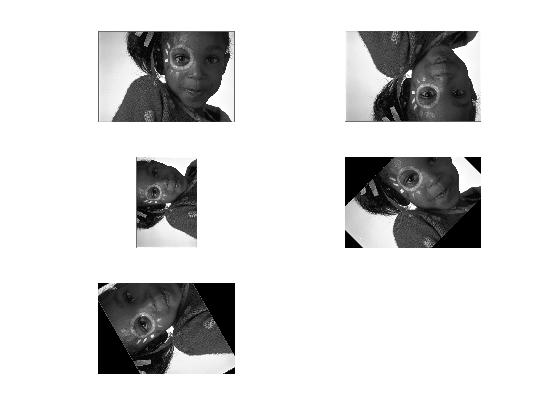

## پاسخ تمرین هشتم :
### بدون استفاده از توابع آماده ی متلب یک تصویر را با 45،90،120،180 درجه بچرخانید؛ در تصاویری که چرخش تصویر باعث خارج شدن از حالت مربعی می شود پیکسل های خالی را برابر رنگ مشکی قرار دهید و پیکسل های خارج شده از محدوده را نادیده بگیرید.

<div dir="rtl">
1. تصویر مورد نظر را با دستور imread فراخوانی کرده و در صورت رنگی بودن به خاکستری تبدیل می کنیم
</div>

````
pic=imread('girl.png');
if size(size(pic),2)==3
    pic = (rgb2gray(pic));
end
````
<div dir="rtl">
 2. چرخش 180
 یک تصویر به اندازه تصویر اصلی ایجاد می کنیم
  با دو حلقه تو در تو به میزان عرض و ارتفاع تصویر حرکت کرده و نقطه متناظر در تصویر اصلی را در تصویر جدید جایگزین می کنیم
به نحوی که اولین پیکسل سمت چپ بالا بابه آخرین پیکسل سمت چپ پایین منتقل می شود
</div>

````
r180Pic=zeros(picSize(1),picSize(2),'uint8');
for x=1: picSize(2)
    for y=1 : picSize(1)
        r180Pic(picSize(1)-y+1,x)=pic(y,x);
    end
end
````
<div dir="rtl">
 3. چرخش 90
 یک تصویر به اندازه تصویر اصلی ایجاد با این تفاوت که جای طول و عرض را تعویض می کنیم
  با دو حلقه تو در تو به میزان عرض و ارتفاع تصویر حرکت کرده و نقطه متناظر در تصویر اصلی را در تصویر جدید جایگزین می کنیم
 به نحوی که اولین پیکسل سمت چپ بالا بابه آخرین پیکسل سمت چپ پایین منتقل می شود وجای عرض و ارتفاع جابجا میشه
</div>

````
r90Pic=zeros(picSize(2),picSize(1),'uint8');
for x=1: picSize(2)
    for y=1 : picSize(1)
        r90Pic(picSize(2)+1-x,y)=pic(y,x);
    end
end
````
 4. چرخش 45
  یک تصویر به اندازه تصویر اصلی ایجاد با نوع دابل ایجاد می کنیم
 مرکز تصویر را مشخص می کنیم
 با توجه به نیاز سینوس و کسینوس زاویه چرخش، هردو را محاسبه می کنیم
  با دو حلقه تو در تو به میزان عرض و ارتفاع تصویر حرکت کرده و تصویر را پیمایش می کنیم
 هر پیکسل در فرمول دایره قرار گرفته و به نسبت مرکز تصویر موقعیت جدید مشخص شده
 با یک شرط چک می کنیم، اگر موقعیت جدید در محدوده مورد نظر باشد در تصویر نهایی جایگزین میشود ودر غیر این صورت نادیده گرفته می شود
</div>

````
x3=double(pic);
centerX=round(picSize(2)/2);
centerY=round(picSize(1)/2);

ro45Pic=zeros(picSize(1),picSize(2),'uint8');
deg=45;
sin=sind(deg);
cos=cosd(deg);

for y=1:picSize(1)
    for x=1:picSize(2)
        pointY(y,x)=round((y-centerY).*cos+(x-centerX).*sin+centerY);
        pointX(y,x)=round(-(y-centerY).*sin+(x-centerX).*cos+centerX);
            if(pointY(y,x)<=picSize(1))&&(pointY(y,x)>0)&&(pointX(y,x)<=picSize(2))&&(pointX(y,x)>0)
              ro45Pic(y,x)=x3(pointY(y,x),pointX(y,x));
            end
    end
end

````

 5. چرخش 120
  دقیقا مانند مرحله قبل عمل شده و تنها درجه ورودی تغییر می کند
</div>

````
ro120Pic=zeros(picSize(1),picSize(2),'uint8');
deg=120;
sin=sind(deg);
cos=cosd(deg);

for y=1:picSize(1)
    for x=1:picSize(2)
        pointY(y,x)=round((y-centerY).*cos+(x-centerX).*sin+centerY);
        pointX(y,x)=round(-(y-centerY).*sin+(x-centerX).*cos+centerX);
            if(pointY(y,x)<=picSize(1))&&(pointY(y,x)>0)&&(pointX(y,x)<=picSize(2))&&(pointX(y,x)>0)
              ro120Pic(y,x)=x3(pointY(y,x),pointX(y,x));
            end
    end

end

````
<div dir="rtl">
6. در پایان تصویر اولیه و هر 4 تصویر نهایی نمایش داده میشود
</div>

````
subplot(3,2,1);imshow(pic);
subplot(3,2,2);imshow(r180Pic);
subplot(3,2,3);imshow(r90Pic);
subplot(3,2,4);imshow(ro45Pic);
subplot(3,2,5);imshow(ro120Pic);
````



````
clc;
clear;
close all;

pic=imread('girl.png');
if size(size(pic),2)==3
    pic = (rgb2gray(pic));
end
picSize=size(pic);

r180Pic=zeros(picSize(1),picSize(2),'uint8');
for x=1: picSize(2)
    for y=1 : picSize(1)
        r180Pic(picSize(1)-y+1,x)=pic(y,x);
    end
end

r90Pic=zeros(picSize(2),picSize(1),'uint8');
for x=1: picSize(2)
    for y=1 : picSize(1)
        r90Pic(picSize(2)+1-x,y)=pic(y,x);
    end
end
  

x3=double(pic);
centerX=round(picSize(2)/2);
centerY=round(picSize(1)/2);

ro45Pic=zeros(picSize(1),picSize(2),'uint8');
deg=45;
sin=sind(deg);
cos=cosd(deg);

for y=1:picSize(1)
    for x=1:picSize(2)
        pointY(y,x)=round((y-centerY).*cos+(x-centerX).*sin+centerY);
        pointX(y,x)=round(-(y-centerY).*sin+(x-centerX).*cos+centerX);
            if(pointY(y,x)<=picSize(1))&&(pointY(y,x)>0)&&(pointX(y,x)<=picSize(2))&&(pointX(y,x)>0)
              ro45Pic(y,x)=x3(pointY(y,x),pointX(y,x));
            end
    end
end

ro120Pic=zeros(picSize(1),picSize(2),'uint8');
deg=120;
sin=sind(deg);
cos=cosd(deg);

for y=1:picSize(1)
    for x=1:picSize(2)
        pointY(y,x)=round((y-centerY).*cos+(x-centerX).*sin+centerY);
        pointX(y,x)=round(-(y-centerY).*sin+(x-centerX).*cos+centerX);
            if(pointY(y,x)<=picSize(1))&&(pointY(y,x)>0)&&(pointX(y,x)<=picSize(2))&&(pointX(y,x)>0)
              ro120Pic(y,x)=x3(pointY(y,x),pointX(y,x));
            end
    end

end

subplot(3,2,1);imshow(pic);
subplot(3,2,2);imshow(r180Pic);
subplot(3,2,3);imshow(r90Pic);
subplot(3,2,4);imshow(ro45Pic);
subplot(3,2,5);imshow(ro120Pic);
````
