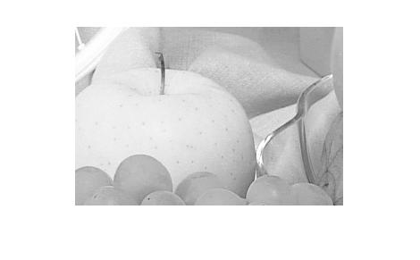

## پاسخ تمرین نهم :
### برنامه ای بنویسید که یک طول و عرض را مشخص کرده و سپس یک تصویر را crop کند.

<div dir="rtl">
1. تصویر مورد نظر را با دستور imread فراخوانی کرده و در صورت رنگی بودن به خاکستری تبدیل می کنیم و اندازه آن را هم محاسبه می کنیم.
</div>

````
orginalPic=imread('fruits.png');
orginalPic=rgb2gray(orginalPic);
picSize=size(orginalPic);

````
<div dir="rtl">
 2. دو نقطه به عنوان نقطه شروع کراپ انتخاب می کنیم
 دو عدد دیگر به عنوان تصویر خروجی در نظر می گیریم
  و یک تصویر با ابعاد تعریف شده ایجاد می کنیم
</div>

````
startx=100;
starty=100;
x=300;
y=200;

cropPic=zeros(y,x,'uint8');
````
<div dir="rtl">
 3. با استفاده از دو حلقه تو در تو اطلاعات مختصات مورد نظررابه تصویر نهایی منتقل می کنیم
</div>

````
for i=1: y
    for j=1 : x
        cropPic(i,j)=orginalPic(starty+i,startx+j);
    end
end
````

<div dir="rtl">
4. در پایان تصویر اولیه و  تصویر نهایی نمایش داده میشود
</div>

````
figure,imshow(orginalPic);
figure,imshow(cropPic);
````



````
clc;
clear;
close all;

orginalPic=imread('fruits.png');
orginalPic=rgb2gray(orginalPic);
picSize=size(orginalPic);

startx=100;
starty=100;
x=300;
y=200;
cropPic=zeros(y,x,'uint8');
for i=1: y
    for j=1 : x
        cropPic(i,j)=orginalPic(starty+i,startx+j);
    end
end
figure,imshow(orginalPic);
figure,imshow(cropPic);
````
