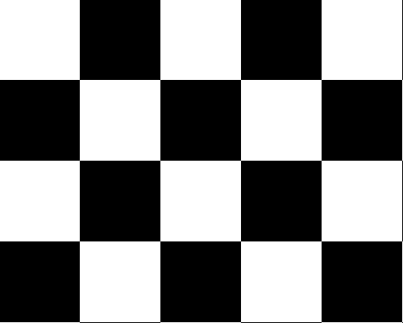

# تمرین 1

<div dir='rtl'>
    باعث می شود پس از هر بار اجرای برنامه پنجره ی فرمان ها پاک شود
</div>

```
clc;
close all;
clear all;
```

<div dir='rtl'>
    می خواهیم طول و عرض هر خانه چند پیکسل باشد :
</div>

```
w=5;%width
h=4;%height
```

<div dir='rtl'>
    تصویر اولیه ای با مقادیر اولیه صفر ایجاد می نماییم!
</div>

```
image = zeros(100*h,100*w);
```

<div dir='rtl'>
    حلقه تو در تو زیر با استفاده از خاصیت باقی مانده صفحه شطرنجی را در تصویرمان ایجاد می کند.
</div>

```
for i=1 : h*100
    if floor(mod( i/100 , 2 )) == 0 
        for j=1 : w*100
            if floor(mod( j/100 , 2 )) == 0 
                image(i, j) = 255;
            end    
            if floor(mod( j/100 , 2 )) == 1 
                image(i, j) = 0;
            end        
        end 
    end
    if floor(mod( i/100 , 2 )) == 1 
        for j=1 : w*100
            if floor(mod( j/100 , 2 )) == 0 
                image(i, j) = 0;
            end    
            if floor(mod( j/100 , 2 )) == 1 
                image(i, j) = 255;
            end        
        end 
    end
end
```

<div dir='rtl'>
    با دستور زیر تصویر تغییر داده شده را نمایش می دهیم.
</div>

```
figure,
imshow(image);
```



