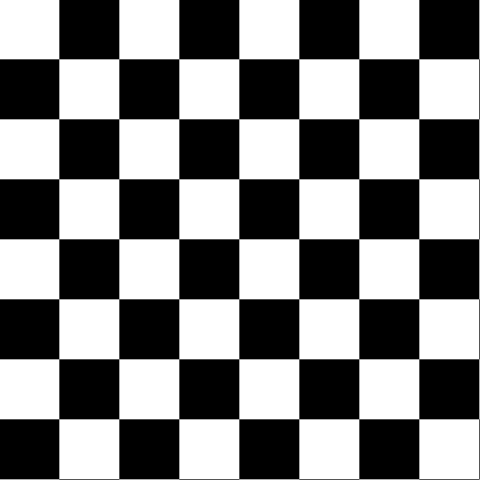

# تمرین 1
<div dir="rtl" >
    باعث می شود پس از هر بار اجرای برنامه پنجره ی فرمان ها پاک شود.
</div>

```
clc;
close all;
clear all;
```

<div dir="rtl" >
 مقیاس صفحه شطرنجی:
 می خواهیم طول و عرض هر خانه شطرنج چند پیکسل باشد.
</div>

```
r=8;
```
<div dir="rtl" >
تصویر اولیه ای با مقادیر اولیه صفر ایجاد می نماییم!
</div>

```
image = zeros(100*r,100*r);
```
<div dir="rtl" >
حلقه تو در تو زیر با استفاده از خاصیت باقی مانده صفحه شترنجی را در تصویرمان ایجاد می کند.
</div>

```
for i=1 : r*100
    if floor(mod( i/100 , 2 )) == 0 
        for j=1 : r*100
            if floor(mod( j/100 , 2 )) == 0 
                image(i, j) = 255;
            end    
            if floor(mod( j/100 , 2 )) == 1 
                image(i, j) = 0;
            end        
        end 
    end
    if floor(mod( i/100 , 2 )) == 1 
        for j=1 : r*100
            if floor(mod( j/100 , 2 )) == 0 
                image(i, j) = 0;
            end    
            if floor(mod( j/100 , 2 )) == 1 
                image(i, j) = 255;
            end        
        end 
    end
end
```
<div dir="rtl" >
با دستور زیر تصویر تغییر داده شده را نمایش می دهیم.
</div>

```
figure,
imshow(image);
```
<div dir="rtl" >
    خروجی بصورت زیر می باشد:
</div>


