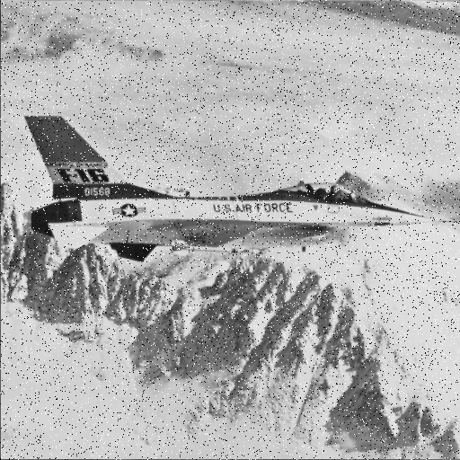
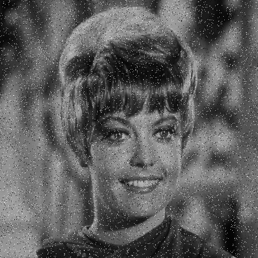
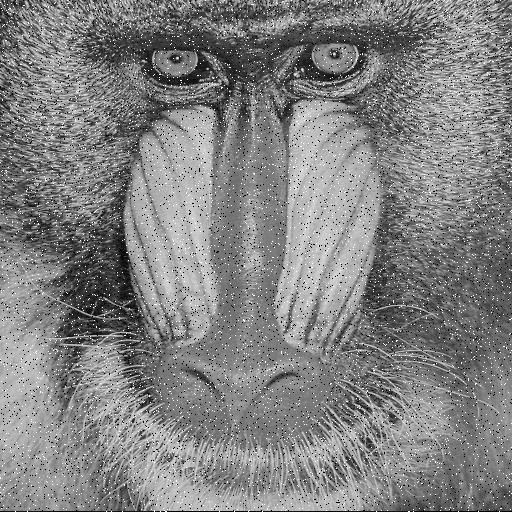
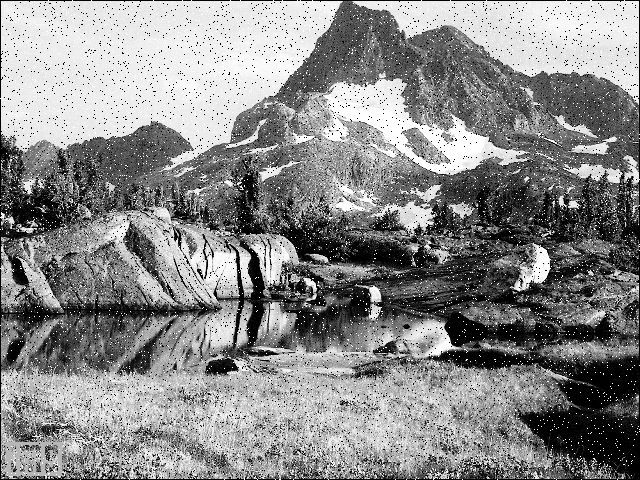

# تمرین 2

<br />
<div dir="rtl">
    باعث می شود پس از هر بار اجرای برنامه پنجره ی فرمان ها پاک شود   
</div>

```
clc;
close all;
clear all;
```

<div dir="rtl">
 وارد کردن تصویر
</div>


```
im = rgb2gray(imread('../../../benchmark/airplane.png'));
```

<div dir="rtl">
  نشان دادن تصویر
</div>

```
figure,
imshow(im);
```

<div dir="rtl">
 تعیین نمودن درصد کل نویز و درصد نویز نمکی(سفید)
</div>

```
a = 0.05; % 5% pixels altered
b = 0.5;  % 50% percent white pixels among all altered pixels
```

<div dir="rtl">
 شمردن تعداد پیکسل ها ، بدست آوردن تعداد پیکسل هایی که باید نویز داده شوند و تولید عدد رندم به تعداد پیکسل هایی که باید نویز داده شوند و با برد تعداد پیکسل ها(شاخص پیکسل های نویز داده شده را بصورت تصادفی انتخاب می کنیم.) و سپس تعیین تعداد پیکسل هایی که باید نویز نمکی داشته باشند. 
</div>


```
n = numel(im(:,:));
m = fix(a*n);
idx = randperm(n, m);
k = fix(b*m);
```

<div dir="rtl">
  تخصص دادن شاخص های تصادفی به دو قسمت فلفلی(idx2) و نمکی(idx1). 
</div>

```
idx1 = idx(1:k);
idx2 = idx(k+1:end);
```

<div dir="rtl">
     سفید کردن دسته اول و سیاه کردن دسته دوم 
</div>

```
im(idx1) = 255;
im(idx2) = 0;
```

<div dir="rtl">
 نشان دادن تصویر نهایی
</div>

```
figure;
imshow(im);
imsave;
```






