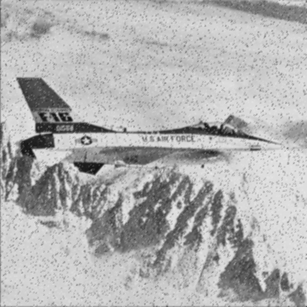

# 1تمرین 2

<br />
<div dir="rtl">
    باعث می شود پس از هر بار اجرای برنامه پنجره ی فرمان ها پاک شود   
</div>

```
clc;
close all;
clear all;
```
<div dir="rtl">
 خواندن تصویر و تبدیل آن به سیاه و سفید در صورت نیاز
</div>

```
image = imread('../../../benchmark/airplane.png');
if size(image,3) == 3 
    image=rgb2gray(image);
end
```

<div dir="rtl">
 ساختن نویز با استفاده از اسکریپت تمرین قبلی
</div>

```
% create the noise --------------------------------------------------------
imageNoisy = image;
a = 0.05; % 5% pixels altered
b = 0.5; % 50% percent white pixels among all altered pixels
n = numel(imageNoisy(:,:));
m = fix(a*n);
idx = randperm(n, m);
k = fix(b*m);
idx1 = idx(1:k);
idx2 = idx(k+1:end);
imageNoisy(idx1) = 255;
imageNoisy(idx2) = 0;
imshow(imageNoisy);
%imsave;
```
<div dir="rtl">
 گرفتن سایز تصویر برای استفاده از آن در الگوریتم های نویز گیری
</div>

```
% the mean(average)filter and median filter combined-------------------------------------------------
imageNoisySize = size(imageNoisy);
height = imageNoisySize(1,1);
width = imageNoisySize(1,2);
```

<div dir="rtl">
 ساختن نگهدارنده های تصاویر نویز گیری شده بوسیله الگوریتم های میانه و میانگین
</div>

```
imageNoisyResultMean = zeros(height, width);
imageNoisyResultMedian = zeros(height, width);
```

<div dir="rtl">
    اعمال الگوریتم برای نقاط گوشه(این الگوریتم بازنویسی شده و بهبود داده شده ی الگوریتمی است که آقای شکری برای ما نوشتند)
</div>


```
% mean window filter
%UP LEFT
sum = [ imageNoisy(1, 1) imageNoisy(1, 2) imageNoisy(2, 1) imageNoisy(2, 2)];
imageNoisyResultMean(1, 1) = uint8(round(mean(sum)));
sum = sort(sum);
imageNoisyResultMedian(1, 1) = uint8(sum(2));
%DOWN LEFT
sum = [ imageNoisy(height-1, 1) imageNoisy(height-1, 2) imageNoisy(height, 1) imageNoisy(height-1, 2)];
imageNoisyResultMean(height, 1) = uint8(round(mean(sum)));
sum = sort(sum);
imageNoisyResultMedian(height, 1) = uint8(sum(2)); 
%UP RIGHT
sum = [ imageNoisy(1, width-1) imageNoisy(1, width) imageNoisy(2, width-1) imageNoisy(2, width)];
imageNoisyResultMean(1, width) = uint8(round(mean(sum)));
sum = sort(sum);
imageNoisyResultMedian(1, width) = uint8(sum(2)); 
%DOWN RIGHT
sum = [ imageNoisy(height-1, width-1) imageNoisy(height-1, width) imageNoisy(height, width-1) imageNoisy(height, width)];
imageNoisyResultMean(1, width) = uint8(round(mean(sum)));
sum = sort(sum);
imageNoisyResultMedian(1, width) = uint8(sum(2));
```

<div dir="rtl">
 :
    اعمل این الگوریتم برای لبه ها
</div>

<div dir="rtl">
    لبه های افقی(سمت بالا و پایین)
</div>


```
%Horizontal
for j = 2:width-1
    %UP
    sum = [ imageNoisy(1, j-1) imageNoisy(1, j) imageNoisy(1, j+1) imageNoisy(2, j-1) imageNoisy(2, j) imageNoisy(2, j+1)];
        %Mean
        imageNoisyResultMean(1, j) = uint8(round(mean(sum)));
        %Median
        sum = sort(sum);
        imageNoisyResultMedian(1, j) = uint8(sum(3));
    % DOWN
    sum = [ imageNoisy(height-1, j-1) imageNoisy(height-1, j) imageNoisy(height-1, j+1) imageNoisy(height, j-1) imageNoisy(height, j) imageNoisy(height-1, j+1)];
        %Mean
        imageNoisyResultMean(height, j) = uint8(round(mean(sum)));
        %Median
        sum = sort(sum);
        imageNoisyResultMedian(height, j) = uint8(sum(3));    
end
```

<div dir="rtl">
  لبه های عمودی(سمت راست و چپ)
</div>

```
%Vertical
for i = 2:height-1
    %LEFT        
    sum = [ imageNoisy(i-1, 1) imageNoisy(i-1, 2) imageNoisy(i, 1) imageNoisy(i-1, 2) imageNoisy(i+1, 1) imageNoisy(i+1, 2)];
        %Mean
        imageNoisyResultMean(i, 1) = uint8(round(mean(sum)));
        %Median
        sum = sort(sum);
        imageNoisyResultMedian(i, 1) = uint8(sum(3));
    %RIGHT
    sum = [ imageNoisy(i-1, width-1) imageNoisy(i-1, width) imageNoisy(i, width-1) imageNoisy(i, width) imageNoisy(i+1, width-1) imageNoisy(i+1, width)];
        %Mean
        imageNoisyResultMean(i, width) = uint8(round(mean(sum)));
        %Median
        sum = sort(sum);
        imageNoisyResultMedian(i, width) = uint8(sum(3));    
end
```

<div dir="rtl">
 اعمال الگوریتم برای پیکسل های داخلی
</div>

```
%Internal
for i = 2:height-1
   for j= 2:width-1      
       sum = [ imageNoisy(i-1, j-1) imageNoisy(i-1, j) imageNoisy(i-1, j+1) imageNoisy(i, j-1) imageNoisy(i, j) imageNoisy(i-1, j+1) imageNoisy(i+1, j-1) imageNoisy(i+1, j) imageNoisy(i+1, j+1)]; 
           %Mean
           imageNoisyResultMean(i, j) = uint8(round(mean(sum)));
           %Median
           sum = sort(sum);
           imageNoisyResultMedian(i, j) = uint8(sum(5));
        
   end
end
```

<div dir="rtl">
  نشان دادن تصاویر پردازش شده توسط این دو الگوریتم
</div>


```
figure,imshow(uint8(imageNoisyResultMean));
%imsave;
figure,imshow(uint8(imageNoisyResultMedian));
%imsave;
imageNoisy=double(imageNoisy);
```

<div dir="rtl">
 بدست آوردن جمع پیکسل ها
</div>

```
sumNoisy = 0;
sumMean = 0;
sumMedian = 0;
for i=1:height
    for j=1:width
        sumNoisy=sumNoisy+imageNoisy(i,j);
        sumMean=sumMean+imageNoisyResultMean(i,j);
        sumMedian=sumMedian+imageNoisyResultMedian(i,j);     
    end
end
```

<div dir="rtl">
  بدست آوردن میانگین پیکسل ها
</div>

```
numberOfPixels=height*width;
N = sumNoisy / numberOfPixels ;
ME = sumMean / numberOfPixels ;
MED = sumMedian / numberOfPixels ;
```

<div dir="rtl">
 نشان دادن آن 
</div>

```
disp("Noisy : "+round(N)+", Mean : "+round(ME)+", Median : "+round(MED));
```
Noisy : 177, Mean : 177, Median : 180
NOISY


MEAN FILTER



MEDIAN FILTER


