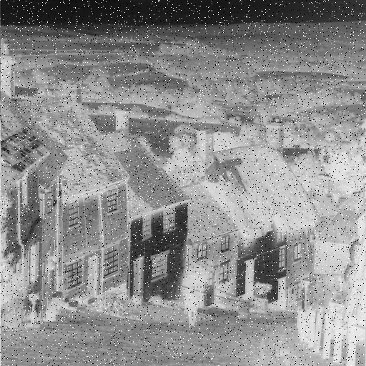

# تمرین 13

<br />
<div dir="rtl">
    باعث می شود پس از هر بار اجرای برنامه پنجره ی فرمان ها پاک شود   
</div>

```
clc;
close all;
clear all;
```

<div dir="rtl">
    بارگزاری کردن تصویر و گرفتن اندازه آن
</div>

```
image = imread('../../../benchmark/goldhill.png');
imageSize = size(image);
height = imageSize(1,1);
width = imageSize(1,2);
```

<div dir="rtl">
 نگاتیو کردن تصویر
</div>

```
% Negative
imageNegative = zeros(imageSize);
for i=1:height
    for j=1:width
        imageNegative(i,j) = 255 - image(i,j);
    end
end
```

<div dir="rtl">
 ایجاد نویز با استفاده از اسگریپت تمرین 11
</div>

```
imageNegativeNoisy = imageNegative;
% noise salt & pepper
a = 0.05; % 5% pixels altered
b = 0.5; % 50% percent white pixels among all altered pixels
n = numel(imageNegativeNoisy(:,:,1));
m = fix(a*n);
idx = randperm(n, m);
k = fix(b*m);
idx1 = idx(1:k);
idx2 = idx(k+1:end);
imageNegativeNoisy(idx1) = 255;
imageNegativeNoisy(idx2) = 0;
figure;
imshow(uint8(imageNegativeNoisy));
%imsave
```

<div dir="rtl">
 گرفتن میانگین
</div>

```
sumNoisy = 0;
for i=1:height
    for j=1:width
        sumNoisy=sumNoisy+imageNegativeNoisy(i,j);          
    end
end
numberOfPixels=height*width;
N = sumNoisy / numberOfPixels ;
```

<div dir="rtl">
 نشان دادن میانگین
</div>

```
disp("NegativeNoisy : "+round(N));
```
NegativeNoisy : 142

noise | mean
------------ | -------------
0.05 | 142
0.1 | 141
0.2| 140


