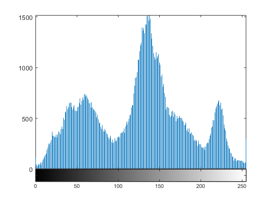
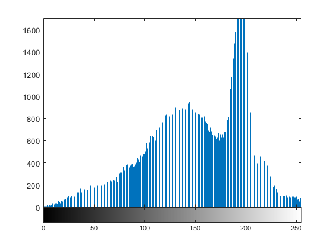

<div dir="rtl">
 باز کردن پوشه حاوی دیتا بیس تهییه شده
</div>

```
% Specify the folder where the files live.
myFolder = 'DataSet14/';
% Check to make sure that folder actually exists.  Warn user if it doesn't.
if ~isfolder(myFolder)
    errorMessage = sprintf('Error: The following folder does not exist:\n%s\nPlease specify a new folder.', myFolder);
    uiwait(warndlg(errorMessage));
    myFolder = uigetdir(); % Ask for a new one.
    if myFolder == 0
         % User clicked Cancel
         return;
    end
end
```

<div dir="rtl">
 خواندن تک به تک عکس ها
</div>

```
% Get a list of all files in the folder with the desired file name pattern.
filePattern1 = fullfile(myFolder,'*.png'); % Change to whatever pattern you need.
theFiles = dir(filePattern1);
PatchArray = zeros(100,100,length(theFiles));
for k = 1 : length(theFiles)
    baseFileName = theFiles(k).name;
    fullFileName = fullfile(theFiles(k).folder, baseFileName);
    fprintf(1, 'Now reading %s\n', fullFileName);
```

<div dir="rtl">
  نمایش عکس ها و تبدیل آنها به عکس های سیاه و سفید و مقایسه نمودار های آنها
</div>

```
    % Now do whatever you want with this file name,
    % such as reading it in as an image array with imread()
    image = imread(fullFileName);   
    image = rgb2gray(image);    
    %imshow(imageArray);  % Display image.
    
    figure,imshow(image);
    %imsave;
    figure,imhist(image);    
    
    drawnow; % Force display to update immediately.
end
```








<div dir="rtl">
 همانگونه که مشاهده می شود . هر چه نمودار ها در ساعات تاریک تری گرفته شده باشند تباین نمودار مقادیر آنها کمتر می باشد.
</div>
