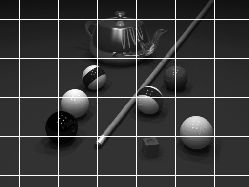
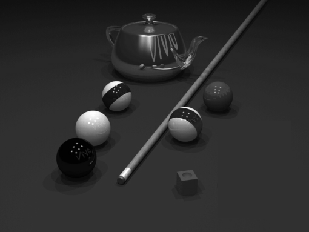

# تمرین 15


<div dir="rtl">
 تصویر بار گزاری شده و اندازه گیری می شود و در یک متغییر برای گرید بندی ریخته می شود
</div>

```
image = rgb2gray(imread('../benchmark/pool.png'));
figure,imshow(image);
imageSize = size(image);
height = imageSize(1,1);
width = imageSize(1,2);
imageSec = image;
```

<div dir="rtl">
 مقیاس گرید ها مشخص می شود
</div>

```

scale=40;
```

<div dir="rtl">
 با حلقه زیر گرید بندی می شود.
</div>


```
for i=height:-1:1
    for j=width:-1:1
        if floor(mod( j , scale )) == 0 
            imageSec(i, j) = 255;
        end
        if floor(mod( i , scale )) == 0 
            imageSec(i, j) = 255;
        end
        
    end
   
end
```

<div dir="rtl">
 با استفاده از حلقه زیر گرید های مربوطه شناسایی شده و مقداری که بنظر چشم طبیعی بیاید به آن بصورت دستی داده شده. 
</div>

```
sx=0;
sy=0;
imageResult = image;
for y=1:scale:height
    sx =0;
    for x=1:scale:width
    if  (sy == 5)|| (sy == 6)|| (sy == 7)||(sy == 8)
        if (sx == 9)|| (sx == 10)||(sx == 11)
            for u=1:scale
                for v=1:scale
                    imageResult(sy*scale+u,sx*scale+v)=48;
                    %66
                end
            end
        end            
    end
    sx=sx+1;        
    end
    sy=sy+1;   
end
```

<div dir="rtl">
 و نمایش داده می شود.
</div>
        

```
figure,imshow(imageSec);
%imsave;
figure,imshow(uint8(imageResult));
%imsave;
%60to230 YellowBall
```



