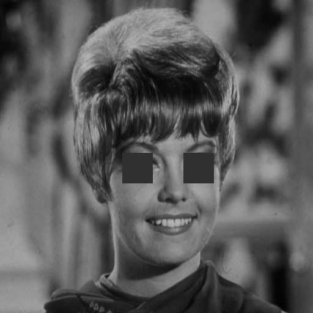

# تمرین 16

<div dir="rtl">
 تصویر را می خواند و انداز گیری می کند و در متغییری برای گرید بندی می ریزد
</div>


```
image = imread('../../../benchmark/zelda.png');
figure,imshow(image);
imageSize = size(image);
height = imageSize(1,1);
width = imageSize(1,2);
imageSec = image;
```

<div dir="rtl">
 مقایس گرید بندی تعیین می شود
</div>

```
scale=50;
```

<div dir="rtl">
 اسکریپت گرید بندی
</div>


```
for i=height:-1:1
    for j=width:-1:1
        if floor(mod( j , scale )) == 0 
            imageSec(i, j) = 255;
        end
        if floor(mod( i , scale )) == 0 
            imageSec(i, j) = 255;
        end
        
    end
   
end
```

<div dir="rtl">
 با استفاده از اسکریپت زیر گرید هایی که روی چشم های zelda.png افتاده اند با رنک میانگین جایگذاری می شوند.
</div>


```
sx=0;
sy=0;
imageResult = image;
for y=1:scale:height
    sx =0;
    for x=1:scale:width
    if  (sy == 5)
        if (sx == 4)|| (sx == 6)
            for u=1:scale
                for v=1:scale
                    imageResult(sy*scale+u,sx*scale+v)=48;
                    %128
                end
            end
        end            
    end
    sx=sx+1;        
    end
    sy=sy+1;   
end
```

<div dir="rtl">
 تصویر نشان داده می شود.
</div>


```
figure,imshow(imageSec);
%imsave;
figure,imshow(imageResult);
%imsave;
```



