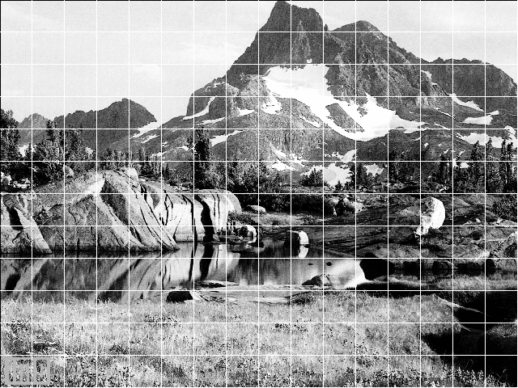
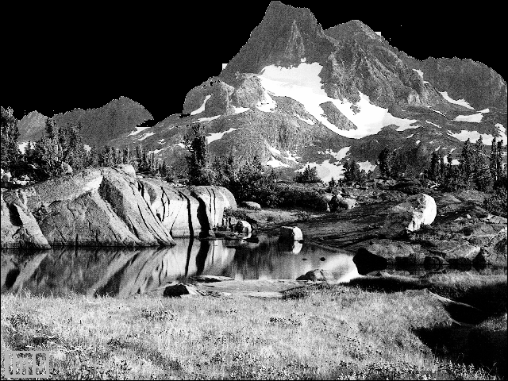

# تمرین 17

<div dir="rtl">
 تصویر بار گزاری شده و اندازه گیری می شود و در یک متغییر برای گرید بندی ریخته می شود
</div>

```
image = imread('../benchmark/mountain.png');
figure,imshow(image);
imageSize = size(image);
height = imageSize(1,1);
width = imageSize(1,2);
imageSec = image;
```

<div dir="rtl">
 مقیاس گرید ها مشخص می شود
</div>


```
scale=40;
```

<div dir="rtl">
 با حلقه زیر گرید بندی می شود.
</div>


```
for i=height:-1:1
    for j=width:-1:1
        if floor(mod( j , scale )) == 0 
            imageSec(i, j) = 255;
        end
        if floor(mod( i , scale )) == 0 
            imageSec(i, j) = 255;
        end
        
    end
   
end
```

<div dir="rtl">
  با استفاده از حلقه زیر گرید های مربوطه شناسایی شده و در گرید های در مرز کوه جوری برنامه ریزی شده که فقط پیکسل های در بازه آسمان را سیاه کند. 
</div>


```
sx=0;
sy=0;
imageResult = image;
for y=1:scale:height
    sx =0;
    for x=1:scale:width
        if  (sy >= 0)&& (sy <= 3) 
            if (sx >= 0)&& (sx <= 5) 
                for u=1:scale
                    for v=1:scale
                        m=image(sy*scale+u,sx*scale+v);
                        if (215 <= m )&& (m <= 255)
                            imageResult(sy*scale+u,sx*scale+v)=0;                 
                        end
                    end
                end
            end
        end
         if  (sy >= 0)&& (sy <= 2) 
            if (sx == 6)
                for u=1:scale
                    for v=1:scale
                        m=image(sy*scale+u,sx*scale+v);
                        if (215 <= m )&& (m <= 255)
                            imageResult(sy*scale+u,sx*scale+v)=0;                 
                        end
                    end
                end
            end
         end
         if  (sy >= 0)&& (sy <= 1) 
            if (sx == 7)
                for u=1:scale
                    for v=1:scale
                        m=image(sy*scale+u,sx*scale+v);
                        if (215 <= m )&& (m <= 255)
                            imageResult(sy*scale+u,sx*scale+v)=0;                 
                        end
                    end
                end
            end
         end
        if  (sy == 0)
            if (sx == 8)
                for u=1:scale
                    for v=1:scale
                        m=image(sy*scale+u,sx*scale+v);
                        if (215 <= m )&& (m <= 255)
                            imageResult(sy*scale+u,sx*scale+v)=0;                  
                        end
                    end
                end
            end
        end
        if  (sy == 0)
            if (sx >= 9)
                for u=1:scale
                    for v=1:scale
                        m=image(sy*scale+u,sx*scale+v);
                        if (215 <= m )&& (m <= 255)
                            imageResult(sy*scale+u,sx*scale+v)=0;                 
                        end
                    end
                end
            end
        end
        if  (sy == 1)
            if (sx >= 12)
                for u=1:scale
                    for v=1:scale
                        m=image(sy*scale+u,sx*scale+v);
                        if (215 <= m )&& (m <= 255)
                            imageResult(sy*scale+u,sx*scale+v)=0;                  
                        end
                    end
                end
            end
        end
        if  (sy == 2)
            if (sx >= 15)
                for u=1:scale
                    for v=1:scale
                        m=image(sy*scale+u,sx*scale+v);
                        if (215 <= m )&& (m <= 255)
                            imageResult(sy*scale+u,sx*scale+v)=0;                                           
                        end
                    end
                end
            end
        end
        sx=sx+1;
    end
    sy=sy+1;        
end
```
<div dir="rtl">
 و نمایش داده می شود.
</div>

```
figure,imshow(imageSec);
figure,imshow(imageResult);
```


