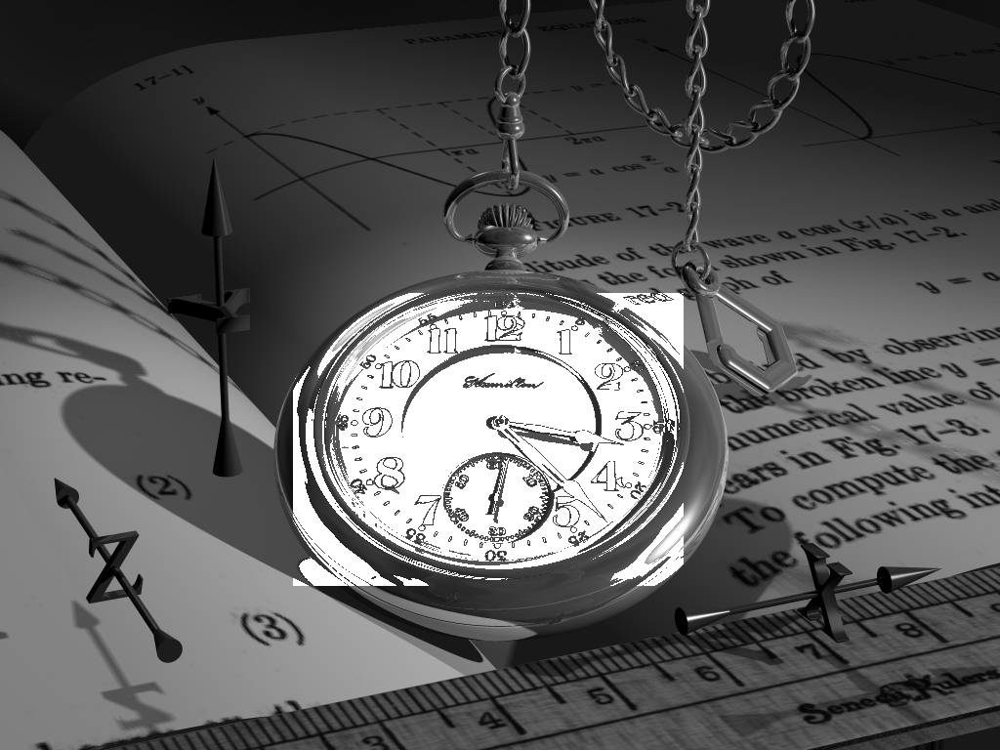
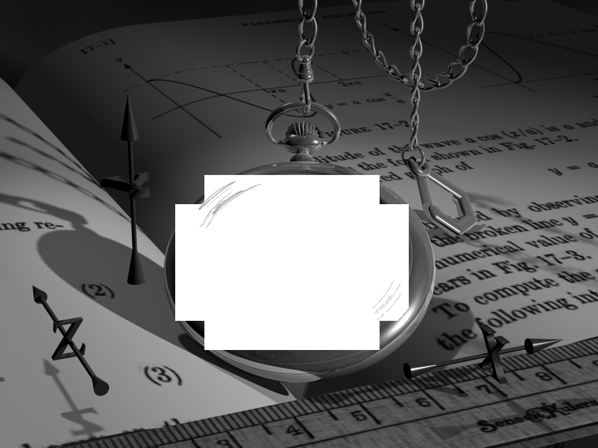

# تمرین 18


<div dir="rtl">
 تصویر ساعت بارگزاری شده ، اندازه گیری می شود و در متغییر ریخته می شود.
</div>

```
image = rgb2gray(imread('../benchmark/watch.png'));
figure,imshow(image);
%imsave;
imageSize = size(image);
height = imageSize(1,1);
width = imageSize(1,2);
imageSec = image;
```

<div dir="rtl">
 مقیاس گرید تعیین می شود.
</div>

```
scale=100;
```

<div dir="rtl">
 گرید بندی شده و نمایش داده می شود.
</div>

```
for i=1:height
    for j=1:width
        if floor(mod( j , scale )) == 0 
            imageSec(i, j) = 255;
        end
        if floor(mod( i , scale )) == 0 
            imageSec(i, j) = 255;
        end        
    end  
end
figure,imshow(imageSec);
```

<div dir="rtl">
 دو روش برای سفید کردن صفحه ساعت استفاده شد. اول اینکه بازه های صفحه ساعت را مورد هدف قرار دهیم:
</div>

```
sx=0;
sy=0;
imageResult = image;
for y=1:scale:height
    sx =0;
    for x=1:scale:width
    if  (sy >= 3)&& (sy <= 5)
        if (sx >= 3)&& (sx <= 6)
            for u=1:scale
                for v=1:scale
                    m=image(sy*scale+u,sx*scale+v);
                    if (0 <= m )&& (m <= 35)
                        imageResult(sy*scale+u,sx*scale+v)=255;
                    end
                    if (50 <= m )&& (m <= 160)
                        imageResult(sy*scale+u,sx*scale+v)=255;
                    end
                    
                end
            end
        end            
    end
    sx=sx+1;        
    end
    sy=sy+1;   
end
```



<div dir="rtl">
 و دوم اینکه صرفا سعی کنیم با گرید بندی و محدود نمودن بازه تا حدودی به نتیجه دست یابیم 
</div>


```
for y=1:scale:height
    sx =0;
    for x=1:scale:width
    if  (sy >= 6)&& (sy <= 11)&& ~((sy == 6)&& (sx == 6) || (sy == 6)&& (sx == 13)|| (sy == 11)&& (sx == 6)|| (sy == 11)&& (sx == 13))
        if (sx >= 6)&& (sx <= 13)
            for u=1:scale
                for v=1:scale
                    m=image(sy*scale+u,sx*scale+v);                    
                    if (0 <= m )&& (m <= 160)
                        imageResult(sy*scale+u,sx*scale+v)=255;
                    end
                    
                end
            end
        end            
    end
    sx=sx+1;        
    end
    sy=sy+1;   
end
figure,imshow(imageResult);
```


<div dir="rtl">
 برای این تمرین تلاش زیادی شده ، لطفا در صورت قابل قبول نبودن بیان فرمایید.
</div>

