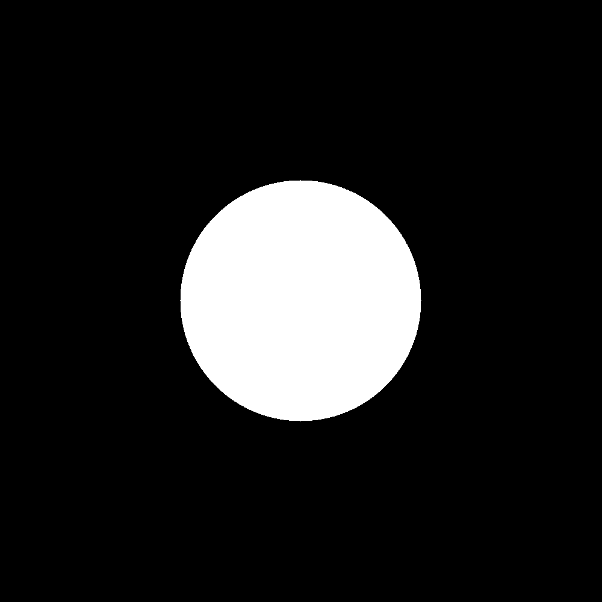

# تمرین 2

<br />
<div dir="rtl">
    باعث می شود پس از هر بار اجرای برنامه پنجره ی فرمان ها پاک شود   
</div>

```
clc;
close all;
clear all;
```

<div dir="rtl">
    شعاع دایره : 
</div>

```
r = 200;
```

<div dir="rtl">
    بدلیل تقریبی بودن فرمول دایره باید آستانه تحملی برای شعاع دایره در نظر گرفت که مرز های آن پر رنگ تر شود .
</div>

```
t = 200 % threshhold
```

<div dir="rtl">
    مکان مرکز دایره را با یک ماتریس یک در دو مشخص می کند . 
</div>

```
p = [300 300];
```

<div dir="rtl">
    تصویر اولیه که دایره قرار است در آن رسم شود را رسم می کنیم .
</div>

```
image = zeros(1000,1000);
```

<div dir="rtl">
    با گشتن در کل تصویر و سفید کردن نقاطی که ویژگی دایره را با مشخصات بیان شده دارند دایره رسم می شود .
</div>

```
for i=1 : 1000
    for j=1 : 1000
        if (p(1,1)-i)^2 +(p(1,2)-j)^2 <= r^2+t && (p(1,1)-i)^2 +(p(1,2)-j)^2 >= r^2-t
            image(i, j) = 255;
        end
    end
end
```

<div dir="rtl">
    و در نهایت دایره با دستور زیر نمایش داده می شود . 
</div>

```
figure,
imshow(image);
imsave
```


<div dir="rtl">
    ولی اگر بخواهیم دایره تو پر رسم کنیم فرمول دایره را با فرمول زیر جایگذاری می کنیم.
</div>

```
(p(1,1)-i)^2 +(p(1,2)-j)^2 < r^2

```

<div dir="rtl">
    و به این ترتیب رسم می شود :
</div>


<div dir="rtl">
در صورتي كه بخواهيم دايره وسط باشد پارامتر لوكيشن مركز را تغيير مي دهيم.
</div>

```
p = [300 300];
```




