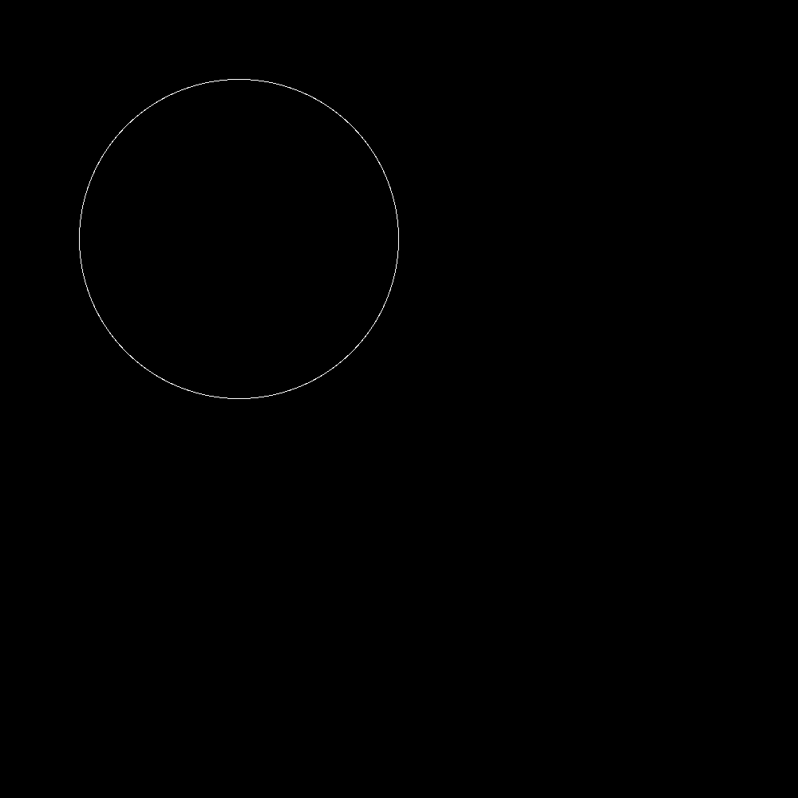
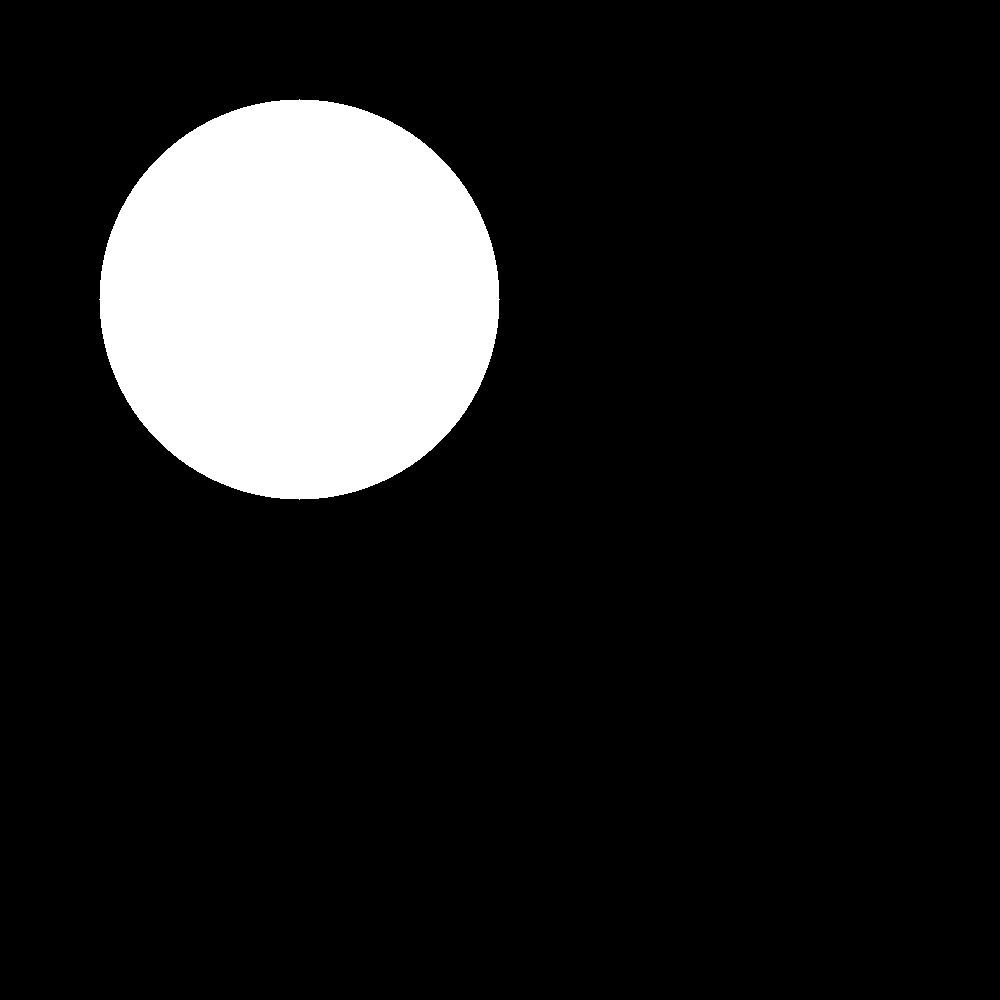

<p direction='ltr'>###تمرین 1</p>
<p direction='ltr'>باعث می شود پس از هر بار اجرای برنامه پنجره ی فرمان ها پاک شود</p>
"""
clc;
close all;
clear all;
"""
<p direction='ltr'>شعاع دایره : </p>

```
r = 200;
```
<p direction='ltr'>بدلیل تقریبی بودن فرمول دایره باید آستانه تحملی برای شعاع دایره در نظر گرفت که مرز های آن پر رنگ تر شود .</p>

```
t = 200 % threshhold
```
<p direction='ltr'>مکان مرکز دایره را با یک ماتریس یک در دو مشخص می کند . </p>

```
p = [300 300];
```

<p direction='ltr'>تصویر اولیه که دایره قرار است در آن رسم شود را رسم می کنیم .</p>

```
image = zeros(1000,1000);
```
<p direction='ltr'> با گشتن در کل تصویر و سفید کردن نقاطی که ویژگی دایره را با مشخصات بیان شده دارند دایره رسم می شود .</p>

```
for i=1 : 1000
    for j=1 : 1000
        if (p(1,1)-i)^2 +(p(1,2)-j)^2 <= r^2+t && (p(1,1)-i)^2 +(p(1,2)-j)^2 >= r^2-t
            image(i, j) = 255;
        end
    end
end
```
<p direction='ltr'> و در نهایت دایره با دستور زیر نمایش داده می شود . </p>

```
figure,
imshow(image);
imsave
```



<p direction='ltr'> ولی اگر بخواهیم دایره تو پر رسم کنیم فرمول دایره را با فرمول زیر جایگذاری می کنیم.</p>

```
(p(1,1)-i)^2 +(p(1,2)-j)^2 < r^2

```

<p direction='ltr'>و به این ترتیب رسم می شود :</p>



