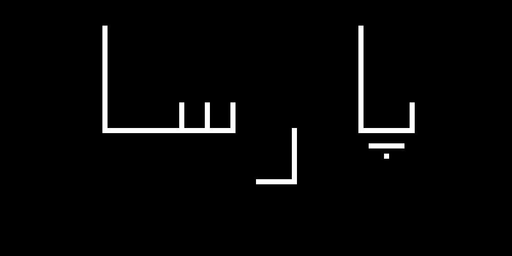

# تمرین 20 


<div dir="rtl">
 ساختن تصویر بک گراند
</div>


```
image = zeros(500,1000);
```

<div dir="rtl">
 سایز گیری از تصویر و ریختن تصویر در یک متغیر برای گرید بندی
</div>


```
imageSize = size(image);
height = imageSize(1,1);
width = imageSize(1,2);
imageSec = image;
```

<div dir="rtl">
 مقیاس گرید
</div>


```
scale=10;
```

<div dir="rtl">
 گرید بندی
</div>

```
for i=1:height
    for j=1:width
        if floor(mod( j , scale )) == 0 
            imageSec(i, j) = 255;
        end
        if floor(mod( i , scale )) == 0 
            imageSec(i, j) = 255;
        end        
    end  
end
```


<div dir="rtl">
 حلقه های تو در تویی که بصورت تجربی برای رسم نمودن اسم نوشته شده . و در رسم آن از تصویر گرید بندی شده استفاده شده.
</div>

```
sx=0;
sy=0;
imageResult = image;
for y=1:scale:height
    sx =0;
    for x=1:scale:width
    if  (sy >= 5)&& (sy <= 25)
        if (sx == 20)
            for u=1:scale
                for v=1:scale                   
                        imageResult(sy*scale+u,sx*scale+v)=255;                                      
                end
            end
        end            
    end
    if  (sy == 25)
        if (sx >= 21)&&(sx <= 45)
            for u=1:scale
                for v=1:scale                   
                        imageResult(sy*scale+u,sx*scale+v)=255;                                      
                end
            end
        end            
    end
    if  (sy >= 20)&& (sy <= 25)
        if (sx == 45)||(sx == 40)||(sx == 35)||(sx == 80)
            for u=1:scale
                for v=1:scale                   
                        imageResult(sy*scale+u,sx*scale+v)=255;                                      
                end
            end
        end            
    end
    if  (sy >= 25)&& (sy <= 35)
        if (sx == 57)
            for u=1:scale
                for v=1:scale                   
                        imageResult(sy*scale+u,sx*scale+v)=255;                                      
                end
            end
        end            
    end
    if  (sy >= 25)&& (sy <= 35)
        if (sx == 57)
            for u=1:scale
                for v=1:scale                   
                        imageResult(sy*scale+u,sx*scale+v)=255;                                      
                end
            end
        end            
    end
    if  (sy == 35)
        if (sx >= 50)&&(sx <= 56)
            for u=1:scale
                for v=1:scale                   
                        imageResult(sy*scale+u,sx*scale+v)=255;                                      
                end
            end
        end            
    end
    if  (sy >= 5)&& (sy <= 25)
        if (sx == 70)
            for u=1:scale
                for v=1:scale                   
                        imageResult(sy*scale+u,sx*scale+v)=255;                                      
                end
            end
        end            
    end
    if  (sy == 25)
        if (sx >= 71)&&(sx <= 80)
            for u=1:scale
                for v=1:scale                   
                        imageResult(sy*scale+u,sx*scale+v)=255;                                      
                end
            end
        end            
    end
    if  (sy == 28)
        if (sx >= 72)&&(sx <= 78)
            for u=1:scale
                for v=1:scale                   
                        imageResult(sy*scale+u,sx*scale+v)=255;                                      
                end
            end
        end            
    end
    if  (sy == 30)
        if (sx == 75)
            for u=1:scale
                for v=1:scale                   
                        imageResult(sy*scale+u,sx*scale+v)=255;                                      
                end
            end
        end            
    end
    sx=sx+1;        
    end
    sy=sy+1;   
end
```

<div dir="rtl">
 تصویر را نمایش می دهد.
</div>


```
figure,imshow(imageSec);
figure,imshow(imageResult);
```


