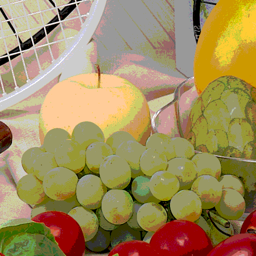

# تمرین 21

<div dir="rtl">
  خواندن تصویر و گرفتن اندازه آن  و ساختن متغییر حامل تصویر خروجی 
</div>


```
image = imread("../../../Benchmark/fruits.png");
imageSize=size(image);
[height,width,dim] = size(image);
imageResult = zeros(imageSize);
```

<div dir="rtl">
 جایگذاری بازه های درست شده توسط رنگ های امن با رنگ های امن  در طی حلقه 
</div>


```
for k =1:dim
    for i=1:height
        for j=1:width
            if image(i,j,k)<=50
                imageResult(i,j,k) = 0;
            end
            if (image(i,j,k)>=51)&&(image(i,j,k)<=101)
                imageResult(i,j,k) = 51;
            end
            if (image(i,j,k)>=102)&&(image(i,j,k)<=152)
                imageResult(i,j,k) = 102;
            end
            if (image(i,j,k)>=153)&&(image(i,j,k)<=203)
                imageResult(i,j,k) = 153;
            end
            if (image(i,j,k)>=204)&&(image(i,j,k)<=254)
                imageResult(i,j,k) = 204;
            end
            if (image(i,j,k)==255)
                imageResult(i,j,k) = 255;
            end
        end
    end
end
```

<div dir="rtl">
 نمایش تصویر!
</div>


```
figure,imshow(uint8(imageResult));
imsave;
```

