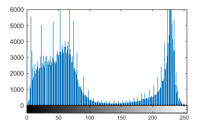
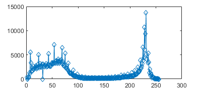
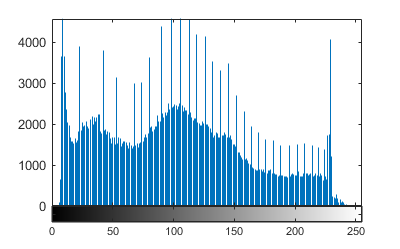
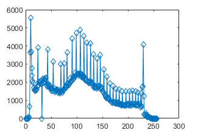
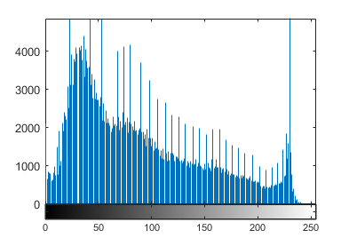
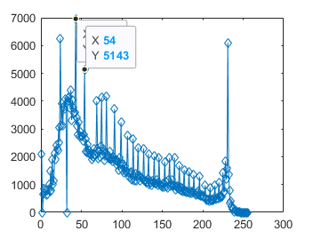

# تمرین 23


<div dir="rtl">
  خواندن یک تصویر بنچمارک رنگی
</div>


```
image = imread("../../../Benchmark/tulips.png");
```

<div dir="rtl">
  ریختن کانال های مختلف آن در متغییر های مختلف
</div>


```
imageRed=image(:,:,1);
imageGreen=image(:,:,2);
imageBlue=image(:,:,3);
```

<div dir="rtl">
 نشان دادن نمودار های آن با استفاده از کتابخانه برای مصادیق مقایسه
</div>


```
figure,imhist(imageRed);
figure,imhist(imageGreen);
figure,imhist(imageBlue);
```

<div dir="rtl">
 نشان دادن توسط تابع ساخته شده دستی
</div>


```
figure,custhist(image,"r");
figure,custhist(image,"g");
figure,custhist(image,"b");
```

<div dir="rtl">
 تابع ساخته شده:
</div>


<div dir="rtl">
 در ابتدا تابع تکلیف اینکه نمودار فراوانی کدام کانال بایستی نشان داده شود با پارامتر K مشخص می شود.
</div>


```
function [] = custhist(image,k)
%CUSTHIST Summary of this function goes here
%   Detailed explanation goes here
if k == "r"
    imagec = image(:,:,1); 
elseif k == "g"
    imagec = image(:,:,2); 
elseif k == "b"
   imagec = image(:,:,3); 
else
    disp("not enough arguments!");   
end
```

<div dir="rtl">
 سایز آن کانال گرفته می شود.
</div>


```
imagesize = size(imagec);
```

<div dir="rtl">
 با استفاده از دستور زیر آرایه یک بعدی hist به نحوی که فراوانی را مشخص کند پر می شود
</div>


```
hist = zeros(1, 256);
for i = 1 : imagesize(1, 1)
    for j = 1 : imagesize(1, 2)
        hist(1, imagec(i, j) + 1) = hist(1, imagec(i, j) + 1) +  1;
    end
end
```


<div dir="rtl">
 و سپس نمودار آن رسم می شود.
</div>

<div dir="rtl">
 توجه : این تابع خروجی ندارد.
</div>

```
plot(hist, '-d');
end
```
RED <br/>


GREEN <br/>


BLUE <br/>


