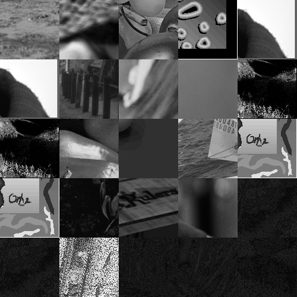

# تمرین 4

<br />
<div dir="rtl">
    باعث می شود پس از هر بار اجرای برنامه پنجره ی فرمان ها پاک شود   
</div>

```
clc;
close all;
clear all;
```
<div dir="rtl">
    فولدری که فایل ها در آن قرار دارد را بارگذاری می کند.
</div>

```
% Specify the folder where the files live.
myFolder = '..\benchmark\';
% Check to make sure that folder actually exists.  Warn user if it doesn't.
if ~isfolder(myFolder)
    errorMessage = sprintf('Error: The following folder does not exist:\n%s\nPlease specify a new folder.', myFolder);
    uiwait(warndlg(errorMessage));
    myFolder = uigetdir(); % Ask for a new one.
    if myFolder == 0
         % User clicked Cancel
         return;
    end
end
```

<div dir="rtl">
    فایل هایی که تصویری هستند را با فرمت های مختلف دریافت می نماید.
</div>

```
% Get a list of all files in the folder with the desired file name pattern.
filePattern1 = fullfile(myFolder,'*.png'); % Change to whatever pattern you need.
filePattern2 = fullfile(myFolder,'*.bmp');
filePattern3 = fullfile(myFolder,'*.tif');
theFiles = [dir(filePattern1);dir(filePattern2);dir(filePattern3)];
```

<div dir="rtl">
    ماتریسی برای نگهداری وصله های هر تصویر ایجاد می شود.
</div>

```
PatchArray = zeros(100,100,length(theFiles));
```

<div dir="rtl">
    با استفاده از یک حلقه به تک تک فایل های درون پوشه دسترسی پیدا می شود .
</div>

```
for k = 1 : length(theFiles)
    baseFileName = theFiles(k).name;
    fullFileName = fullfile(theFiles(k).folder, baseFileName);
    fprintf(1, 'Now reading %s\n', fullFileName);
    % Now do whatever you want with this file name,
    % such as reading it in as an image array with imread()
```
    
<div dir="rtl">
    در حلقه فایل خوانده می شود.
</div>
```    
    image = imread(fullFileName);
```

<div dir="rtl">
    بدلیل اینکه برخی از آنها رنگی هستند اول به سیاه و سفید تبدیل می شوند.
</div>

```
    if size(image,3)==3
        image = rgb2gray(image);
    end
```

<div dir="rtl">
    با استفاده از حلقه تو در توی زیر هر تصویر قسمت راست و پایینش خوانده شده و در ماتریس وصله ها ریخته می شود .  
</div>

```
    %imshow(imageArray);  % Display image.
    imagesize = size(image);
    
    p = 100;
    for i = imagesize(1, 1) : -1 :(imagesize(1, 1)-100)
        if p == 0 
            break;
        end
        q = 100;
        for j = imagesize(1, 2): -1 :(imagesize(1, 2)-100)
            if q == 0 
                break;
            end
            PatchArray(p,q,k)= image(i,j,1);
            q=q-1;
        end
        p=p-1;
    end
        drawnow; % Force display to update immediately.
end
```

<div dir="rtl">
    ماتریس تصویر نهایی ساخته می شود . 
</div>

```
PatchImage=zeros(500,500);
```
<div dir="rtl">
    با استفاده از حلقه زیر با ماتریس وصله های تصاویر دیگر از چپ و بالا بسمت راست و پایین پر می شود.
</div>    

```
for u = 1:5
    for w = 1:5
        for m = 100:-1:1
            for o = 100:-1:1               
                PatchImage((u-1)*100+m,(w-1)*100+o)=PatchArray(m,o,4*u+w);                
            end           
        end
    end
end
```
<div dir="rtl">
    تصویر اصلی نشان داده شده و ذخیره می شود.
</div>

```
figure,
imshow(uint8(PatchImage));
%imsave
```

