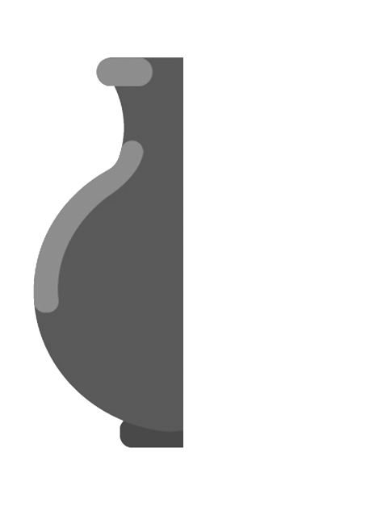

# تمرین 5

<br />
<div dir="rtl">
    باعث می شود پس از هر بار اجرای برنامه پنجره ی فرمان ها پاک شود   
</div>

```
clc;
close all;
clear all;
```
<div dir="rtl">
    تصویر نا تمام خوانده می شود.
</div>

```
image = imread("koozeh.png");
```
<div dir="rtl">
    اندازه آن گرفته می شود.
</div>

```
%imshow(image);
imagesize=size(image);
```

<div dir="rtl">
    با استفاده از حلقه زیر بخش موجود آن گرفته شده و قرینه می شود و به بخش ناکامل انتقال داده می شود.  
</div>

```
for j=1 : imagesize(1, 2)/2
    for i=1 : imagesize(1, 1)
        image(i,imagesize(1, 2)-j)=image(i, j) ;
    end
end
```
<div dir="rtl">
    و سپس نتیجه نهایی نمایش داده می شود . 
</div>

```
figure,
imshow(image);
% imsave
```


```
% the picture in this exercise is copyrighted
% Courtesy of imastudios inc. 
% please don't copy! 
% thank you for respecting that!
```


