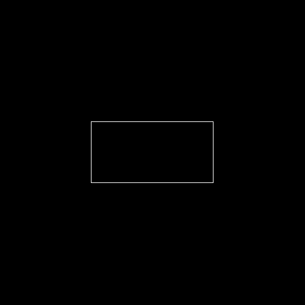
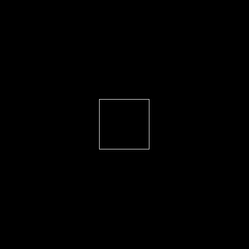
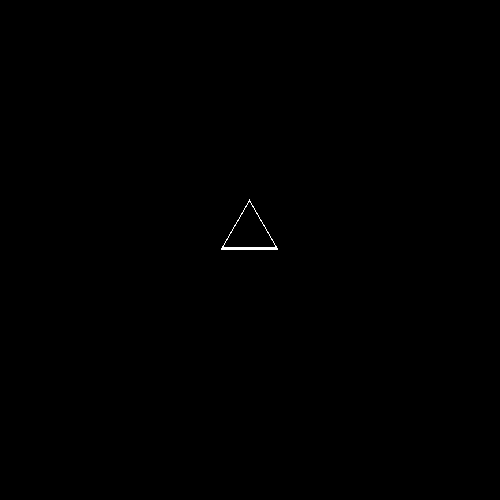

# تمرین 7

<br />
<div dir="rtl">
    باعث می شود پس از هر بار اجرای برنامه پنجره ی فرمان ها پاک شود   
</div>

```
clc;
close all;
clear all;
```

<div dir="rtl">
    شعاع هر کدام از اشکال هندسی
</div>    

```
r = 50;
```

<div dir="rtl">
    آستانه تحمل بمنظور ذخیم کردن دیواره های اشکال هندسی
</div> 

```
t = 2 % threshhold
```

<div dir="rtl">
    مرکز پدید آمدن هر کدام از اشکال هندسی
</div> 

```
p = [250 250];
```

<div dir="rtl">
    بوجود آمدن متغییر های نگهدارنده این اشکال
</div> 

```
image = zeros(500,500);
image1 = zeros(500,500);
image2 = zeros(500,500);
image3 = zeros(500,500);
```

<div dir="rtl">
    ساختن مربع با استفاده از فرمول مختصاتی آن 
</div> 

```
%square
for i=1 : 500
    for j=1 : 500
        if max(abs(p(1,1)-i) , abs(p(1,2)-j)) == r 
            image(i, j) = 255;
        end
    end
end
```

<div dir="rtl">
    ساختن مستطیل با استفاده از فرمول مختصاتی آن
</div> 

```
%rectangle
for i=1 : 500
    for j=1 : 500
        if max(abs(p(1,1)-i) , 0.5*abs(p(1,2)-j)) == r 
            image1(i, j) = 255;
        end
    end
end
```
<div dir="rtl">
    ساختن لوزی با استفاده از فرمول مختصاتی آن 
</div> 

```
%Rhombus
for i=1 : 500
    for j=1 : 500
        if r-t <= abs(p(1,1)-i)+ 1.68*abs(p(1,2)-j) && abs(p(1,1)-i)+ 1.68*abs(p(1,2)-j) <= r+t 
            image2(i, j) = 255;
        end
    end
end
```

<div dir="rtl">
    ساختن مثلث با استفاده از فرمول مختصاتی آن 
</div> 

```
x0=p(1,1);
y0=p(1,2);
t0=1/sqrt(3);
%Triangle
for x=1 : 500
    for y=1 : 500
          pri= [abs(x+(y-y0)/t0-x0) abs(x-(y-y0)/t0-x0) abs(x-x0+r)] ;         
        if r-t <= max(pri) && max(pri)<= r 
            image3(x, y) = 255;
        end
    end
end
```

<div dir="rtl">
    نمایش دادن و ذخیره همه آنها
</div> 

```
figure,
imshow(image);
imsave
figure,
imshow(image1);
imsave
figure,
imshow(image2);
imsave
figure,
imshow(image3);
imsave
```





