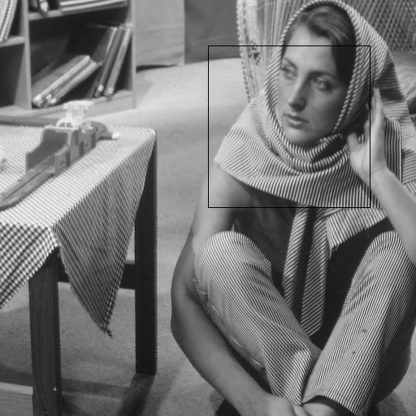
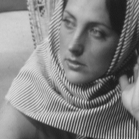

# تمرین 9

<br />
<div dir="rtl">
    باعث می شود پس از هر بار اجرای برنامه پنجره ی فرمان ها پاک شود   
</div>

```
clc;
close all;
clear all;
```
<div dir="rtl">
    تصویر را خوانده و سایز آن را دریافت می کند.
</div>

```
image = imread("../../../benchmark/barbara.png");
[imageWidth , imageHeight ] = size(image);
```
<div dir="rtl">
     کد جوری طراحی شده که مانند مختصات مرکز تصویر (0و0) در نظر گرفته شده و با مقدار دهی نمودن متغییر های زیر می توان مرکز چهار ضلعی که crop می شود را تعیین نمود. 
</div>

```
offsetX=-100;
offsetY=100;
```
<div dir="rtl">
    طول و عرضی که می خواهیم برش داده شود را تعیین می کنیم.
</div>

```
cropW = 200;
cropH = 200;
```

<div dir="rtl">
    بر اساس متغییر های پیشین مختصات نقاط بالا و چپ پیکسل های مورد برش محاسبه می شود. 
</div>

```
cropX = (imageWidth/2)-(cropW/2)+offsetX;
cropY = (imageHeight/2)-(cropH/2)+offsetY;
```

<div dir="rtl">
    متغییری برای جا دهی عکس برش داده شده ایجاد می شود.
</div>

```
croppedImage = zeros(cropW,cropH);
```
<div dir="rtl">
    عکس مورد برش به متغییر ریخته می شود
</div>

```
for i = 1 :  cropW 
    for j = 1 :  cropH 
        croppedImage(i,j)=image(i+cropX,j+cropY);
    end
end
```
<div dir="rtl">
 مکان برش داده شده در عکس اصلی نمایان می شود.
</div>

```
for i = 1 :  cropW 
    for j = 1 :  cropH
        if (i==1) || (j==1)||(i==cropW)||(j==cropH)
            image(i+cropX,j+cropY)=0;
        end
    end
end
```

<div dir="rtl">
  عکس نشان داده می شود.
</div>

```
figure,
imshow(image);
%imsave;
figure,
imshow(uint8(croppedImage));
%imsave;
```



