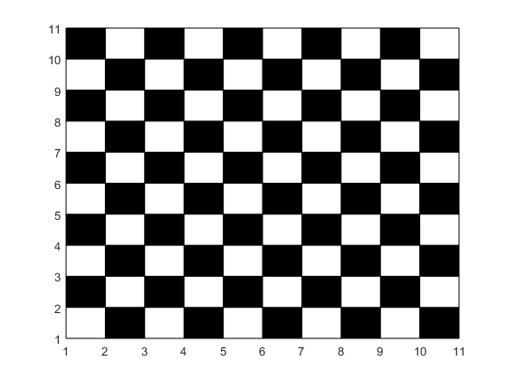

## تمرین 1
<div dir='rtl'>
ابتدادو مقدار برای سطر و ستون را از ورودی میگیریم و بر اساس این مقادیر یک صفحه با کمک تابع zeros ایجاد میکنیم  
</div>
</br>

```
n = input('Enter row : ');
m = input('Enter column : ');
Chessboard = zeros(n,m);
```
<div dir='rtl'>
  سپس با کمک دستور for کل صفحه را پیمایش کرده و مقدار خانه های فرد را تغییر میدهیم.
</div>
</br>

```
for i = 1:1:n
    x = i;
    for j = 1:1:m
        if(mod(x,2) == 1)
            Chessboard(i,j) = 1;
        end
        x = x + 1;
    end
end
```
<div dir='rtl'>
  در نهایت با پیمایش کل صفحه خانه هایی که مقدار صفر داشته باشند با رنگ سیاه و خانه های با مقدار یک را با رنگ سفید ایجاد میکنیم
</div>
</br>

```
for i = 1:1:n
    for j = 1:1:m
        if(Chessboard(i,j) == 0)
            rectangle('Position',[i j 1 1], 'FaceColor','k');
        else
            rectangle('Position',[i j 1 1], 'FaceColor','w');
        end
    end
end
```


