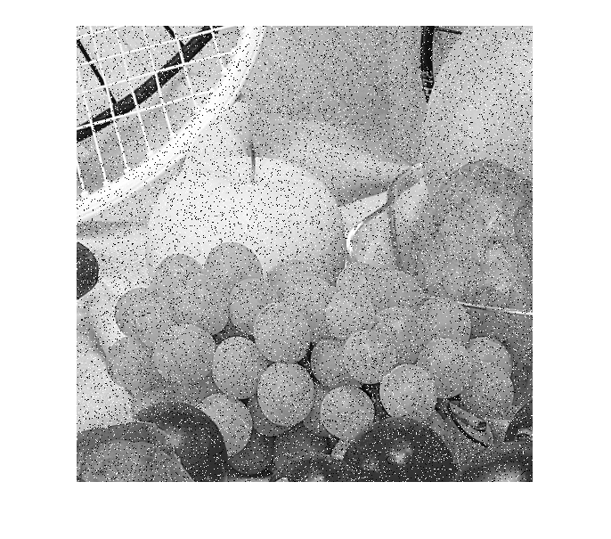

## تمرین 11
<div dir='rtl'>
  تصویر را خوانده و آن را به تصویر خاکستری تبدیل میکنیم و متغیر percent  را برای مشخص کردن درصد نویز تعریف میکنیم و سایز تصویر را هم بر میداریم و تصویر را داخل متغییر NoiseImg قرار میدهیم و یک عدد تصادفی تولید میکنیم
</div>
</br>

```
image = imread("fruits.png");
image2 = rgb2gray(image);

percent = 20;
p = 255*percent/100;
[x,y] = size(image2);

NoiseImg = image2;
Rmatrix = randi(x,y);
```
<div dir='rtl'>
  در متغیر NoiseImg اگر مقدار عدد تصادفی کمتر یا مساوی نصف متغیر p باشد نویز فلفلی و اگر مقدار آن بزرگتر از نصف p باشد و عدد تصادفی کوچکتر از p باشد نویز نمکی اعمال میشود. 
</div>
</br>

```
NoiseImg(Rmatrix <= p/2) = 0;
NoiseImg(Rmatrix > p/2 & Rmatrix < p) = 255;

imshow(NoiseImg);
```
<div dir='rtl'>
  خروجی کد :
</div>
</br>


