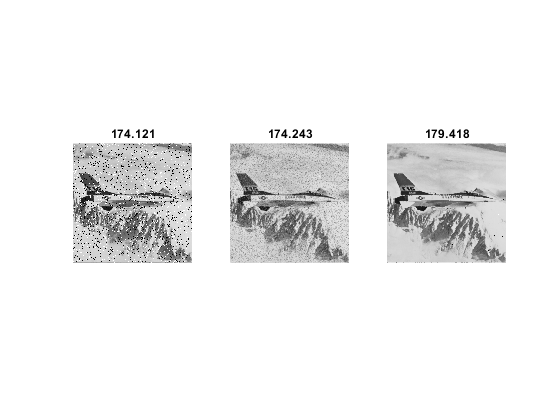

## تمرین 12

<div dir='rtl'>
  تصویر را از ورودی خوانده و آنرا به فرم خاکستری تبدیل میکنیم و سپس سایز تصویر را در متغیر های x,y ذخیره میکنیم.
</div>
</br>

```
image = imread("../../../benchmark/airplane.png");
image = rgb2gray(image);

[x,y] = size(image);

```

<div dir='rtl'>
سپس با کمک توابع SPNoise که در سوال 11 توضیح داده شده و توابع Mean_ و Median_ تصویر را به فرم های نویز فلفل نمکی و میانگین و میانه تبدیل میکنیم.
</div>
</br>

```
image_Noise = SPNoise(image);
image_Mean = Mean_(image);
image_Median = Median_(image);

```

<div dir='rtl'>
برای هر کدام از فرم ها یک آرایه تعریف میکنیم و با پیمایش کل تصویر مقادیر پیکسلی مربوط به هر فرم را در آرایه ی مربوط به خودش قرار میدهیم و میانگین هر یک را جداگانه حساب میکنیم.
</div>
</br>

```
imn_sum = [] ; imm_sum = [] ; immed_sum = [];
for i=1:x
    for j=1:y
        imn_sum = [imn_sum ; image_Noise(i,j)];
        imm_sum = [imm_sum ; image_Mean(i,j)];
        immed_sum = [immed_sum ; image_Median(i,j)];
    end 
end

imn_avg = mean(imn_sum);
imm_avg = mean(imm_sum);
immed_avg = mean(immed_sum);

```

<div dir='rtl'>
در پایان هم با کمک دستور subplot  در یک صفحه ی یک در سه تصوایر را نمایش میدهیم و میانگین هر تصویر را هم در بالای آن نمایش میدهیم.
</div>
</br>

```
subplot(1,3,1);
imshow(image_Noise);
title(imn_avg)
subplot(1,3,2);
imshow(image_Mean);
title(imm_avg)
subplot(1,3,3);
imshow(image_Median);
title(immed_avg)

```


<div dir='rtl'>
  خروجی کد:
</div>
</br>


