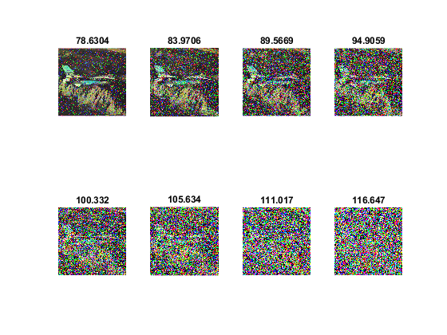

## تمرین 13

<div dir='rtl'>
  تصویر را خوانده و سایز تصویر را در متغیر های x و y  ذخیره میکنیم
</div>
</br>

```
image = imread("airplane.png");
[x,y] = size(image);

```

<div dir='rtl'>
  سپس با دستورهای for تصویر را به تصویر نگاتیو تبدیل میکنیم
</div>
</br>

```
for i=1:x
    for j=1:y
        image(i,j) = 255 - image(i,j);
    end
end

```

<div dir='rtl'>
  در پایان هم برای 8 مقدار جداگانه نویز را ایجاد کرده و سپس میانگین تمام پیکسل ها را محاسبه میکنیم و همه ی آنها را با کمک subplot در یکجا نمایش میدهیم و عنوان هر نمودار هم برابر با میانگین تمام پیکسل های آن است
</div>
</br>

```
s=1;
for i=.1:.1:.8
   image2 = imnoise(image,"salt & pepper",i);
   avg = mean(image2(:));
   subplot(2,4,s);
   imshow(image2);
   title(avg);
   s=s+1;
end

```


<div dir='rtl'>
  خروجی کد:
</div>
</br>


