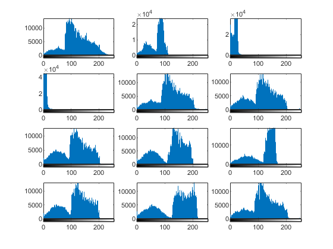

## تمرین 14

<div dir='rtl'>
  در داخل حلقه ی for مسیر تصاویر مورد نظر را ایجاد میکنیم و سپس از آن مسیر تصاویر را داخل تکرار یک به یک میخوانیم و آن ها را به فرم خاکستری تبدیل میکنیم و سپس در هر مرحله هیستوگرام مربوطه را در نمودار رسم میکنیم
</div>
</br>

```
path = dir('Images/*.png');

for i=1:12
   name = path(i).name;
   f = strcat('Images/',name);
   image = imread(f);
   image = rgb2gray(image);
   
   if(i==1)
       subplot(4,3,1); 
       imhist(image);
   elseif(i==2)
       subplot(4,3,2); 
       imhist(image);
   elseif(i==3)
       subplot(4,3,3); 
       imhist(image);
   elseif(i==4)
       subplot(4,3,4); 
       imhist(image);
   elseif(i==5)
       subplot(4,3,5); 
       imhist(image);
   elseif(i==6)
       subplot(4,3,6); 
       imhist(image);
   elseif(i==7)
       subplot(4,3,7); 
       imhist(image);
   elseif(i==8)
       subplot(4,3,8); 
       imhist(image);
   elseif(i==9)
       subplot(4,3,9); 
       imhist(image);
   elseif(i==10)
       subplot(4,3,10); 
       imhist(image);
   elseif(i==11)
       subplot(4,3,11); 
       imhist(image);
   elseif(i==12)
       subplot(4,3,12); 
       imhist(image);
   end
end
```

<div dir='rtl'>
  خروجی کد:
</div>
</br>


