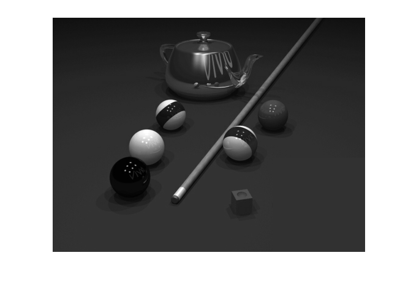

## تمرین 15
<div dir='rtl'>
  تصویر را از ورودی خوانده و آن را به تصویر خاکستری تبدیل میکنیم و سایز تصویر را در متغییر های x  و y قرار میدهیم
</div>
</br>

```
image = imread("../../../benchmark/pool.png");
image2 = rgb2gray(image);

[x,y] = size(image2);

```
<div dir='rtl'>
  سپس با دو دستور for  در نهایت هم تصویر اولیه و تصویر نهایی را نمایش می دهیمقسمت مورد نظر که توپ در آن قرار دارد را پیمایش میکنیم و اگر پیکسل مورد نظر رنگ متفاوتی داشته باشد رنگ آن را تغییر داده و هم تراز با رنگ زمینه میکنیم تا توپ از تصویر حذف شود 
</div>
</br>

```
for i=230:x
    for j=360:y
        if(image2(i,j) > 0)
            image2(i,j) = 49;
        end
    end
end


figure
imshow(image);
figure
imshow(image2);
```
<div dir='rtl'>
  خروجی کد :
</div>
</br>


