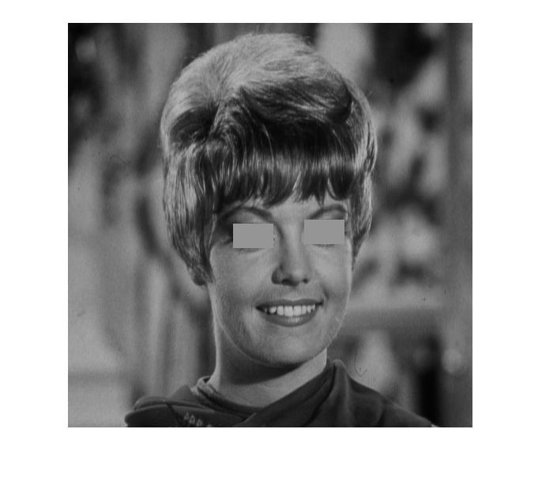

## تمرین 16

<div dir='rtl'>
  تصویر را خوانده و سایز تصویر را در متغیر های x و y  ذخیره میکنیم
</div>
</br>

```
image = imread("../benchmark/zelda.png");
[x,y] = size(image);

```

<div dir='rtl'>
 قسمت هایی که چشم راست در آن قرار دارد را بررسی کرده و رنگ آنها را تغییر میدهیم و در تصویر مربوطه اعمال میکنیم.
</div>
</br>

```
for i=255:285
    for j=210:260
        image(i,j) = 149;
    end
end

```

<div dir='rtl'>
همان کارهای چشم راست را برای چشم چپ نیز انجام داده و تصویر را نمایش میدهیم.
</div>
</br>

```
for i=250:280
    for j=300:350
        image(i,j,1) = 149;
    end
end

figure
imshow(image);

```


<div dir='rtl'>
  خروجی کد:
</div>
</br>


