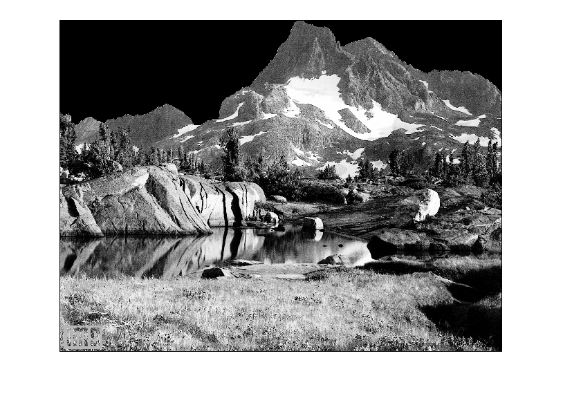

## تمرین 17
<div dir='rtl'>
  تصویر را خوانده و به اندازه ی کل عرض تصویر و اندازه ارتفاع آسمان در تصویر پیمایش را انجام میدهیم اگر پیکسل موردنظر مقداری به جز مقدار مشابه با آسمان داشت از حلقه بیرون میاییم و خانه هایی که رنگ مشابه با آسمان دارن را به رنگ سیاه تغییر میدهیم.
</div>
</br>

```
image = imread("img\mountain.png");

for j=2:y
    f = true;
    for i=2:200
        if(image(i,j) < 200)
            break;
        end
        image(i,j) = 0; 
    end
end

imshow(image);

```

<div dir='rtl'>
  خروجی کد :
</div>
</br>


