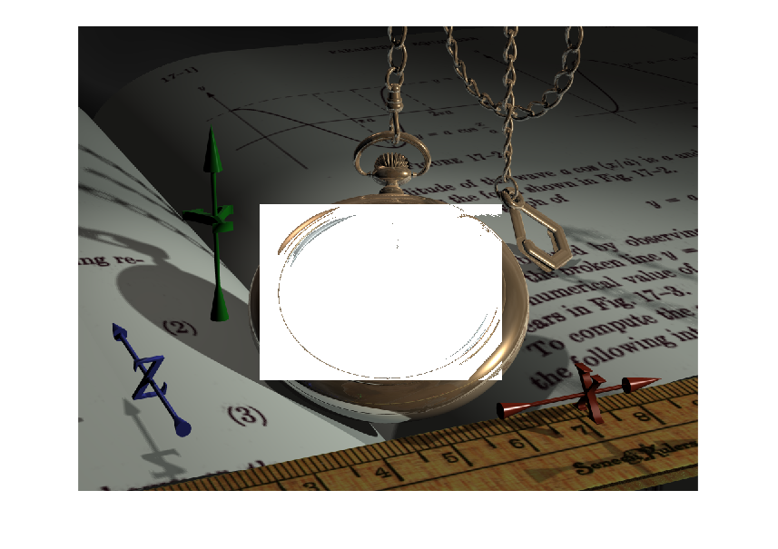

## تمرین 18

<div dir='rtl'>
تصویر را از ورودی خوانده و سپس با توجه به محل قرار گیری ساعت در تصویر پیکسل ها را مورد بررسی قرار میدهیم و آنهایی که مقدار کمتر از 125 داشته باشند مولفه های RGB آن را سفید میکنیم تا آن قسمت در تصویر سفید شود. و در پایان نیز تصویر را نمایش می دهیم.
</div>
</br>

```
image = imread("../benchmark/watch.png");

for i=295:585
    for j=300:700
        if image(i,j) < 125
            image(i,j,1) = 255;
            image(i,j,2) = 255;
            image(i,j,3) = 255;
        end
    end
end

figure
imshow(image);

```

<div dir='rtl'>
  خروجی کد:
</div>
</br>


